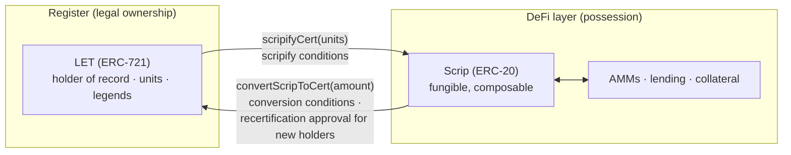

# Ledger Entry Tokens and scrip

A register entry has to name a holder, a unit count and the restrictions
that bind those units, so it cannot be fungible. AMMs, lending markets and
vesting contracts expect interchangeable ERC-20 units. The protocol gives
each job its own token. A **Ledger Entry Token (LET)** is an ERC-721 token
that records one entry on the company's register. **Scrip** is an ERC-20
token that a holder creates by moving units out of a LET and can convert
back into a LET.

## A LET is one entry on the register

Each class or series has its own LET contract, a deployment of
[`LedgerEntryToken`](../reference/contracts/LedgerEntryToken.md). A LET
carries what the governing law asks of a register entry, namely the holder's
name, the unit count, the class or series, restriction legends, the
endorsement history, authorized signatures, the acquisition price and the
URI of the governing agreement.

The LET contract records the holder of record separately from the address
that holds the ERC-721 token, so moving the token leaves the registration
where it was. Registration changes only through operations the company
gates, such as issuance, trade settlement, endorsement, voiding and the
conversion of scrip into a LET. On a v5 company,
possession of a LET also carries no power to endorse it. Only the holder of
record endorses, or the IssuanceManager does so as registrar on the holder's
signature, so a custodian holding the token cannot endorse it to itself and
take title on delivery. A v4 LET contract also accepts an endorsement from
the address holding the token. Corporate, LLC, partnership and fund law all
distinguish possessing an instrument from being registered as its owner, and
the LET contract keeps the two apart.

## Scrip carries units off the LET

`scripifyCert` moves units from a LET into scrip, and `convertScripToCert`
turns scrip back into a LET. Each LET contract can have one scrip contract
([`CyberScrip`](../reference/contracts/CyberScrip.md)), which mints at the
scrip ratio set for that LET contract. Scripifying can be partial, so a
holder of 1,000,000 shares can scripify 250,000 to trade and keep 750,000
active on the LET. The
[`IssuanceManager`](../reference/contracts/IssuanceManager.md) keeps an
ERC-4626-style pool for each LET contract that tracks every LET's scripified
units as a vault position, and a conversion back into a LET withdraws from
that pool in proportion. Every unit of scrip in circulation is backed by
units scripified out of LETs in the same LET contract.

## Scrip's legal character comes from the governing documents

The company issues scrip through its own IssuanceManager, against units
taken off its own register, and sets the conditions for converting it back.
No third party issues the scrip or holds what backs it. In a Delaware
corporation, DGCL §155 authorizes scrip, and the governing documents decide
what rights it carries. MetaLeX-form bylaws say scrip tokens are not stock
and, unless their terms provide otherwise, represent neither equity nor debt
of the corporation. Holding scrip confers no stockholder right by itself (no
vote, dividend, liquidation, appraisal or inspection right), though the
scrip's terms may provide, as §155 permits, for distributions on the backing
shares to be escrowed and released.

Under those bylaws, the holder of record of a LET remains the registered
owner of the units it scripified, the scrip holders carry the economics of
those units, and a scrip holder becomes a stockholder of record by
converting into a LET. The app's [cap table](../webapp/captable.md) shows
both readings. Its **Registered** view credits the LET holder, and for an
equity class its **Beneficial** view credits the scrip holders.

## Inside the scrip lifecycle, the register moves only at the two conversions

Scrip can trade in a Uniswap v4 pool all day while the register stays still.
When a scrip holder wants to be the holder of record, they convert, and at
that moment the full gate runs, made up of the conversion conditions set for
that LET contract and, for a new holder, the issuer's recertification
approval. Scripifying runs its own conditions on the way out. Primary
issuance, secondary settlement, endorsement and voiding change the register
through their own gated flows.

Because the register moves only at those two conversions, a company can
choose where compliance runs. A whitelisted LiquiLeX pool checks credentials on every
swap. An open pool leaves trading free, optionally screened with zkPassport,
and runs the full gate when scrip converts into a LET.
[Compliance architecture](compliance-architecture.md) covers both models.

## A secondary trade can settle on the register or in scrip

cyberTRADE settles negotiated secondary trades by either route. On the
register route, a v5 company's DealManager runs an offer flow in which the
buyer elects an exemption pathway, the pathway's conditions and the issuer's
own conditions run, and settlement reduces or uses up the seller's LET and
mints the buyer a new LET carrying the seller's endorsement. On the scrip
route, the trade settles in scrip, on an AMM through LiquiLeX or otherwise,
and the buyer converts into a LET later if they want to be on the register.

## See also

* [Run a secondary trade](../how-to/run-a-secondary-trade.md)
* [Issue a LET](../how-to/issue-a-let.md)
* [Composability and DeFi](composability.md)
