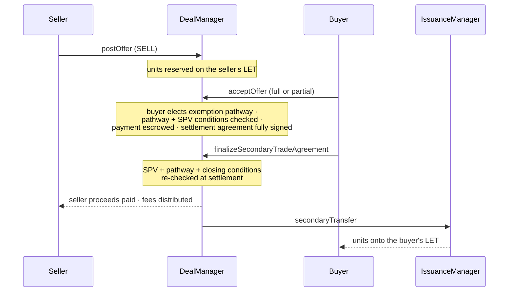

# Run a secondary trade

A cyberCORP's `DealManager` settles secondary trades of its Ledger Entry
Tokens (LETs) through an offer flow: post an offer, accept it, finalize the
settlement. Each acceptance creates a settlement agreement in the
`CyberAgreementRegistry` (a `bytes32` id), signed by both sides, and the
DealManager holds the escrow itself. To settle in scrip instead, see
[Scripify and settle a secondary trade](scripify-and-settle.md).

Offers have two sides (`OfferSide.SELL`, `OfferSide.BUY`) and support
partial fills. Every settlement runs under one securities-law exemption
pathway (`ExemptionPathway`: `RULE_144`, `SECTION_4A7`, `SECTION_4A1HALF`,
`RULE_144A`, `REGULATION_S`), either pinned by the offer or elected by the
buyer at acceptance. The structs are in
[`ISecondaryTradeStorage.sol`](https://github.com/MetaLex-Tech/cybercorps-contracts/blob/develop/src/interfaces/ISecondaryTradeStorage.sol).



## 0. Set the trading policy once

Before any offer can settle, an owner or admin sets the company's trading
policy on the DealManager:

```solidity
// enable a pathway and set its exemption-specific conditions
dealManager.setPathwayThresholdConditions(ExemptionPathway.RULE_144, conds, true);
dealManager.setSpvThresholdConditions(fundConds);    // apply to every offer
dealManager.setClosingConditions(closingConds);      // checked at finalize only
dealManager.setMinTradeThreshold(minUnits, minConsideration);
dealManager.setSettlementWindow(window);             // seconds from acceptance
dealManager.setDefaultIntegrator(integrator);        // optional fee-split partner
```

A pathway that is not enabled can be neither pinned nor elected.

The company does not set the platform fee on a settlement. It comes from the
DealManagerFactory's **secondary** rate (`getSecondaryFeeRatio()`, which
MetaLeX can override per DealManager), set separately from the primary rate
used for deals and rounds. A whitelisted integrator's share comes out of
that fee. [DealManager](../reference/contracts/DealManager.md) has the fee
details.

## 1. Post the offer

```solidity
import {PostOfferParams, OfferSide, ExemptionPathway, HostingMode}
    from "src/interfaces/ISecondaryTradeStorage.sol";

bytes32 offerId = dealManager.postOffer(PostOfferParams({
    side:                     OfferSide.SELL,
    certPrinter:              certPrinter,   // the security being sold
    tokenId:                  tokenId,       // seller's LET (0 for BUY offers)
    units:                    10_000e18,     // 10,000 shares (units are 18-decimal)
    paymentToken:             USDC,
    consideration:            200_000e6,     // total for all offered units
    exemptionPathway:         ExemptionPathway.NONE, // NONE = each buyer elects
    validUntil:               block.timestamp + 30 days,
    counterpartyRestrictions: "",
    additionalTerms:          "",
    integrator:               address(0),    // 0 = default integrator
    templateId:               templateId,    // agreement template
    salt:                     salt,
    globalValues:             globalValues,
    offerorPartyValues:       sellerValues,
    offerorAgreementSig:      sellerAgreementSig, // EIP-712 over the agreement
    openEndorsementSig:       openEndorsementSig, // seller's pre-signed endorsement
    buyerName:                "",            // BUY offers only
    buyerHostingMode:         HostingMode.DIRECT,
    adminMultisig:            address(0)
}));
```


`units` is **18-decimal fixed point** (one share = `1e18`), while
`consideration` is denominated in the payment token's own decimals
(USDC = 6). Mixing these up misprices the offer by orders of magnitude.


* A **SELL** offer requires the caller to be the LET's registered owner and
  the LET not to be void (`CertificateVoided`). The offered units are
  reserved on the LET, and reserved units cannot be scripified or
  reassigned.
* A **BUY** offer pulls the full `consideration` into DealManager custody up
  front and must pin an exemption pathway.
* `HostingMode.ADMINISTERED` delivers the buyer's lot to `adminMultisig`,
  so it needs a nonzero address there (`MissingAdminMultisig` otherwise),
  on a buy offer at posting and on a sell offer at acceptance.
* `offerorAgreementSig` is stored with the offer and attached to each
  settlement agreement through `signContractWithEscrow`. Neither the
  DealManager nor the registry verifies it. The offeror's commitment rests
  on its own `postOffer` transaction (or its relayer authorization), and
  the stored signature records what it signed.

## 2. Accept all or part of the offer

Any counterparty can accept the whole offer or part of it:

```solidity
import {AcceptOfferParams} from "src/interfaces/ISecondaryTradeStorage.sol";

bytes32 settlementAgreementId = dealManager.acceptOffer(AcceptOfferParams({
    offerId:             offerId,
    units:               4_000e18,                   // 4,000 shares; partial fills allowed
    exemptionPathway:    ExemptionPathway.RULE_144,  // buyer's election (sell offers)
    buyerName:           "Bob Buyer",
    buyerHostingMode:    HostingMode.DIRECT,
    adminMultisig:       address(0),
    sellerTokenId:       0,                          // BUY-offer acceptances only
    acceptorPartyValues: buyerValues,
    acceptorAgreementSig: buyerAgreementSig,         // EIP-712, registry-verified
    openEndorsementSig:  ""                          // BUY-offer acceptances only
}));
```

Acceptance creates the settlement agreement in the registry, signed by both
sides, and funds the escrow (on a sell offer the buyer pays here). It also
re-runs the SPV and elected-pathway conditions against the actual buyer. A
failed condition reverts the whole acceptance, and so does a seller LET
voided since the offer was posted.

The registry verifies `acceptorAgreementSig`, so the acceptor signs
`SignatureData` (with `signer` = the acceptor) for the settlement
agreement's id before the agreement exists. On a registry with the current
`SignatureData` type, that id is

```solidity
// A dynamic array, as SecondaryTradeStorage builds it. A literal
// [offeror, acceptor] is address[2], which encodes differently and gives
// another id.
address[] memory parties = new address[](2);
parties[0] = offeror;
parties[1] = acceptor;

keccak256(abi.encode(
    offer.templateId,
    uint256(keccak256(abi.encodePacked(offer.salt, n))), // n = earlier acceptances of this offer
    offer.globalValues,                                  // string[]
    parties,                                             // address[]
    bytes32(0),        // no secret
    dealManager        // the DealManager is the finalizer
))
```

The settlement expiry is not part of the id. `n` counts every earlier
acceptance, including voided ones, so a competing acceptance mined first
changes the id and invalidates the signature. The id formulas are in
[CyberAgreementRegistry](../reference/contracts/CyberAgreementRegistry.md).

Each lot is priced from the offer's running total:
`offer.consideration × (offer.unitsAccepted + params.units) / offer.units − offer.paymentAccepted`,
where `params.units` is this fill's size and `offer.units` the offer's
total (integer division rounds down; a negative result counts as zero).
The lot that exhausts the offer therefore pays whatever remains, and
rounding does not accumulate across fills. A priced lot that rounds to zero
reverts `ZeroConsiderationFill`. The minimum-trade threshold applies to a
partial lot and to the remainder it leaves. The lot that exhausts the offer
is exempt, so raising the threshold never strands an existing tail.

## 3. Finalize the settlement

Anyone can finalize after acceptance, within the settlement window:

```solidity
dealManager.finalizeSecondaryTradeAgreement(settlementAgreementId);
```

Finalization re-checks the pathway, threshold and closing conditions,
because eligibility must hold at settlement as well as at acceptance. It
then pays the seller net of the secondary fee (any integrator share comes
out of that fee), releases the unit reservation, and executes the ownership
change through `IssuanceManager.secondaryTransfer`, which reduces the
seller's LET and mints the buyer's LET with the seller's endorsement
attached.

## Cancel an offer or void a settlement

* `cancelOffer(offerId)` lets the offeror cancel a live offer. It releases
  only the uncommitted units and consideration, and settlements already in
  flight resolve on their own.
* `voidSecondaryTradeAgreement(agreementId, signer, signature)` records one
  party's void request. The settlement voids once **both** parties request
  it, or once it has expired.
* `voidExpiredSecondaryTradeAgreement(agreementId, signer, signature)`
  unwinds a settlement past its expiry.
* `syncVoidedSecondaryTradeAgreement(agreementId)` syncs a settlement that
  was voided directly in the registry.

## Let a relayer submit for the user

`postOffer`, `cancelOffer` and `acceptOffer` each have a relayed overload
`(…, address forAddr, uint256 nonce, bytes sig)`, where `sig` is
`forAddr`'s EIP-712 authorization over the call parameters and nonce, so
end users can trade without paying gas. `voidSecondaryTradeAgreement`'s
relayed overload takes `(agreementId, signer, voidSignature, nonce,
authSig)`: the registry void signature plus a separate
relayer-authorization signature, with `signer` as the authorized party.

## Negotiate a bespoke deal instead

The DealManager's generic deal flow runs alongside the offer flow, for
primary issuances and negotiated bilateral deals: `proposeDeal(...)` or
`proposeAndSignDeal(...)` (both return
`(bytes32 agreementId, uint256[] certIds)`), then
`signDealAndPay(signer, agreementId, signature, partyValues,
fillUnallocated, name, secret)`, then `finalizeDeal(agreementId)`.
`voidExpiredDeal`, `revokeDeal` and `signToVoid` unwind a deal.

The DealManager holds payment and LETs in escrow for deals too, so neither
flow has a separate escrow contract to call;
[LeXscroWLite](../reference/contracts/LeXscroWLite.md) documents the escrow
logic.

Function-level detail is in
[DealManager](../reference/contracts/DealManager.md) and
[CyberAgreementRegistry](../reference/contracts/CyberAgreementRegistry.md).
The conditions in the trading policy are covered in [Gate state transitions
with conditions](gate-with-conditions.md).
