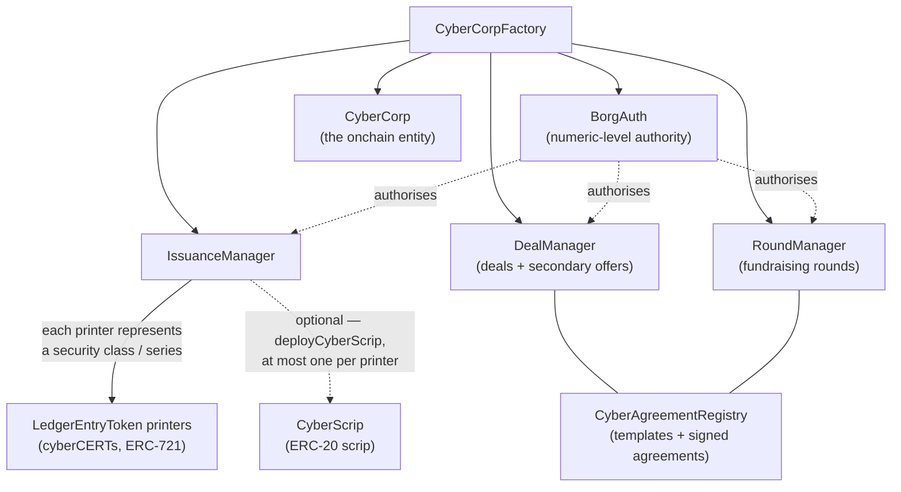

# Core contracts

Contract roles, as implemented in
[`cybercorps-contracts`](https://github.com/MetaLex-Tech/cybercorps-contracts)
(`develop`). Each core contract carries its own `DEPLOY_VERSION` constant
(currently `"4"` for most, `"4.1"` for IssuanceManager, `"4.0.1"` for
DealManager) — see the individual pages.

| Contract | Role |
|---|---|
| [**CyberCorp**](contracts/CyberCorp.md) | The onchain entity. Stores the company name, type, jurisdiction, contact details, dispute-resolution default, officers, escrowed officer signatures, an optional corp-level extension, and the addresses of the IssuanceManager / DealManager / RoundManager. UUPS-upgradeable. |
| [**CyberCorpFactory**](factories.md) | Deploys a cyberCORP and its full suite (BorgAuth, IssuanceManager, DealManager, RoundManager) in one call. |
| [**IssuanceManager**](contracts/IssuanceManager.md) | Issuance authority. Creates LedgerEntryToken printers, mints/assigns cyberCERTs, registers security-class designations, deploys CyberScrip, runs scripification and de-scripification, manages recertification approvals, and effectuates secondary-trade ownership changes. |
| [**LedgerEntryToken**](contracts/LedgerEntryToken.md) | ERC-721 of cyberCERTs (Ledger Entry Tokens). Formerly named CyberCertPrinter; one printer per security series. Mutated by its IssuanceManager (or BorgAuth admins for administrative functions). |
| [**CyberScrip**](contracts/CyberScrip.md) | ERC-20 fungible form of a security, deployed per LedgerEntryToken printer. USDC-style compliance powers (force transfer, force burn, freeze) with one-way disable toggles. |
| [**CyberShares**](contracts/CyberShares.md) | An ERC-20 share token with certificate-formation logic. Partly in-progress — see the page. |
| [**DealManager**](contracts/DealManager.md) | Deal lifecycle: propose, sign, finalise, void/revoke — plus the secondary-trading venue (post/accept/cancel offers, settlement escrows, exemption pathways). Built on the agreement registry. |
| [**RoundManager**](contracts/RoundManager.md) | Multi-investor fundraising rounds: create, submit EOIs, allocate, reject/recall, close. |
| [**LeXscroWLite**](contracts/LeXscroWLite.md) | The escrow layer used at deal/round close. Implemented as the `LexScrowStorage` library shared by DealManager and RoundManager — see the page. |
| [**CyberAgreementRegistry**](contracts/CyberAgreementRegistry.md) | Onchain registry of agreement templates and executed, multi-party-signed contracts, with signing delegation and void-request tracking. |
| [**SafeCertificateConverter**](contracts/SafeCertificateConverter.md) | Computes a SAFE→equity conversion plan from round data. **Currently a stub.** |
| [**LexChex / LeXcheXBadge**](contracts/LexChex.md) | ERC-5484 soulbound credentials: the legacy LeXcheX accreditation NFT and the unified LeXcheXBadge credential registry. |
| [**CertificateUriBuilder**](contracts/CertificateUriBuilder.md) | Builds the onchain JSON + SVG token URI for cyberCERTs. |

See [Factories](factories.md) for the specialised factories (PumpCorp,
MetaDAO, ParentCo).
