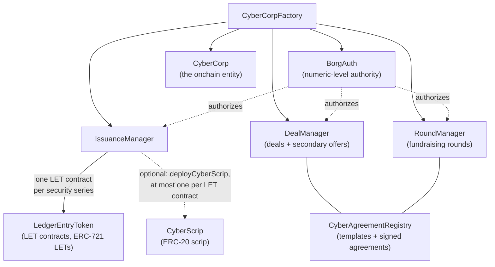

# Core contracts

Each company-owned contract carries a `DEPLOY_VERSION` constant. In the
`develop` source of
[`cybercorps-contracts`](https://github.com/MetaLex-Tech/cybercorps-contracts)
all six (CyberCorp, IssuanceManager, DealManager, RoundManager,
LedgerEntryToken, CyberScrip) report `"5"`, the version deployed on
Ethereum, Base and Arbitrum. New companies are created on v5. An existing
company runs the version it was created with (`"3"`, `"4"` or `"4.1"`)
until its owner upgrades it, so read `DEPLOY_VERSION()` on the instance
before choosing an ABI. See [Upgrade model](upgrade-model.md).

```mermaid
flowchart TD
    F["CyberCorpFactory"] --> AUTH["BorgAuth<br/>(numeric-level authority)"]
    F --> CORP["CyberCorp<br/>(the onchain entity)"]
    F --> IM["IssuanceManager"]
    F --> DM["DealManager<br/>(deals + secondary offers)"]
    F --> RM["RoundManager<br/>(fundraising rounds)"]
    IM -- "one LET contract<br/>per security series" --> LET["LedgerEntryToken<br/>(LET contracts, ERC-721 LETs)"]
    IM -. "optional: deployCyberScrip,<br/>at most one per LET contract" .-> SCRIP["CyberScrip<br/>(ERC-20 scrip)"]
    DM --- REG["CyberAgreementRegistry<br/>(templates + signed agreements)"]
    RM --- REG
    AUTH -. "authorizes" .-> IM
    AUTH -. "authorizes" .-> DM
    AUTH -. "authorizes" .-> RM
```

| Contract | Role |
|---|---|
| [**CyberCorp**](contracts/CyberCorp.md) | The onchain entity. Stores the company's name, type, jurisdiction, contact details, default dispute resolution, officers, escrowed officer signatures, an optional corp-level extension, and the addresses of its IssuanceManager, DealManager and RoundManager. UUPS-upgradeable. |
| [**CyberCorpFactory**](factories.md) | Deploys a cyberCORP and its suite (BorgAuth, IssuanceManager, DealManager, RoundManager) in one call. |
| [**IssuanceManager**](contracts/IssuanceManager.md) | The issuance authority. Creates LET contracts, mints and assigns Ledger Entry Tokens (LETs), registers security classes, deploys CyberScrip, runs scripification and de-scripification, manages recertification approvals, settles the ownership change of secondary trades, and voids emptied LETs. |
| [**LedgerEntryToken**](contracts/LedgerEntryToken.md) | The LET contract: an ERC-721 that mints the LETs of one security series. Tracks possession and the holder of record separately, with a transfer gate for each. Its IssuanceManager mutates it, and BorgAuth admins call its administrative functions directly. |
| [**CyberScrip**](contracts/CyberScrip.md) | The ERC-20 scrip of one LET contract. USDC-style compliance powers (force transfer, force burn, freeze), each with a one-way disable switch. |
| [**CyberShares**](contracts/CyberShares.md) | An ERC-20 share token with certificate-formation logic. Partly implemented; see its page. |
| [**DealManager**](contracts/DealManager.md) | Primary deals (propose, sign, finalize, void, revoke) and the secondary-trading venue (post, accept and cancel offers, settlement escrows, exemption pathways). Built on the agreement registry. |
| [**RoundManager**](contracts/RoundManager.md) | Multi-investor fundraising rounds: create, submit EOIs, allocate, reject or recall, close. |
| [**LeXscroWLite**](contracts/LeXscroWLite.md) | The escrow used when deals and rounds close: the `LexScrowStorage` library that DealManager and RoundManager share. |
| [**CyberAgreementRegistry**](contracts/CyberAgreementRegistry.md) | Onchain registry of agreement templates and executed multi-party agreements, with signing delegation and void-request tracking. |
| [**SafeCertificateConverter**](contracts/SafeCertificateConverter.md) | Computes a SAFE-to-equity conversion plan from round data. A stub that returns an empty plan. |
| [**LexChex / LeXcheXBadge**](contracts/LexChex.md) | ERC-5484 soulbound credentials: the LeXcheX accreditation NFT and the LeXcheXBadge fact-keyed credential registry. |
| [**CertificateUriBuilder**](contracts/CertificateUriBuilder.md) | Builds the onchain JSON and SVG token URI of every LET, with the SVG drawn by a separate image-builder contract. |

[Factories](factories.md) covers the specialised factories (PumpCorp,
MetaDAO, ParentCo).
