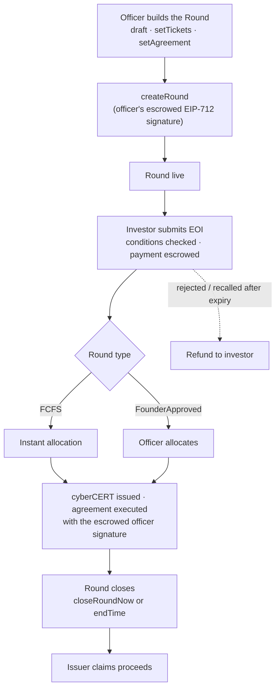

# Tutorial: Run a cyberRAISE round

In this tutorial you create a SAFE round on a cyberCORP's `RoundManager`,
take an investor's Expression of Interest, allocate it, and close the round.

> Code here is **illustrative of the flow**, using the real signatures and
> structs from `cybercorps-contracts` (`develop`). The `Round` and `EOI`
> structs are large — check the source for every field.

The flow at a glance:



## Prerequisites

A cyberCORP from [Tutorial 1](incorporate-a-cybercorp.md). You need its
`roundManager` address and an officer key.

## 1. Build the round

A round is a `Round` struct
([`RoundLib.sol`](https://github.com/MetaLex-Tech/cybercorps-contracts/blob/develop/src/libs/RoundLib.sol)).
Build it with the `RoundLib` builder — `draft()`, then `setTickets`, then
`setAgreement`:

```solidity
import {RoundLib, Round, RoundType} from "src/libs/RoundLib.sol";
import {SecuritySeries} from "src/CyberCorpConstants.sol";
using RoundLib for Round;

Round memory round = RoundLib.draft()
    .setTickets(
        SecuritySeries.NA,        // seriesType
        RoundType.FounderApproved,// FCFS or FounderApproved
        false,                    // publicRound
        true,                     // allowTimedOffers
        false,                    // restrictEndTimeReduction
        2_000_000e18,             // raiseCap   (USD, 18 decimals)
        25_000e18,                // minTicket
        500_000e18,               // maxTicket
        USDC,                     // paymentToken
        1e18,                     // pricePerUnit (USD, 18 decimals)
        20_000_000e18,            // valuation
        block.timestamp,          // startTime
        block.timestamp + 30 days // endTime
    )
    .setAgreement(
        TEMPLATE_ID,              // agreement template id
        officer,                  // authorityOfficer
        "Jane Founder",           // officerName
        "Chief Executive Officer",// officerTitle
        legalDetails,             // string[] (per cert printer)
        roundPartyValues,         // string[]
        extensionData,            // bytes[]  (per cert printer)
        conditions,               // address[] of ICondition gates
        escrowedSignature         // bytes — officer's escrowed signature
    );
```

`RoundType.FCFS` accepts EOIs first-come; `RoundType.FounderApproved`
requires the officer to allocate each one.

The `escrowedSignature` is the `authorityOfficer`'s EIP-712 signature over
the round's economic parameters (the `EscrowedSignatureData` struct in
[`RoundManagerStorage.sol`](https://github.com/MetaLex-Tech/cybercorps-contracts/blob/develop/src/storage/RoundManagerStorage.sol)).
`createRound` recomputes the hash from the draft and reverts
`InvalidEscrowedSignature` if it does not verify.

## 2. Create the round

`createRound` also creates a cert printer (`LedgerEntryToken`) for each
`CyberCertData` entry you pass.

```solidity
import {CyberCertData} from "src/storage/RoundManagerStorage.sol";
import {SecurityClass} from "src/CyberCorpConstants.sol";

CyberCertData[] memory certData = new CyberCertData[](1);
certData[0] = CyberCertData({
    name:           "SAFE",
    symbol:         "ACME-SAFE",
    uri:            "ipfs://acme-safe-art",
    securityClass:  SecurityClass.SAFE,
    securitySeries: SecuritySeries.NA,
    extension:      SAFE_EXTENSION_ADDR,
    seriesData:     "",       // series-scope payload encoded by `extension`
    defaultLegend:  legend
});

bytes32 roundId = IRoundManager(roundManager).createRound(round, certData);
```

## 3. Investor submits an EOI

The investor signs the round's agreement (EIP-712) offchain and submits an
`EOI` struct ([`RoundManagerStorage.sol`](https://github.com/MetaLex-Tech/cybercorps-contracts/blob/develop/src/storage/RoundManagerStorage.sol)):

```solidity
import {EOI} from "src/storage/RoundManagerStorage.sol";

EOI memory eoi = EOI({
    name:          "Alice Investor LLC",
    investorType:  "entity",
    jurisdiction:  "USA",
    contact:       "alice@example.com",
    minAmount:     100_000e6,    // in payment-token decimals
    maxAmount:     100_000e6,
    expiry:        block.timestamp + 14 days,
    naturalPerson: false,
    lexchexDetails: lexchexDetails    // see LexChexDetails in the source
});

(bytes32 agreementId, uint256 tokenId) = IRoundManager(roundManager).submitEOI(
    roundId,
    eoi,
    globalValues,     // string[]
    partyValues,      // string[]
    investorSignature,// bytes (EIP-712)
    salt,             // uint256
    eoiConditions,    // address[]
    secretHash        // bytes32
);
```

## 4. Allocate the EOI

The officer allocates an accepted EOI. `allocate` prices the ticket, mints a
SAFE cyberCERT per printer, attaches the officer's escrowed signature and an
endorsement, and refunds any rounding dust.

```solidity
uint256 certTokenId = IRoundManager(roundManager).allocate(
    agreementId,
    100_000e6        // allocatedAmount, in payment-token decimals
);
```

## 5. Close the round

```solidity
IRoundManager(roundManager).closeRoundNow(roundId);
```

## What you just did

* Built and created a SAFE round, which also created its cert printer.
* Took a signed EOI, allocated it, and minted the investor's SAFE cyberCERT.
* Closed the round.

## Next

* [Scripify and settle a secondary trade](scripify-and-settle.md).
* Reference: [RoundManager](../reference/contracts/RoundManager.md).
