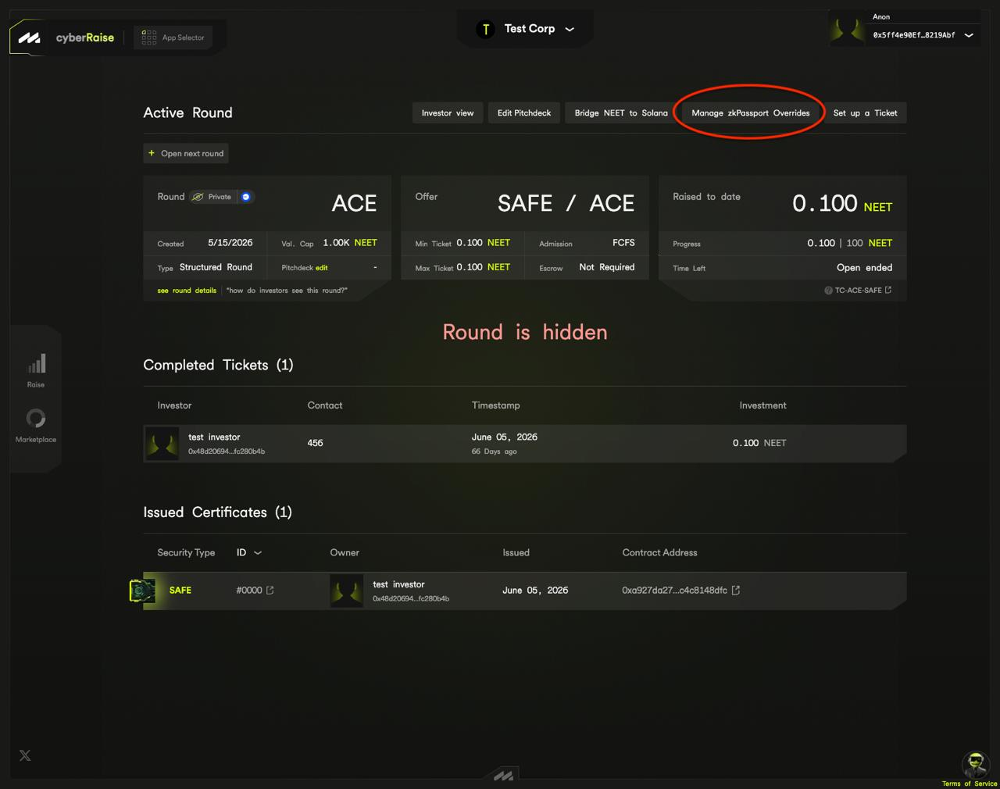
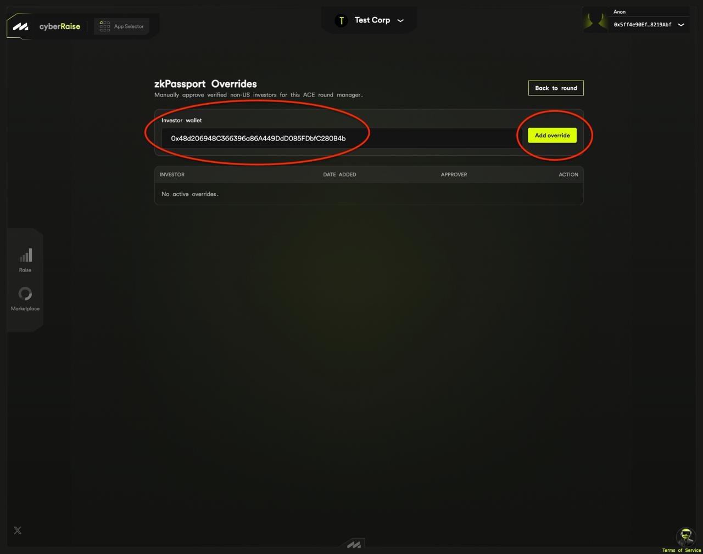

# ACE

**ACE** is MetaLeX's fundraising product for token communities. An ACE raise
sells a **tokenized SAFE** priced and paid in the project's community token,
so members of the community become equity holders of the company behind the
project.

ACE runs inside [cyberRAISE](cyberraise.md) (`cyberraise.metalex.tech`),
and links to `ace.metalex.tech` redirect there. ACE rounds run on **Base**.

## What sets an ACE raise apart

* The raise is **denominated in a community token** instead of USDC. The
  token can be a Base **ERC-20** (the default) or a **Solana token**, in
  which case funding involves bridging it between Solana and Base.
* The deal paper is an **ACE SAFE**, in a Reg D and a Reg S variant.

Round types, admission modes and escrow work as in any other cyberRAISE
round.

## Set up an ACE raise

You create an ACE raise through the normal cyberRAISE flow: create your
cyberCORP if you don't have one, initialize the round (dates, ticket size,
funding cap, round type, admission mode), and pick **ACE SAFE (Reg D)** or
**ACE SAFE (Reg S)** as the ticket type. The final **SAFE Setup** step is
specific to ACE:

1. **Identify your token.** Choose the **token type**, ERC-20 or Solana
   token (Solana bridging is supported only on Base), and paste the token
   address or Solana mint address. The token's name, ticker and image load
   automatically.
2. **Set the terms.** Enter the **entity valuation** as a token amount and
   the **current token percentage**, choose a dispute-resolution method, and
   add any optional **custom provisions**. The raise cap, minimum and
   maximum investment, company identity and payable address carry over
   read-only from the earlier steps.
3. **Sign.** Signing the agreement preview is a free signature. A raise that
   also creates the company then asks for a second free signature, **Sign to
   approve round**, which approves the company's deployment details and the
   token. ERC-20 and Solana-token raises both ask for it.
4. **Review the summary.** The *New ACE Round Summary* shows the network,
   round type, admission mode, ticket size, funding cap, valuation, dates
   and dispute resolution, and **Confirm & Submit** deploys the round
   onchain.

Drafts save automatically as you fill in the form, and the header icons
save the draft to the cloud and share a resumable link. A **support chat
link** ("Need help?") stays on the form throughout.

A live ACE round's header has the usual management actions plus **Bridge
\<token\> to Solana** and **Set up a Ticket**, which starts an individually
negotiated ticket (Reg D or Reg S). It also has **Manage zkPassport
Overrides**, which appears on any round gated to non-U.S. persons, ACE or
not.

ACE tickets use the same ticket form as other cyberRAISE tickets. A new ACE
raise creates a v5 company, where the ticket form first has you choose each
security's class and set up its terms and LET contract. On a v3 or v4
company the offer reuses or creates its LET contracts itself.
[Set up a ticket for an existing company](cyberraise.md#set-up-a-ticket-for-an-existing-company)
gives the steps and what happens on other versions.

### zkPassport overrides

On a round restricted to non-U.S. persons, the founder can manually approve
a verified investor as an exception. This works on any round that carries
the non-U.S. condition, including a USDC-denominated Regulation S round.

To find it, open the round from your rounds list so you are on its
**management view** (the founder console with the Round, Offer and Raised
summary cards, as opposed to the public investor page), with your owner
wallet connected. The action bar at the top, the row with **Investor view**
and **Edit Pitchdeck**, shows **Manage zkPassport Overrides**. On an ACE
round it sits between **Bridge \<token\> to Solana** and **Set up a
Ticket**.

The button is hidden unless the round carries the non-U.S. condition and
the connected wallet owns the company. It is also hidden on ACE rounds that
use the first version of the non-U.S. condition contract, which has no
override function.

On the overrides page, enter the **investor wallet** and **Add override**.
Adding and removing an override are both onchain transactions. The page
lists active overrides with when and by whom each was added.

An override is granted against your company's round manager, so it covers
more than the round you opened it from. It satisfies the non-U.S. check on
**every** round of yours that shares the condition. Grant one only to an
investor you would except from all of them.

## Invest in an ACE round

1. **Open the round.** The detail page shows the company, the security, the
   status (open, funded or closed), an elevator pitch, the founder's
   profile and any resource documents. A "Help with sharing your signal?"
   prompt offers **Stay Anon** or **Amplify**; opting in lists you among
   the round's key investors.
2. **Verify eligibility.** A round restricted to non-U.S. persons asks for
   a **zkPassport** verification: a passport check in the zkPassport mobile
   app that proves you are not a U.S. national and not from a sanctioned
   country without revealing your identity. Submitting the proof is an
   onchain transaction, so you need a little ETH on the round's network
   (typically under \$1).
3. **Invest.** The invest flow opens with a notice that this is a legally
   binding investment issued as a tokenized SAFE. You give your name,
   contact, investor type (and jurisdiction of formation for an entity) and
   the amount. In a first-come round your investment is accepted and the
   LET mints at once; in a founder-approval round your funds wait in
   escrow until the founder decides.
4. **Bridge if needed.** A Solana-token ACE round is funded in a
   Base-wrapped version of the token. On these rounds, clicking connect
   first shows a short preface: you connect a wallet on the round's EVM
   chain to continue, and you connect your **Solana wallet** separately
   inside the investment form. If your Base balance is short, an in-page
   bridge card walks you through bridging (see
   [the Solana bridge](#the-solana-bridge)).
5. **Track your holdings.** Your ACE SAFEs appear in the cyberRAISE
   **Portfolio** with your other investments.

## The Solana bridge

A Solana-token ACE raise runs on Base, so the community token crosses
between the chains over the **Base ↔ Solana native bridge**. Separate
*Bridge to Solana* and *Bridge from Solana* pages handle each direction (a
header toggle switches between them), and the invest form embeds the
Solana-to-Base flow for investors whose Base balance is short.

You need both wallets connected, Solana and EVM, and about 0.01 SOL for
account rent and relay fees on top of the token you are bridging. Each
bridge action asks you to accept the Terms of Service before signing.

**Solana → Base** takes one signature. A single Solana transaction sends
the token into the bridge and pays for relay, and the page then watches
Base until the wrapped token reaches your wallet. It allows up to ten
minutes, and the transfer usually takes much less.

**Base → Solana** takes three actions spread over the bridge's validation
cycle:

1. **Bridge.** A Base transaction locks the wrapped token for your Solana
   address. The page writes the transaction hash into its URL, so you can
   close the tab and resume later, and a "past transfers" list reopens any
   transfer still in flight.
2. **Prove.** After validators post the checkpoint to Solana (about 20
   minutes), a Solana transaction proves your message.
3. **Claim.** A final Solana transaction releases the token and creates
   your token account if needed.

Neither page charges a protocol fee. You pay Base gas, Solana fees and
rent.

## Under the hood

ACE uses the protocol's **ACE / PumpCorp** path. An ACE raise deploys a
cyberCORP configured for a token-to-equity offering and issues **ACE SAFE**
Ledger Entry Tokens (LETs), a SAFE variant whose security series is `ACE`.
The non-U.S. eligibility check is an onchain **condition**, the
zkPassport-backed `NonUSNationalityCondition`, and a founder override
writes to that condition contract.

* The offering type at the protocol level:
  [Deploy a PumpCorp for ACE](../how-to/deploy-pumpcorp-ace.md) and
  [Factories](../reference/factories.md).
* How eligibility gating works: [Conditions](../reference/conditions.md)
  and [Compliance architecture](../explanation/compliance-architecture.md).
* What an ACE SAFE is as a security:
  [Security types](../reference/security-types.md).

## Good to know

* **The eligibility check keeps your identity private.** The non-U.S. proof
  shows your status without revealing who you are; recording it onchain
  costs a little gas.
* **An ACE SAFE is a security.** It is a claim on the company, recorded as
  a LET.
* **MetaLeX never holds your funds.** ACE uses the same onchain escrow as
  the rest of cyberRAISE.
