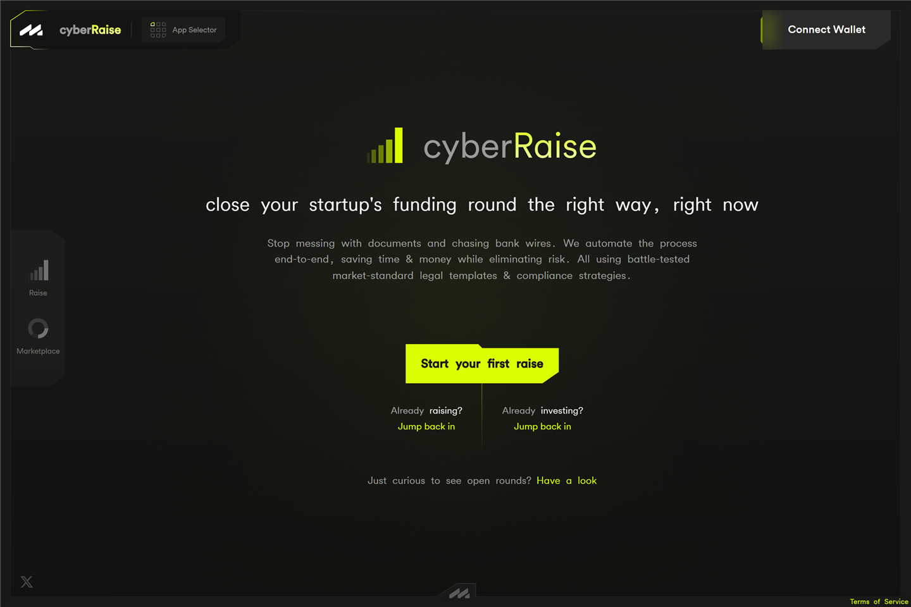
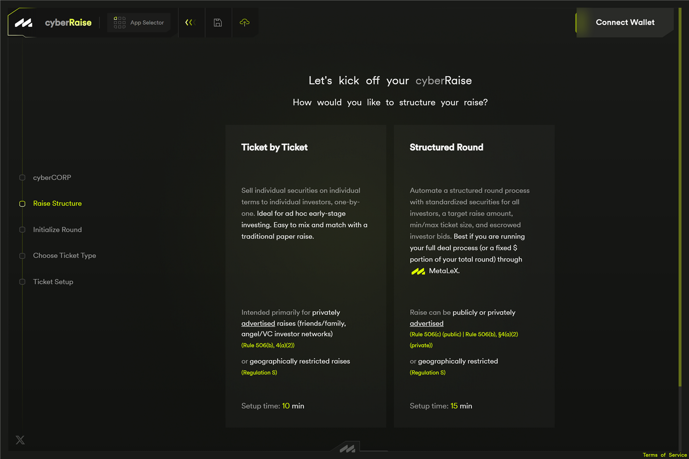
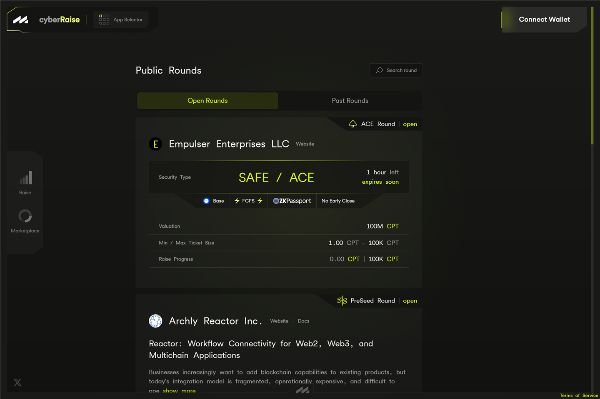
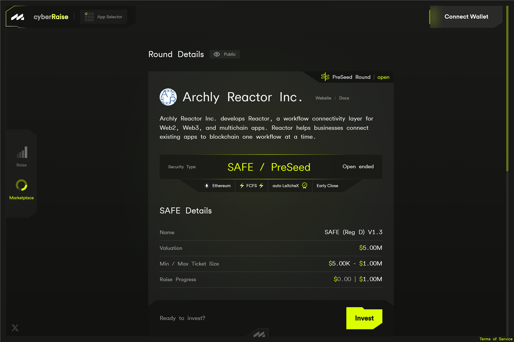
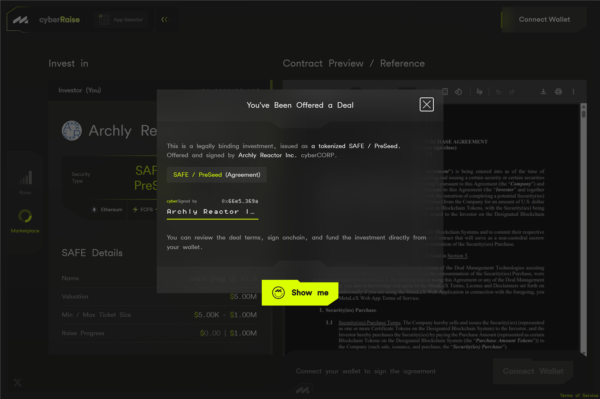

# cyberRAISE — raising and investing

**cyberRAISE** (`cyberraise.metalex.tech`) is the fundraising app. Companies
run rounds here; investors invest here. It is separate from the
[cyberCORPs app](mainframe.md) — **rounds are created and configured in
cyberRAISE.**

This page has two halves: issuers first, then investors.

---

## For issuers: running a raise

Starting a raise (desktop-only) begins with one choice: **how would you
like to structure your raise?**

If you don't have a cyberCORP yet, the flow first walks you through
creating one (the same Network → Legal Identity → Public Profile wizard as
the cyberCORPs app) and then straight into the raise — company and round
are deployed together at the end.

### Ticket-by-Ticket vs. Structured Round

* **Ticket by Ticket** — you sell securities to investors **one at a time**,
  each on its own terms. There is no shared target or min/max; each “ticket”
  is an individually configured deal. Suited to privately advertised raises
  or geographically restricted (Regulation S) raises.
* **Structured Round** — an automated round with **standardized terms for
  all investors**: a target raise, min/max ticket sizes, and escrowed
  investor bids. Can be public or private.

### Configuring a structured round

A structured round is a three-step wizard. Progress saves as you go, and
the header icons let you **save your progress** locally or **save to the
cloud** for a shareable link.

**Step 1 — Initialize the round.** The form collects, in order:

* **Round stage** — the security series (e.g. Pre-Seed), auto-incrementing
  from your last round.
* **Round type** — **Privately Advertised** (invite-only), **Publicly
  Advertised** (listed on the public-rounds Marketplace; investors must be
  accredited via [LeXcheX](lexchex.md)), or **Publicly or Privately
  Advertised — U.S. Excluded** (a Regulation S round: participants prove
  non-U.S.-person status with a passport scan in the zkPassport mobile app,
  unless you manually approve them as an exception — the how-to, and a
  caution about override scope, is
  [zkPassport overrides](ace.md#zkpassport-overrides)). The Reg S option is
  not available on every network.
* **Admission mode** — **First-Come, First-Served** (offers are accepted
  automatically in order, funds escrowed immediately, until the round
  fills) or **Investors Bid / Founders Approve** (you review each bidder —
  their profile, socials, reputation — and choose who gets in and for how
  much).
* **Ticket size** — the minimum and maximum any one investor can invest.
* **Funding target/cap** — a hard cap; the round ends automatically when
  hit.
* **Start and end dates** — or tick **Open ended** to run without an end
  date. (An open-ended founder-approval round automatically makes all
  offers exploding.)
* **Exploding offers** (founder-approval rounds only) — optionally let
  investors send time-limited offers.
* **Closing conditions** — **Allow early close** lets you close the round
  before its scheduled end date or once fully funded. Investors see a
  “may close early” note on the round.
* **Pitch deck** — an optional description and up to three uploaded files.

**Step 2 — Choose the ticket type.** Pick the deal paper: SAFE, SAFT,
SAFTE, or SAFE + Token Warrant, each in Reg D and Reg S variants. If
MetaLeX has approved a **custom template** for you, it appears here as an
extra card; there is also a *Custom* option where you enter a template ID
agreed with MetaLeX (checked against the onchain registry). If the series
already has an existing line, you add a **sub-series label** (e.g. “2” to
run Series A-2) so the new round's onchain identifiers stay unique.

**Step 3 — Set up the agreement.** Configure the standard agreement
investors will sign. Submitting opens a **round summary** — network, round
type, admission mode, ticket size, funding cap, valuation, dates, dispute
resolution — and **Confirm & Submit** deploys the round onchain.

Filling the forms is free. MetaLeX applies a **0.3% fee to funds claimed by
the issuer**; investors pay nothing, and no fees are charged on rejected
bids.

> **Under the hood.** A round is created on your cyberCORP's
> [`RoundManager`](../reference/contracts/RoundManager.md). The contract-
> level walkthrough — building the round, taking EOIs, allocating, and
> closing — is the tutorial
> [Run a cyberRAISE round](../tutorials/run-a-cyberraise-round.md).

### Managing your rounds

The **rounds list** for your company shows active and closed rounds, each
with its series, public/private label, structure, raised-vs-target progress,
and a flag when EOIs are waiting for you.

Opening a round shows the **management view** — three summary cards (Round,
Offer, Raised) and, for founder-approval rounds, tables of:

* **Pending Offers** — EOIs awaiting your decision,
* **Exploding Offers** — time-limited offers,
* **Completed Offers** — EOIs you've allocated,
* **Issued Certificates** — the round's issued cyberCERTs, and
* a checkbox to reveal **expired and rejected offers**.

(First-come rounds need no review, so they show completed tickets and
certificates.)

From here you can switch to the **Investor view**, **Edit Pitchdeck**
(requires Authenticating), and — if you enabled early close — **Close
Round**. A round that hasn't raised anything yet can also be **hidden**,
which permanently removes it from public view.

On a **ticket-by-ticket** round, the management view lists pending and
completed tickets, and **Set up a Ticket** starts a new individually
configured deal (a dropdown, if your round has more than one agreement
template).

### Reviewing an EOI

**Review** on a pending offer opens the EOI: the investor's profile, bio,
the offer (min–max amount, their message, any expiry), the agreement
details, their trading activity, and their LeXcheX accreditation status.
You then either:

* **Allocate** — for a min–max offer, enter an amount within the range —
  and confirm the onchain transaction that accepts them, or
* **Reject** — confirm the onchain transaction that declines the offer.

> **Under the hood.** Allocating an EOI releases the investor's escrowed
> funds to the company and mints their security as a cyberCERT through the
> [`IssuanceManager`](../reference/contracts/IssuanceManager.md). The legal
> agreement each party signs is anchored in the
> [`CyberAgreementRegistry`](../reference/contracts/CyberAgreementRegistry.md).

### Closing a round

**Close Round** is a single transaction. It stops new EOIs immediately; you
can still review and allocate any EOIs already submitted. When a round hits
its cap, the app prompts you to **initialize the next round**.

---

## For investors: investing in a round

### Find a round

Browse **Public Rounds** (the marketplace) — searchable, split into **Open
Rounds** and **Past Rounds**. Only publicly advertised rounds appear here.
Private rounds are reached through a link the issuer shares with you.

Opening a round shows its detail page: the company, the security and
series, the round's terms and progress, its eligibility badges, and the
**Invest** or **Express Interest** call to action.

If you don't hold a valid [LeXcheX](lexchex.md) accreditation, the list
shows an **“I am investing as:”** card — toggle between *an individual* and
*a legal entity* — explaining the paths to accreditation: LeXcheX
verification, investing above a threshold (\$200k+ individual / \$1M+
entity), or manual verification by a MetaLeX attorney. You'll need one of
these for public U.S. rounds; **Regulation S rounds** instead require a
non-U.S. passport scan via zkPassport.

### Express interest

The *Express Interest* screen (titled *Invest in …* on first-come rounds)
has the form on one side and the legal agreement on the other. On first
visit it opens with a plain-language notice that this is a legally binding
investment, issued as a tokenized security and countersigned by the
company.

You provide:

* **Your investor details** — name, contact, investor type, and (if not an
  individual) jurisdiction of formation. These pre-fill from your
  [profile](profile.md) and can be encrypted — the first time you submit,
  a **privacy settings** dialog opens so you choose what is encrypted.
* **Investment amount** — a fixed amount or (in founder-approval rounds
  with a range) a min/max range, within the round's ticket limits and your
  wallet balance.
* an optional **message** to the founder (founder-approval rounds), and
  optionally your own **exploding offer** expiry (24/48/72 hours or a
  custom date).

If the round requires accreditation, you either confirm an existing LeXcheX
credential or mint one here; a Reg S round asks for zkPassport verification
instead.

Then:

1. **Sign the agreement** — a free signature.
2. **Approve the payment token** if needed — an onchain transaction.
3. **Submit** — the onchain transaction that places your EOI.

In a founder-approval round your maximum amount is held in escrow until the
founder accepts your offer or the round closes — any unused remainder is
returned. In a first-come round, accepted investments mint the certificate
without delay. If the issuer enabled early close, the round may end before
its scheduled end date.

> **Under the hood.** Your EOI is an EIP-712-signed offer recorded on the
> [`RoundManager`](../reference/contracts/RoundManager.md); your funds sit
> in an onchain escrow until the round resolves. The security you receive is
> a **cyberCERT** — a real entry on the company's register, not a receipt.
> See [The dual-token model](../explanation/dual-token-model.md).

### Track it in your Portfolio

**My Portfolio** shows your **pending investments** (EOIs awaiting a
decision, with their expiry), your **closed investments**, the securities
you hold (**Owned Securities**), and any scrip (**Owned Scrips**) —
checkboxes reveal voided, expired, and rejected entries. If an EOI
expires unanswered, **Recall** returns your escrowed funds. From the
portfolio you can also scripify a certificate, transfer certificates and
scrip, and request re-certification — those actions are walked through in
[For holders: your securities](holders.md).

## The MetaLeX console (staff)

MetaLeX staff operate a read-only **console** (at `/console` on any of the
app subdomains, gated to an admin allowlist). Its **Raises** explorer lists
every raise on the platform — structured rounds and ticket-by-ticket deals,
across every cyberCORP and chain — with search, filters, and sortable
columns (cyberCORP, round, type, chain, created, participations, progress,
status). Opening a raise shows its full terms, documents, and
participations, including each participation's **signed legal document**
with its parties and signature status. A **cyberCERTs** explorer lists
every issued certificate across the platform, grouped by company. A
**Round templates** page is where staff register and approve the custom
round templates that then appear in an issuer's ticket-type step.

Nothing in the console mutates a raise — it is an inspection surface.

## Good to know

* **MetaLeX never holds your money.** Funds in flight are in an onchain
  escrow with no override — see
  [The role of MetaLeX](../explanation/role-of-metalex.md).
* **Signing the agreement is free; approving the token and submitting are
  transactions.**
* **Your security is real and onchain** — a cyberCERT is the actual register
  entry for your stake.
