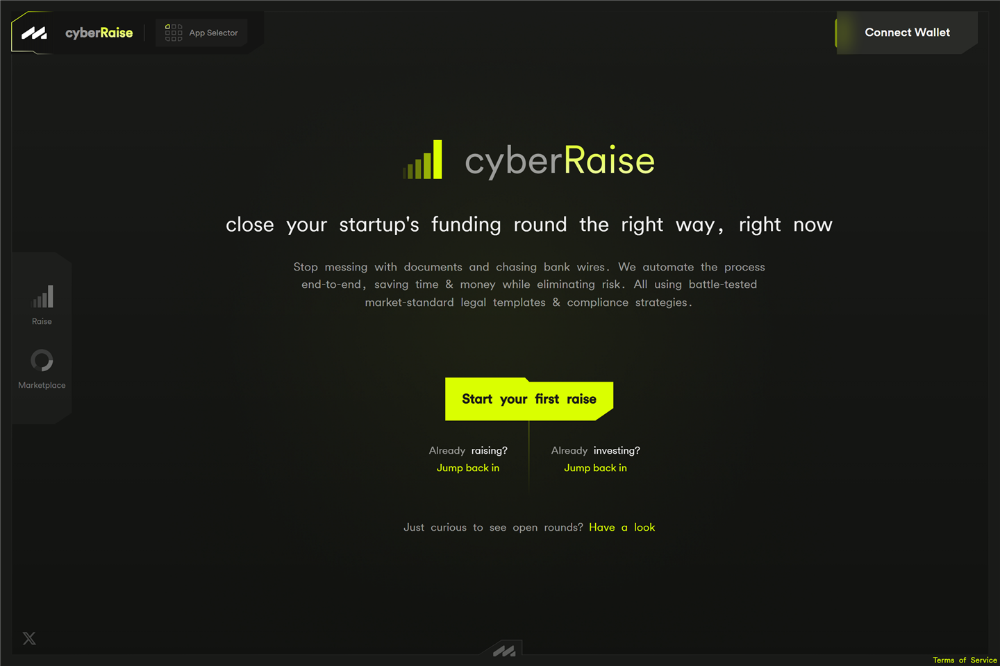
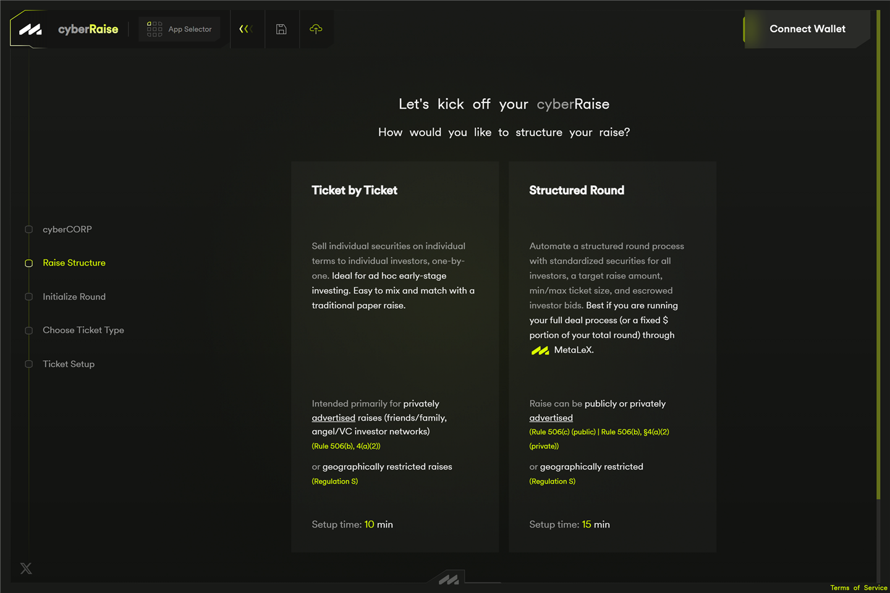
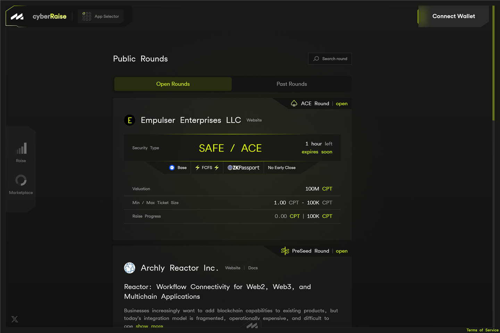
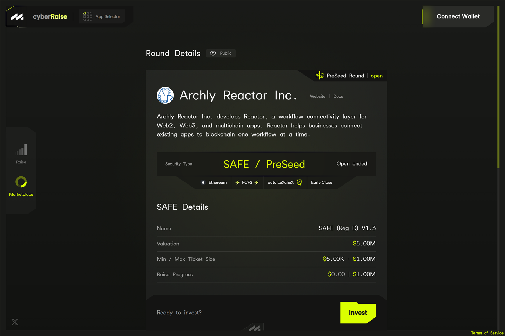
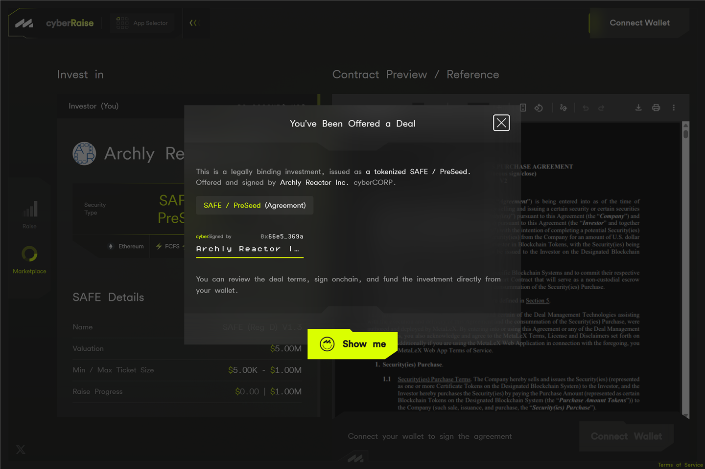

# cyberRAISE

**cyberRAISE** (`cyberraise.metalex.tech`) is the fundraising app:
companies create and run their rounds here, and investors invest. The
cyberCORPs app's **cyberRaise** sidebar item opens it.

## Run a raise

A new raise first asks **how would you like to structure your raise?**
Without a cyberCORP, the flow creates one first, with the same Network,
Legal Identity and Public Profile steps as the cyberCORPs app, and deploys
the company and the round together at the end. A raise needs a legally
formed company; the cyberCORPs app can [form an LLC or C-Corp](formation.md)
for you.

A setup you resume, or open from a saved draft link, keeps the company it
was started for. If a saved draft lacks the company, the round or the
template, the form shows **Complete your raise setup**, and **Continue
setup** returns you to that step with your other answers kept.

### Plan the financing first (optional)

Above the two structure choices, **Want help choosing your financing?**
links to **Open my financing plans**. A financing plan (*Your financing
plan*) is a guided questionnaire in four parts (*Issuer and financing
direction*, *Existing commitments and token plans*, *Investors and deal
process*, *Terms and preparation*) that ends with a preliminary financing
direction and the items still open **Before detailed setup** and **Before
execution**. GAIBE, MetaLeX's AI agent, can walk you through each part
(**Discuss with GAIBE**); a change it proposes to your answers applies only
when you accept it. Plans are private to your account, need you signed in,
and resume on any device. **Save and continue my financing plan** in the
entity guide of the formation flow carries its relevant answers over for
you to confirm.

**Save and prepare a fresh financing draft** opens a new raise setup, where
you choose the company (*Which company will use this financing plan?*) and
confirm it is the issuer the plan describes. **Use reviewed round
structure** copies one answer, ticket by ticket or structured round, into
the setup; you set everything else in the normal steps. The plan is
guidance and gives no legal clearance.

### Choose ticket by ticket or a structured round

* **Ticket by Ticket** sells securities to investors one at a time, each on
  its own terms. There is no shared target and no minimum or maximum; each
  ticket is an individually configured deal. It suits privately advertised
  raises and geographically restricted (Regulation S) raises.
* **Structured Round** runs an automated round on the same terms for every
  investor, with a target raise, minimum and maximum ticket sizes, and
  escrowed investor bids. It can be public or private.

### Configure a structured round

The wizard has three steps. Progress saves as you go, and the header icons
**save your progress** locally or **save to the cloud** for a shareable
link.

**Step 1, initialize the round.** The form asks, in order, for:

* **Round stage**, the security series (e.g. Pre-Seed), which increments
  from your last round.
* **Round type**:
  * **Privately Advertised - U.S.** keeps the round invite-only.
  * **Publicly Advertised - U.S.** lists the round on the public-rounds
    Marketplace, and every investor must be accredited through
    [LeXcheX](lexchex.md).
  * **Publicly or Privately Advertised - U.S. Excluded** is a Regulation S
    round. Participants prove they are not U.S. persons with a passport
    scan in the zkPassport mobile app, unless you approve one manually as
    an exception (see [zkPassport overrides](ace.md#zkpassport-overrides),
    which also explains how far an override reaches). This type is offered
    on Ethereum and Base and is marked unsupported on Arbitrum.
* **Admission mode**:
  * **First-Come, First-Served** accepts offers automatically, in order,
    and escrows the funds at once until the round fills.
  * **Investors Bid / Founders Approve** lets you review each bidder
    (profile, socials, reputation) and choose who gets in and for how
    much.
* **Ticket size**, the minimum and maximum one investor can invest.
* **Funding target/cap**, a hard cap. The round ends when it is reached.
* **Start and end dates**, or **Open ended** for no end date. An open-ended
  founder-approval round makes every offer exploding.
* **Exploding offers** (founder-approval rounds only), which lets investors
  send time-limited offers.
* **Closing conditions**. **Allow early close** lets you close the round
  before its end date or once it is fully funded, and investors see a "may
  close early" note on the round.
* **Pitch deck**, an optional description and up to three files.

**Step 2, choose the ticket type.** Pick the deal paper: SAFE, SAFT, SAFTE,
or SAFE + Token Warrant, each in a Reg D and a Reg S variant. Choose the
variant by who invests in the round:

* If any investor in the round is a U.S. person, use the Reg D variant for
  the whole round, including the non-U.S. investors. Non-U.S. investors in a
  Reg D round must also be accredited investors.
* Use the Reg S variant only if no investor in the round is a U.S. person.
* Do not split one round into Reg D tickets and Reg S tickets. In a
  ticket-by-ticket raise you choose the type for each ticket, so apply the
  rule to every ticket in the round.

"U.S. person" has its Regulation S meaning
([Rule 902(k)](https://www.law.cornell.edu/cfr/text/17/230.902)). It
includes anyone who lives in the United States and any corporation or
partnership organized under U.S. law. For an individual the test is
residence, so a U.S. citizen who lives abroad is generally not a U.S.
person.

Investor status is not the only Regulation S condition. Each sale must also
be an offshore transaction: the investor is outside the United States when
they place the order, or the company reasonably believes so. The company
must also make no directed selling efforts in the United States
([Rule 903](https://www.law.cornell.edu/cfr/text/17/230.903)). An order that
an investor places from inside the United States is not an offshore
transaction, even if the investor is not a U.S. person.

The round type from step 1 can settle the variant for you:

| Round type | Ticket types offered |
| --- | --- |
| Publicly Advertised - U.S. | Reg D only. The round relies on Rule 506(c), and non-U.S. investors can invest in it too. |
| Publicly or Privately Advertised - U.S. Excluded | Reg S only. |
| Privately Advertised - U.S. | Reg D and Reg S. Apply the rule above. |

Custom templates approved in the MetaLeX console appear as extra cards here
and in ticket-by-ticket raises, and the round type filters them the same
way. Each card says whether the template was registered for your company or
approved by MetaLeX for any company. The
*Custom* option takes a template name or registry ID agreed with MetaLeX,
which the app checks against the onchain registry. If the series already
has a line, you add a **sub-series label** (e.g. "2" to run Series A-2) so
the new round's onchain identifiers stay unique. If the company already has
a LET contract for the series and deal type, an **Existing cert printer**
field shows it and the round reuses it.

**Step 3, set up the agreement.** Configure the standard agreement
investors will sign. Submitting opens a **round summary** (network, round
type, admission mode, ticket size, funding cap, valuation, dates, dispute
resolution), and **Confirm & Submit** deploys the round onchain.

Signing the round agreement is a free signature. When the company is
created in the same flow, your wallet asks for a second free signature that
approves the company's deployment details, which the agreement signature
does not cover. For an existing company, the app reads which round manager
the company uses, and that contract's version, before you sign and again
before it sends the transaction. If the wallet, the round or the contract
changed in between, it stops with "The wallet, round or contract changed.
Review and sign again." It refuses to send to a round manager that reports
a version the app does not support.

Filling in the forms is free. MetaLeX takes **0.3% of the funds the issuer
claims**; investors pay nothing, and rejected bids are never charged (see
[What it costs](README.md#what-it-costs)).

> **Under the hood.** A round is created on your cyberCORP's
> [`RoundManager`](../reference/contracts/RoundManager.md). The
> contract-level walkthrough (building the round, taking EOIs, allocating
> and closing) is
> [Run a cyberRAISE round](../how-to/run-a-cyberraise-round.md).

### Manage your rounds

The company's **rounds list** shows its active and closed rounds, each with
its series, public or private label, structure, progress against target,
and a flag when EOIs are waiting for you.

Opening a round shows its **management view**: three summary cards (Round,
Offer, Raised) and, for a founder-approval round, tables of **Pending
Offers** (EOIs awaiting your decision), **Exploding Offers** (time-limited
ones), **Completed Offers** (EOIs you have allocated) and **Issued
Certificates** (the LETs the round has issued), with a checkbox that
reveals expired and rejected offers. A first-come round needs no review, so
it shows completed tickets and issued certificates.

The view also offers **Investor view**, **Edit Pitchdeck** (once you are
signed in) and, if you allowed early close, **Close Round**. A round that
has raised nothing can be **hidden**, which removes it from public view
permanently.

A **ticket-by-ticket** round lists its pending and completed tickets, and
**Set up a Ticket** starts a new individually configured deal, with a
dropdown when the round has more than one agreement template. Ticket tables
name each ticket's template, custom templates included.

The rounds list and the management view link to the company's
[public company page](company.md), which anyone can read without a wallet.

### Set up a ticket for an existing company

A ticket for an existing company mints its securities from the company's
LET contracts. How the offer gets those contracts depends on the company's
version (see [v4 and v5 companies](#v4-and-v5-companies)).

**On a v3 or v4 company**, the app reuses the LET contract that matches each
certificate's type, series, legal document and payment token. If none
matches, as on a company's first ticket, the offer creates the LET
contracts in the same transaction as the offer. The company, its deal and
issuance managers and each reused LET contract must all report the same
major version, 3 or 4. A v4 company can report "4" while a manager reports
"4.1". If one of them reports another major version, the app stops before
you sign.

**On a v5 company**, each security in the offer needs a class identity and
active class terms before the ticket can be signed:

1. The form opens **Set up the security for this offer**; **Review security
   class setup** opens it on demand.
2. For each certificate, pick the **Cap table class or series** it belongs
   to, or create one with **New class name**, **Series name** and
   **Governing document reference**, then **Save class identity**.
3. Save, approve and activate the class terms. These steps need a current
   officer wallet of the company, and **Approve class terms with wallet** is
   a free signature.
4. Link a LET contract. Either choose a compatible existing one and **Link
   selected printer**, or **Prepare a new printer** and **Deploy reviewed
   printer**, which is a transaction. If the deployment is interrupted,
   paste its transaction hash and **Check transaction and finish linking**
   instead of deploying again.
5. **Return to ticket and sign** takes you back to the ticket with your
   entries intact.

Saving the class records no position and issues no units. It ties the
tokenized and untokenized positions of that class together in the
[cap table](captable.md).

On any other version the ticket form stays blocked with "This company's
contract version is unknown or unsupported." ACE tickets follow the same
rules. After you sign a ticket, a change to its template, the company, the
network, the class terms, the LET contract or your wallet invalidates the
signature, and the app asks you to review and sign again.

### Allocate or reject an EOI

**Review** on a pending offer opens the EOI: the investor's profile and bio,
the offer (minimum and maximum amount, their message, any expiry), the
agreement details, their trading activity and their LeXcheX accreditation
status. You then either:

* **Allocate**, entering an amount within the range for a minimum-maximum
  offer, and confirm the onchain transaction that accepts them; or
* **Reject**, and confirm the onchain transaction that declines the offer.

An agreement stays with the round manager that finalized it, so allocation
goes to that manager even if the company has since switched to another one.
Before you confirm, the app checks onchain that the manager still holds the
investor's escrow unallocated and runs a version the app supports. If a
check fails (the offer is already allocated, the escrow belongs to another
investor, the version is unsupported), it tells you before you sign and
sends no transaction that would revert.

> **Under the hood.** Allocating an EOI releases the investor's escrowed
> funds to the company and mints their security as a LET through the
> [`IssuanceManager`](../reference/contracts/IssuanceManager.md). Each
> party's legal agreement is anchored in the
> [`CyberAgreementRegistry`](../reference/contracts/CyberAgreementRegistry.md).

### Close a round

**Close Round** is a single transaction. It stops new EOIs at once, and you
can still review and allocate the EOIs already submitted. When a round hits
its cap, the app prompts you to **initialize the next round**.

### Review a term sheet with GAIBE

**Term sheet** in the sidebar, or **Review a term sheet** on the cyberRAISE
home page, opens *Term sheet review*. Upload one financing term sheet as a
PDF of up to about 3 MB, and GAIBE reads it and returns a report:

* counts of **Terms identified**, terms that **Need review**, terms
  **Outside / partial** the cap table model, and **Pages cited**;
* **Core terms**: valuation, liquidation preference, participation,
  anti-dilution, board composition and protective provisions. Each is
  marked *Identified*, *Ambiguous* or *Not found*, with what GAIBE
  extracted, quoted evidence with its page number, and a **MetaLeX fit**
  label for how far the cap table can record it (*Cap table supported*,
  *Partially represented* or *Outside cap table model*);
* **Additional material terms** it found, such as the option pool,
  dividends, pro rata rights or redemption, each with the same fit label.

You can copy the report or download it as Markdown. A review can take a few
minutes. Any signed-in user can run one, up to a daily limit per account.
The PDF and the report are not stored and are not added to a cyberCORP or a
cap table. The page labels the result an AI review that is not legal
advice. A term GAIBE reports as absent may still be unfavorable, and GAIBE
can miss or misread text, so use the report to focus your review with
counsel.

## Invest in a round

### Find a round

**Public Rounds**, the Marketplace, is searchable and split into **Open
Rounds** and **Past Rounds**. Only publicly advertised rounds appear there;
you reach a private round through a link the issuer gives you.

A round's detail page shows the company, the security and series, the
round's terms and progress, its eligibility badges, and the **Invest** or
**Express Interest** button. The terms panel is headed by the round's
security class, for example *SAFE Details*, or *Round Details* when the
class can't be read. Links to a public round page and its express-interest
page carry a preview image, so apps that build link previews show a card.

If you hold no valid [LeXcheX](lexchex.md) accreditation, the list shows an
**"I am investing as:"** card. Toggle between *an individual* and *a legal
entity* to see the routes to accreditation: LeXcheX verification, investing
above a threshold (\$200k+ for an individual, \$1M+ for an entity), or
manual verification by a MetaLeX attorney. A public U.S. round needs one of
them. A Regulation S round instead needs a non-U.S. passport scan through
zkPassport.

### Express interest

The *Express Interest* screen (titled *Invest in …* on first-come rounds)
puts the form and the legal agreement side by side on a desktop; on a phone
you swipe between the two panels. Your first visit opens with a
plain-language notice that this is a legally binding investment, issued as
a tokenized security and countersigned by the company.

You provide:

* **your investor details**: name, contact, investor type and, for anyone
  other than an individual, jurisdiction of formation. They prefill from
  your [profile](profile.md) and can be encrypted; the first time you
  submit, a **privacy settings** dialog asks what to encrypt;
* **the investment amount**: a fixed amount or, in a founder-approval round
  that allows a range, a minimum and maximum, within the round's ticket
  limits and your wallet balance;
* in a founder-approval round, an optional **message** to the founder and
  your own optional **exploding offer** expiry (24, 48 or 72 hours, or a
  custom date).

If the round requires accreditation, you confirm an existing LeXcheX
credential or mint one here. A Regulation S round asks for zkPassport
verification instead.

Then:

1. **Sign the agreement**, a free signature.
2. **Approve the payment token** if needed, an onchain transaction.
3. **Submit**, the onchain transaction that places your EOI.

In a founder-approval round, your maximum amount stays in escrow until the
founder accepts your offer or the round closes, and any unused remainder
comes back to you. In a first-come round, an accepted investment mints the
LET at once. If the issuer allowed early close, the round may end before
its scheduled date.

Your signature covers the round's terms as they stand when you sign. Before
the token approval and again before submitting, the app reads the round's
company, round manager and terms onchain and simulates the exact
transaction. It stops with a message such as "Round terms changed. Review
and sign again." when, since you signed, the terms changed, the company
moved to a different round manager, or that manager was upgraded to a new
major version (v4 to v5, for example). You then sign the current agreement.
An upgrade within the same major version keeps your signature valid. The
app refuses to submit to a round whose manager reports a version it does
not support.

> **Under the hood.** Your EOI is an EIP-712-signed offer recorded on the
> [`RoundManager`](../reference/contracts/RoundManager.md). Until the round
> resolves, your funds sit in an onchain escrow that MetaLeX does not hold
> and no one can override (see
> [Upgrades and control](../explanation/upgrades-and-control.md)). The
> security you receive is a Ledger Entry Token (LET) minted by the class's
> LET contract; where the company's governing documents make the onchain
> record its securities ledger, that LET is your ledger entry. See
> [LETs and scrip](../explanation/lets-and-scrip.md).

### Track your investments in the portfolio

**My Portfolio** shows your **pending investments** (EOIs awaiting a
decision, with their expiry), your **closed investments**, the securities
you hold (**Owned Securities**) and any scrip (**Owned Scrips**).
Checkboxes reveal voided, expired and rejected entries. If an EOI expires
unanswered, **Recall** returns your escrowed funds.

The portfolio is also where you scripify a LET, transfer LETs and scrip,
and request re-certification ([For holders](holders.md) walks through
each), and where you bridge ACE-round tokens to Solana (see
[the Solana bridge](ace.md#the-solana-bridge)).

## v4 and v5 companies

On Ethereum, Base and Arbitrum, a new company is a v5 company, including
one created inside a cyberRAISE flow. An existing company keeps the version
it was deployed with until its owners upgrade it from the cyberCORPs app
(see [Run your company](company.md)). cyberRAISE supports both. It reads
the version of the specific company and contract it is about to use, never
assumes one for the whole chain, and refuses an unknown version, or one
newer than it supports, with a visible message.

* **Structured rounds** are set up, signed, funded and allocated the same
  way on v4 and v5 companies.
* **Tickets for an existing company** differ, as described in
  [Set up a ticket for an existing company](#set-up-a-ticket-for-an-existing-company).
  Some older companies run v3. For tickets, the app treats a v3 company the
  same way as a v4 company. The app does not support tickets for v1 or v2
  companies.
* **A signature is tied to the major version** of the manager it was given
  for, whether the founder's or an investor's. If the company upgrades that
  manager from v4 to v5 before the transaction is sent, the app asks for a
  fresh review and signature and never sends the old one.

The *Contracts and deployed versions* section of a company's
[public company page](company.md) reads each contract's version live and
says whether it matches the reference its factory publishes.

## The MetaLeX console (staff)

MetaLeX staff have an admin console at `/console` on any of the app
subdomains, open only to an allowlist of admin wallets. The parts that
touch cyberRAISE:

* **Raises** is a read-only explorer of every raise on the platform,
  structured rounds and ticket-by-ticket deals, across every cyberCORP and
  chain. It has search, filters and sortable columns (cyberCORP, round,
  type, chain, created, participations, progress, status). A raise opens to
  its full terms, documents and participations, including each
  participation's **signed legal document** with its parties and signature
  status.
* **cyberCERTs** is a read-only list of every LET issued on the platform,
  grouped by company.
* **Templates** is where staff register and approve custom templates, for
  one company or for all, which then appear in the ticket-type step of
  structured rounds and ticket-by-ticket raises.
* **Curation** is where staff blacklist cyberCORPs and hide spam rounds
  from the public Marketplace.
