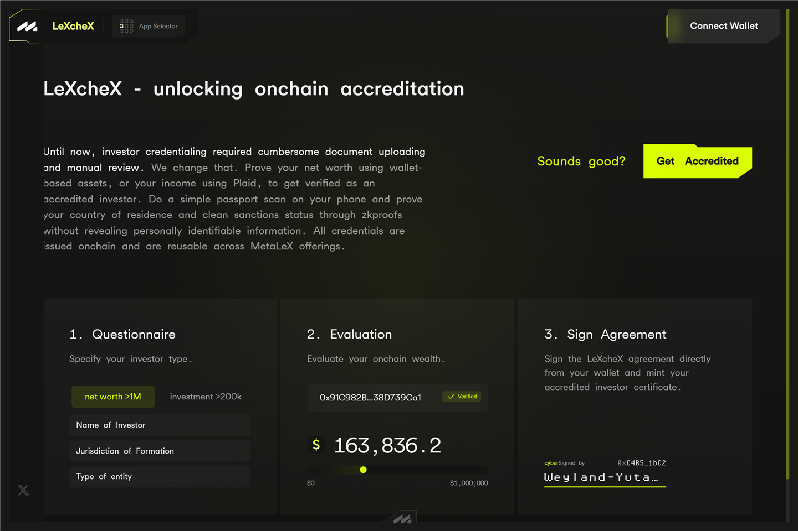

# LeXcheX — get accredited

Many private investment rounds are open only to **accredited investors**.
**LeXcheX** (`lexchex.metalex.tech`) lets you prove that status — using your
onchain wealth — and carry it as a credential the other apps can check.

## Why you might need it

If a [cyberRAISE](cyberraise.md) round is publicly advertised, it is open
only to accredited investors, and you'll need a valid LeXcheX credential
before you can invest. The cyberRAISE public-rounds list and your
[profile](profile.md) both surface your accreditation status and link here.

Getting a credential is a quick process; afterwards, any round that
requires it can verify you automatically.

## What the credential is

A LeXcheX credential is a **non-transferable certificate bound to your
wallet** — a “soulbound” NFT. It cannot be sent, sold, or moved to another
wallet. It simply lives in the wallet that earned it and proves that
wallet's holder is accredited.

## The process: three steps

1. **Questionnaire** — state whether you are applying as an **individual**
   or a **legal entity**, confirm your legal status, choose your evaluation
   path, and complete the compliance form (based on SEC Rule 501(a)).
   Today, the live wallet-based paths are **net worth of \$1M+** for
   individuals and **total assets of \$5M+** for entities; other paths
   shown in the form are marked coming soon.
2. **Evaluation** — connect and verify the wallet addresses that hold your
   assets (you sign a verification message from each wallet), and LeXcheX
   values the portfolio across them. Multiple wallets can be combined, and
   if the first evaluation falls short you can add or swap wallets and try
   again. Both plain wallet holdings and DeFi positions count; very small
   balances, borrowed positions, and tokens below a market-cap floor do
   not.
3. **Sign Agreement** — sign the LeXcheX agreement from your wallet;
   **Mint Certificate** mints the accredited-investor certificate to that
   wallet.

An **income-based route** — proving \$200k+ annual income via a Plaid bank
connection instead of wallet assets — is an early (alpha) alternative for
individuals.

## Other routes to accreditation

LeXcheX is one path. As the cyberRAISE public-rounds list explains, an
investor can also qualify by **investing above a threshold** (around \$200k
for an individual, \$1M for an entity) or through **manual verification**
by a MetaLeX attorney outside the app. The route that fits you depends on
your circumstances.

## Under the hood

A LeXcheX credential is an onchain accreditation NFT issued by the protocol's
[`LexChex` / `LexChexMinter`](../reference/contracts/LexChex.md) contracts.
When a round requires accreditation, it attaches a **`lexchexCondition`** —
an onchain [condition](../reference/conditions.md) that checks for a valid
LeXcheX credential before letting an investment proceed. How this fits into
Reg D / Reg S gating is covered in
[Compliance architecture](../explanation/compliance-architecture.md).

## After you have the credential

* It stays in your wallet. Restricted rounds verify it automatically — you
  won't repeat the process for each one.
* It is tied to the wallet that holds it. Invest from a different wallet and
  that wallet won't carry the credential — unlike your
  [profile](profile.md), which follows your account across all its linked
  wallets, the credential itself stays put.
* **Credentials expire** — a certificate is generally valid for about three
  months. Your certificate page shows its status (active, expired, or
  voided) and time remaining, with a **Renew Certificate** button when it
  lapses.

## Good to know

* **Onchain wealth counts.** LeXcheX exists specifically so assets held in
  your wallet can support accreditation.
* **The credential shows the test, not your balances.** The certificate
  publicly shows which evaluation you passed and when it expires — never
  your holdings or their amounts.
* This is **not legal or financial advice.** Accreditation rules vary and
  change; whether you qualify is a legal question.
