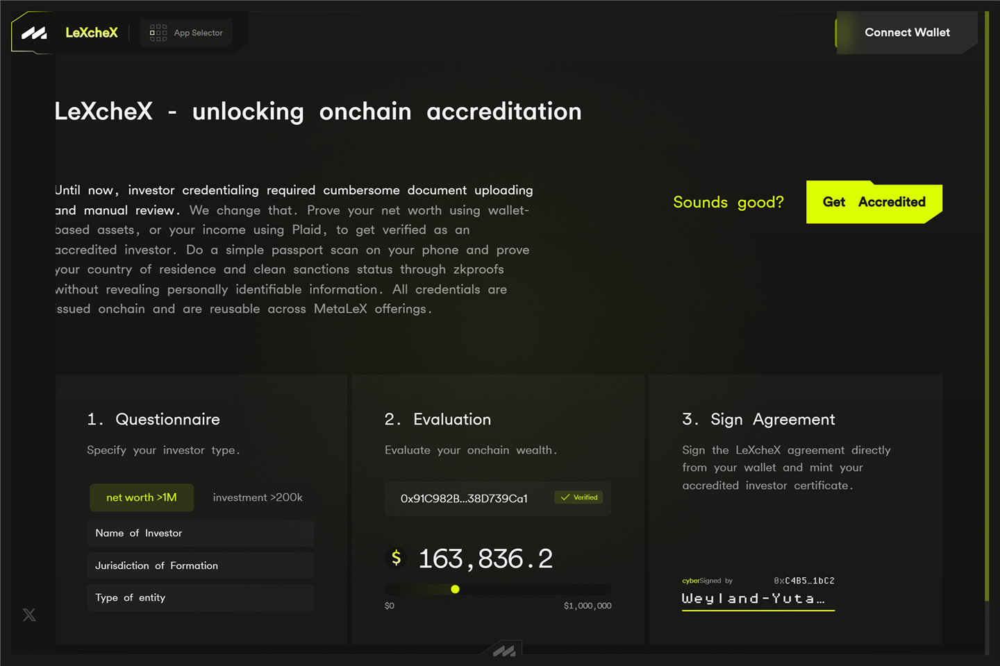

# LeXcheX

Many private investment rounds are open only to **accredited investors**.
**LeXcheX** (`lexchex.metalex.tech`) lets you prove that status from your
onchain wealth and carry the result as a credential the other MetaLeX apps
can check.

## When you need a credential

A publicly advertised [cyberRAISE](cyberraise.md) round is open only to
accredited investors, so you need a valid LeXcheX credential before you can
invest in one. The cyberRAISE public-rounds list and your
[profile](profile.md) both show your accreditation status and link here.
Once you hold a credential, every round that requires it checks it
automatically.

The credential is a **soulbound NFT**: a non-transferable certificate bound
to the wallet that earned it. It can't be sent, sold or moved to another
wallet, and it proves that the wallet's holder is accredited.

## Get accredited in three steps

1. **Questionnaire.** Say whether you are applying as an **individual** or
   a **legal entity**, confirm your legal status, choose your evaluation
   path, and complete the compliance form, which follows SEC Rule 501(a).
   The wallet-based paths are **net worth of \$1M+** for individuals and
   **total assets of \$5M+** for entities. The form marks its other paths
   coming soon.
2. **Evaluation.** Connect and verify the wallets that hold your assets by
   signing a verification message from each, and LeXcheX values the
   portfolio across them. You can combine several wallets, and if the first
   evaluation falls short you can add or swap wallets and try again. Plain
   wallet holdings and DeFi positions both count; very small balances,
   borrowed positions and tokens below a market-cap floor do not.
3. **Sign Agreement.** Sign the LeXcheX agreement from your wallet, and
   **Mint Certificate** mints the accredited-investor certificate to that
   wallet.

An **Income** path, marked **ALPHA**, lets an individual prove \$200k+
annual income through a Plaid bank connection instead of wallet assets.

## Other routes to accreditation

As the cyberRAISE public-rounds list explains, an investor can also qualify
by **investing above a threshold** (around \$200k for an individual, \$1M
for an entity) or through **manual verification** by a MetaLeX attorney
outside the app. Which route fits depends on your circumstances.

## Keep and renew the credential

* It stays in your wallet, and restricted rounds verify it automatically,
  so you don't repeat the process for each one.
* It is tied to the wallet that holds it. Invest from a different wallet
  and that wallet carries no credential. Your [profile](profile.md) follows
  your account across all its linked wallets, but the credential stays put.
* **Credentials expire.** A certificate is generally valid for about three
  months. Your certificate page shows its status (active, expired or
  voided) and the time remaining, with a **Renew Certificate** button once
  it lapses.

## Your MetaLeX account in LeXcheX

LeXcheX uses the same MetaLeX account and account card as the other apps.
Clicking the card opens the account menu: **Profile**, **Wallet Settings**,
the wallets connected in this browser, **Link another wallet** and **Sign
out**. **Profile** and **Wallet Settings** open the
[profile app](profile.md#use-several-wallets-with-one-account) in a new
tab, and **Sign out** ends your MetaLeX session as well as the wallet
connection. The notices the other apps show about your wallets, such as a
wallet that belongs to another profile, appear here too.

Linking or unlinking wallets on your profile never moves a credential. It
stays in the wallet that earned it.

## Under the hood

A LeXcheX credential is an onchain accreditation NFT issued by the
protocol's [`LexChex` / `LexChexMinter`](../reference/contracts/LexChex.md)
contracts. A round that requires accreditation attaches a
**`lexchexCondition`**, an onchain [condition](../reference/conditions.md)
that checks for a valid LeXcheX credential before an investment goes
through. [Compliance architecture](../explanation/compliance-architecture.md)
explains how this fits into Reg D and Reg S gating.

## Good to know

* **Onchain wealth counts.** LeXcheX exists so that assets held in your
  wallet can support accreditation.
* **The credential shows the test you passed and hides your balances.** The
  certificate publicly shows which evaluation you passed and when it
  expires, never your holdings or their amounts.
* **LeXcheX gives no legal or financial advice.** Accreditation rules vary
  and change, and whether you qualify is a legal question.
