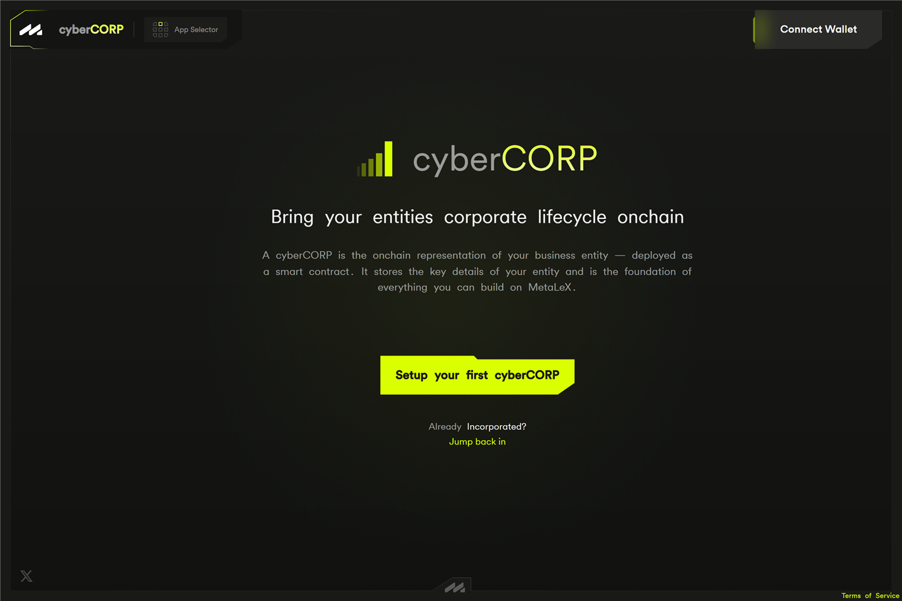
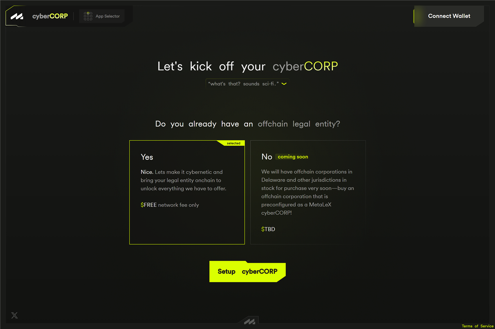
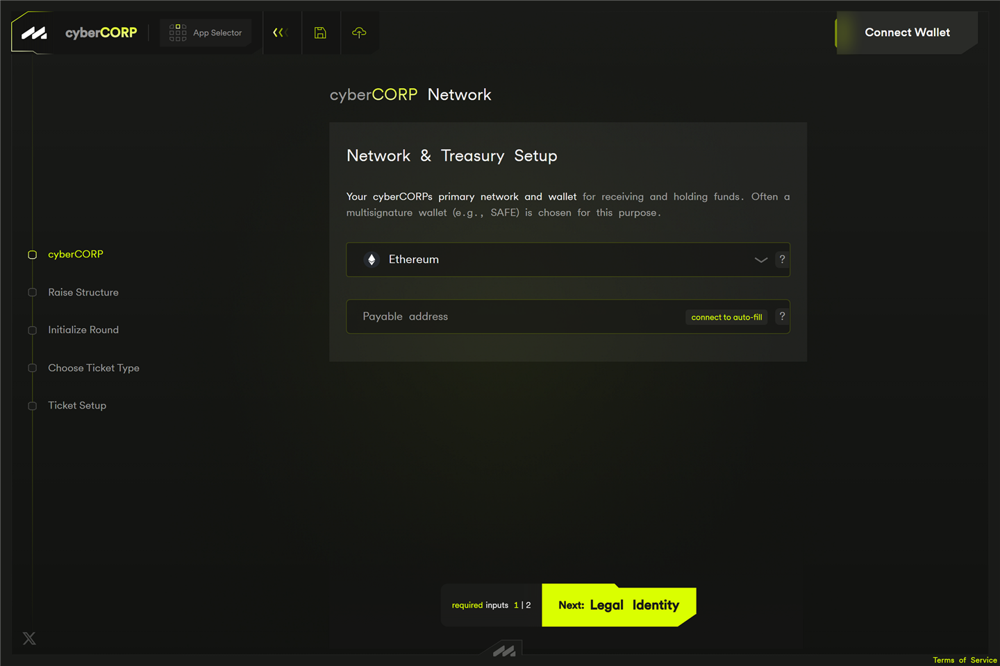

# The cyberCORPs app — manage your company

The **cyberCORPs app** (`cybercorps.metalex.tech`) is where a company is
created and run. If you are a founder or officer, this is your company's
onchain control panel. Once a company is selected, a **sidebar** on the left
navigates its areas:

* **mainFrame** — the live company record: what's true now and what needs action.
* **company record** — the onchain formation record and founding documents.
* **boardRoom** — officers, governance documents, and board approvals.
* **capTable** — tokenized and untokenized positions in one unified cap
  table.
* **grants** — equity awards (options, RSUs, restricted stock) with onchain
  vesting.
* **cyberRaise** — jumps to your raises in [cyberRAISE](cyberraise.md).
* **Tokenization Hub** — the equity hub: configure, issue, and manage tokenized
  securities.
* **cyberSign** — sign and countersign the company's legal agreements (opens
  MetaLeX's standalone signing app).

Hovering a sidebar item shows a short description of the area. The three
largest areas have their own guides: [the cap table](captable.md),
[token grants and onchain vesting](grants.md), and
[the boardRoom](boardroom.md). This page covers the two ways to get a
company into the app, the Tokenization Hub, and how the areas fit
together.

> **Fundraising rounds are not here.** Rounds are created and run in
> [cyberRAISE](cyberraise.md). The cyberCORPs app is about the company
> itself and its register of holders.

## Getting started

### Has your company already been legally formed?

The first question the app asks is whether your company **already exists as
a legal entity** (a Delaware corp, an LLC, etc.):

* **Yes** — you set up your existing company on MetaLeX, free of charge
  (network fee only): one wallet transaction creates its public onchain
  company record. This is the three-step wizard below.
* **No** — **Form a company** runs the whole thing in one guided flow, for
  a flat **\$1,000, all inclusive, paid in USDC**: the state filing and
  formation documents, filing of the initial tax documents, a 30-minute
  lawyer consultation with @lex\_node on Telegram, and free lifetime
  access to the cap-table features — fully synchronous and in-app, no
  sales calls. The public onchain company record is created as part of the
  process. See [Forming a new company](#forming-a-new-company-llc-or-c-corp).

A cyberCORP is best understood as a *digital twin* of your real company —
and on the formation path, the app arranges for the real company too.

### Set up an existing company

Setup is a three-step wizard. Your progress is saved as you go.

**Step 1 — Network:**

* **Network & Treasury Setup** — the chain (Ethereum, Arbitrum, or Base) and
  a *payable address* — the address that receives payments for the company.
  A Safe multisig is recommended here; an auto-fill button can insert your
  connected wallet.

**Step 2 — Legal Identity:**

* **Founder identity** — the founder/officer name and title. This is always
  public, and this address holds the company's primary admin authority.
* **Identity** — the cyberCORP name, a primary contact (Telegram, X, email,
  or phone), the legal entity type, and the jurisdiction of formation.

**Step 3 — Public Profile:**

* A description, profile image, and website, whitepaper, and document links.

The final **Deploy cyberCORP** button is an onchain transaction. When it
confirms, your company exists onchain.

> Bringing a company onchain has legal prerequisites: the company's
> governing documents need to designate the onchain system as its official
> register. MetaLeX provides templates for this — involve your counsel.

> **Under the hood.** “Deploy cyberCORP” calls the protocol's
> [`CyberCorpFactory`](../reference/factories.md), which deploys your
> [`CyberCorp`](../reference/contracts/CyberCorp.md) contract and its suite
> (issuance, deal, and round managers) and a `BorgAuth` access-control
> contract in one transaction. The “founder identity” address becomes an
> officer in [BorgAuth](../reference/access-control.md). For the full
> walkthrough at the contract level, see the tutorial
> [Incorporate a cyberCORP](../tutorials/incorporate-a-cybercorp.md); for
> *why* the chain can be the official register, see
> [Constitutive vs. pointer tokenization](../explanation/constitutive-vs-pointer.md).

## Forming a new company (LLC or C-Corp)

**Form a company** opens a single long-page form (not a wizard) that
gathers everything the filing and the onchain record need. Nothing is
saved automatically — a dialog on a fresh session tells you to save with
the disk icon and to **keep the session link**, which reopens your saved
draft in the same browser.

What the form asks for, in order:

* **Company** — entity type (C-Corporation or LLC), the legal name and its
  ending, up to two optional **backup company names** (saved for manual
  follow-up — automated filing submits only the reviewed primary name),
  and the state of formation. For Delaware and a few other states the form
  links the state's business-name database and has you attest **"I
  searched the … database and my proposed primary name appears
  available"** — the attestation resets if you later change the name. A
  Delaware-specific preflight also catches names that are too long,
  contain non-printable characters, or use approval-sensitive terms
  (bank, trust, insurance, university). Search results are advisory; the
  state makes the final call when it reviews the filing.
* **Responsible party** (mostly private) — the IRS responsible party who
  signs the tax paperwork, with the option to also list them as the first
  public officer of the onchain record.
* **Capitalization** (always private) — authorized share count and par
  value for a C-Corp; the member list (ownership totalling 100%) for an
  LLC.
* **Officer roles** — President, Secretary, Treasurer, Director, each
  defaulting to the responsible party, each optionally listed publicly.
* **Proposed initial ownership** (always private) — proposed Common Stock
  allocations, saved **encrypted** as a private setup plan. The form is
  explicit that this does not create positions, reserve shares, or
  promise stock — it pre-stages your cap table for later.
* **Public company record** (always public) — the founding wallet, the
  treasury address, the public contact and first public officer, and the
  optional profile. On this path the network is **locked to the payment
  chain** (Ethereum mainnet in production) rather than chosen freely.
* A **legal attestation** that the details are accurate and the public
  values are approved for permanent onchain publication.

**Review incorporation** shows everything grouped by disclosure — private
filing details, the private setup plan, and the public record — with the
price notice, before **Save and continue**.

### Paying and what happens next

**Pay 1,000 USDC and start incorporation** runs two authorization steps
that settle as **one onchain transaction**: a gasless payment
authorization (a free typed-data signature that moves no funds by
itself), then a single company-setup transaction that pays the \$1,000
USDC and creates your public company record. The state filing goes to
MetaLeX's formation partner only after both are verified.

The **Formation Status** page then tracks the whole order: the filing
checklist (request accepted, state filing, required signatures, company
incorporated / LLC formed, EIN issued, documents available), signing
sessions for the IRS Forms SS-4 and 8821, and authenticated downloads of
your private legal documents — the page auto-refreshes while anything is
in flight. **My formation orders** (in the profile dropdown) lists every
formation you have running.

Once the company record is deployed and your wallet owns it, the status
page hands you off to the **company record** area, and the rest arrives
as tasks on the mainFrame dashboard: publish your selected officers to
the onchain roster from the boardRoom, review the auto-created **draft**
cap-table positions from your private setup plan (visible, non-counting
drafts — no stock is issued), onboard any stakeholders who don't have
wallets yet via invitation links, and finish each issuance from the cap
table's Securities status queue (review cash terms, the federal
exemption, and the board approval, then record it). Cap-table setup opens
as soon as the state filing completes — you don't wait for the EIN. A
saved setup plan you no longer want can be discarded at any time without
touching the company or the cap table.

> **Under the hood.** The payment and the company-record deployment are
> one Multicall3 batch: a USDC `transferWithAuthorization` plus the
> factory's `deployCyberCorp`. Within the batch the two execute — or
> revert — together. The one edge case: a signed payment authorization
> is submittable by anyone, so if it gets mined separately before your
> batch, the fee (which only ever pays MetaLeX) transfers there and the
> batch reverts on the used nonce without deploying — the status page's
> recovery actions (verify transaction hash, reset payment attempt)
> reconcile exactly this. See
> [Integrate from a frontend](../how-to/integrate-from-frontend.md#atomic-fee--formation-via-multicall3).

## mainFrame — the company dashboard

Once your cyberCORP exists, **mainFrame** shows the live company record: a
compact identity strip up top and, below it, an operations dashboard built
from the same data as the cap table. Its **Tasks and reminders** card is
also where an in-flight formation surfaces — payment, filing, signature,
and setup steps appear here until the journey is done.

For a **brand-new company** (no stakeholders or positions yet), the
mainFrame instead leads with a **“Get set up — what's your next move?”**
grid of cards:

* **Start or manage a cyberRaise** — jumps to [cyberRAISE](cyberraise.md).
* **Open Tokenization Hub** — the securities console.
* **Manage your capTable.**
* **Enter the boardRoom.**

(On smaller screens, where the sidebar is hidden, the grid adds cards for
the company record, grants, and cyberSign and doubles as the app's
navigation.)

Once the company has a record, those destinations live in the sidebar and
the mainFrame leads with the record itself.

## company record

The **company record** area is the company's formation record, private and
public halves side by side:

* **State formation record** (private) — the filing status, filing date
  and number, the EIN, and any required signatures, for a company formed
  through the app.
* **Public company record** (onchain, public) — legal name, entity type,
  jurisdiction, dispute-resolution method, the date the company was
  *cybernated*, the contact, the treasury (company payable) address, and
  the addresses of the company's contracts (cyberCORP, BorgAuth, and the
  issuance, deal, and round managers), each linked to a block explorer.
* **Founding documents** — the governing documents anchored at formation.
* A read-only officer roster with a **Manage officers in boardRoom →**
  hand-off — officer changes happen in the boardRoom, not here.

To create another company, use the cyberCORP selector's **Setup your
cyberCORP** or the app grid's **deploy new cyberCORP** — both restart the
onboarding choice.

It is described alongside the boardRoom in
[The boardRoom and company records](boardroom.md#the-company-record-page).

## boardRoom

The **boardRoom** is the corporate-authority hub: the officer roster, the
board of directors, the company payment destination, governance documents,
and **board approvals** — written consents of the board that can gate
specific securities issuances. It also holds the **Transfer cyberCORP**
hand-over flow and a preview of the coming BORG board multisig.

The full guide, including how directors are seated, how consents route for
signature, and what goes to public IPFS, is
[The boardRoom and company records](boardroom.md).

## The Tokenization Hub — your equity hub

The Tokenization Hub is the company's securities console. It requires you
to connect your wallet, **Authenticate**, and be an owner of the cyberCORP.

The Tokenization Hub displays and manages the company's onchain securities
records. For a cyberCORP whose governing documents designate the Tokenized
Stock Ledger System as its official stock ledger, these records form part of
that ledger. The app does not infer that legal status from tokenization alone.

### Security Classes

Each class of security your company has (a series of preferred stock, a SAFE
class, an option pool, etc.) appears as a panel showing:

* the class and series, and how many shares are issued;
* its status, including whether scrip is enabled;
* **class-wide transferability** — an on/off toggle you can flip directly
  from the panel (an onchain transaction);
* if scrip is enabled — the scrip ratio, the de-scrip threshold, and a
  breakdown of how much of the class is in certificate vs. scrip form;
* an **ownership state** summary — active registered positions and holders.

### Issued Securities

Below the classes, a table of issued securities. Expanding a class shows:

* its **certificates** — the individual cyberCERTs (your register of
  holders), with holder, wallet, ID, agreement, units, and issue date, and
* its **scrip holders** — holders of the fungible cyberSCRIP form.

Voided certificates can be shown or hidden with a checkbox. If a holder has
requested de-scripification, a banner prompts you to review it.

Three buttons at the top of the Tokenization Hub: **Cap Table**, **Create
new Security Class**, and **Issue New Security under existing Security
Class**.

> **Under the hood.** Each security *class* is a
> [`LedgerEntryToken`](../reference/contracts/LedgerEntryToken.md) (cert
> printer) contract.
> Each *certificate* is a **cyberCERT** — an ERC-721 “Ledger Entry Token” —
> and the set of them is your register of holders. Each scrip token is a
> [`CyberScrip`](../reference/contracts/CyberScrip.md) ERC-20. A cyberCERT
> and its cyberSCRIP are the same security in two forms; see
> [The dual-token model](../explanation/dual-token-model.md).

## Creating a security class

Before you can issue a security, its class must exist. Each class/series
line gets its own printer contract. The *Create New Class / Series* form
asks for:

* the **series** (e.g. Pre-Seed, Series A),
* an optional **sub-series label** (e.g. “2” to create Series A-2 when a
  Series A line already exists),
* the **security type** — chosen from the template library (SAFE, SAFT,
  SAFTE, token warrant — each in Reg D and Reg S variants — plus common and
  preferred stock, stock options, convertible notes, token purchase
  agreements, and restricted stock/token purchase agreements and units),
* a **security name** (auto-generated from the series and company),
* the **legal document** — either upload a PDF or paste a link to it.

Submitting deploys the class onchain and returns you to the Tokenization
Hub.

> **Under the hood.** This deploys a new `CyberCertPrinter` for the chosen
> [security type](../reference/security-types.md). The instrument-specific
> terms are handled by a [certificate extension](../reference/extensions.md).

## Issuing a certificate

*Issue New Security* lets you mint a cyberCERT to a holder. You pick the
class/series, then fill in the **certificate details**:

* **Investor details** — the holder's name (with profile lookup) and
  address.
* **Security detail** — the number of units represented, the investment
  amount (denominated in the class's payment token — USDC by default), and
  the issuance date (which must be in the past).
* **Certificate-specific terms** — instrument terms that depend on the
  security type (a SAFE's custom provisions; a SAFT's unlock schedule; etc.).
* **Signing officers** — the officer(s) signing the certificate.
* **Legal terms** — the dispute-resolution method and the governing legal
  document.

Issuing takes **two approvals**: first the signing officer signs the
certificate (a free signature), then you confirm the onchain transaction
that mints it.

> **Under the hood.** The transaction calls the
> [`IssuanceManager`](../reference/contracts/IssuanceManager.md), which
> mints the cyberCERT on the class's `CyberCertPrinter` and records the
> holder as the registered owner. See the how-to
> [Issue a cyberCERT](../how-to/issue-a-cybercert.md).

## Enabling scrip (scripify)

To give a security a tradable, fungible form, you *scripify* its class. The
*Scrip Configuration* screen asks for:

* the **scrip ratio** — how many scrip tokens equal one share. **This is
  permanent**, so choose carefully; a confirmation step echoes the exact
  ratio back to you before anything is deployed.
* the **de-scrip threshold** — the minimum amount of scrip that can be
  converted back to a certificate (adjustable later).
* **de-scrip handling** — currently fixed to **Founder Approval**
  (registered holders de-scripify automatically; new holders need your
  approval). An **Auto** mode is shown but not yet enabled.
* **clawback** — an optional, one-way **“No clawback”** switch that
  permanently disables the issuer's force-transfer / freeze / burn override
  for the class. Required for grants that promise vested shares are
  irrevocably the recipient's; leave it off to keep the issuer override for
  compliance.

Scripify requires your Issuance Manager to be on the latest version; if it
isn't, the form points you to the **Upgrade** page first.

> **Under the hood.** Scripify deploys a
> [`CyberScrip`](../reference/contracts/CyberScrip.md) ERC-20 for the class.
> Holders can then convert certificate units to scrip and back. The
> mechanics — partial scripification, the scrip ratio, and the two
> recertification paths — are covered in the tutorial
> [Scripify and settle a secondary trade](../tutorials/scripify-and-settle.md).

## Approving de-scripification

When a scrip holder wants to become a registered holder, they request
de-scripification. You approve it from the Tokenization Hub's
pending-request banner: the *Approve De-scripification* screen pre-fills
the holder and
share amount, you complete and sign the certificate details, and confirm.
The holder is then put on the register.

> **Under the hood.** Issuer approval is the moment that matters legally —
> it is when a new holder is added to the register of record. See
> [The dual-token model](../explanation/dual-token-model.md) and
> [Compliance architecture](../explanation/compliance-architecture.md).

## The cap table

The **capTable** area (in beta) is the company's unified capitalization
workspace: offchain positions you record by hand or import, and the
tokenized certificates from the Tokenization Hub, side by side in one
ledger, with an AI-assisted import for bringing in a cap table from any
format. Modeling and compliance tooling (round modeling, exit waterfall,
§219 lists, 409A / Rule 701 / 3921 / 83(b) records) lives alongside it.
After an in-app formation, this is also where the requested Common Stock
class and the draft positions from your private setup plan land.

Two guides cover it: [The cap table](captable.md) for the ledger,
importing, and tokenizing, and
[Cap-table records, modeling and compliance](captable-tools.md) for the
tools.

## Grants

The **grants** area manages equity awards to service providers — options,
RSUs, and restricted stock that vest over time, escrowed onchain as scrip
so the chain enforces the schedule. Recipients get their own **My grants**
view with sign, claim, and exercise actions, no company login needed.

The full guide is [Token grants and onchain vesting](grants.md).

## For stakeholders: invitations and My holdings

Companies onboard their stakeholders with **invitation links** (managed
from the cap table's **Invitations** panel — also where a formation's
walletless stakeholders get onboarded). Claiming one attaches the
stakeholder's wallet to their record and opens **My holdings** — their
scoped portal of positions, certificates, documents, and grants.

The holder's side of the app — My holdings, the certificate page, and
transfers, scripify, and de-scripify from the portfolio — is
[For holders: your securities](holders.md).

## Admin

The **admin** area edits the company profile. The top half is the **public
profile** (description, image, links) — a plain save, no transaction. Below
it, an **onchain details** section lets the owner update the cyberCORP
name, the payable address, and the officer roster — these are onchain
transactions.

## Upgrade

The **upgrade** area lists your company's contracts — CyberCorp, Deal
Manager, Issuance Manager, Round Manager — and, under **Issuance
Upgrades**, the cyberCERT/cyberSCRIP implementations. For each it shows
whether a newer MetaLeX-published version is available (“Up to date” /
“Upgrade available”). You upgrade each one individually, and only when you
choose; upgrades are never forced.

> **Under the hood.** Upgrades use a **co-approval** model: MetaLeX
> publishes a new implementation, and your company opts in — neither side
> can act alone. See [Upgrade model](../reference/upgrade-model.md) and
> [Co-approval upgradeability](../explanation/co-approval-upgradeability.md).

## Good to know

* **Every change to the register is a transaction.** Issuing, transferring,
  scripifying, and approving cost a small amount of gas. Offchain cap-table
  entries, drafts, and profile edits are plain saves.
* **You keep control.** MetaLeX cannot issue your securities, move your
  funds, or change your register — see
  [The role of MetaLeX](../explanation/role-of-metalex.md).
* **Nothing is hidden offchain.** Anyone you authorise can verify the
  register directly.
