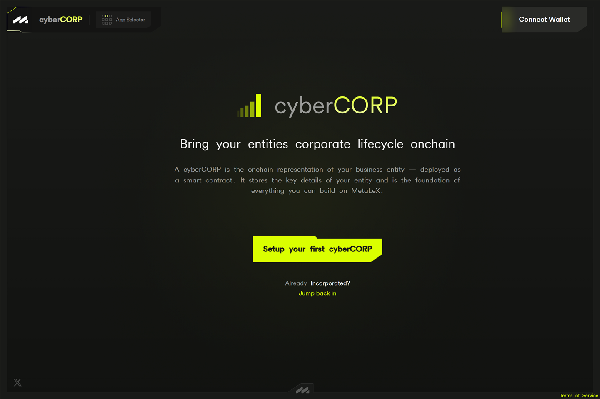
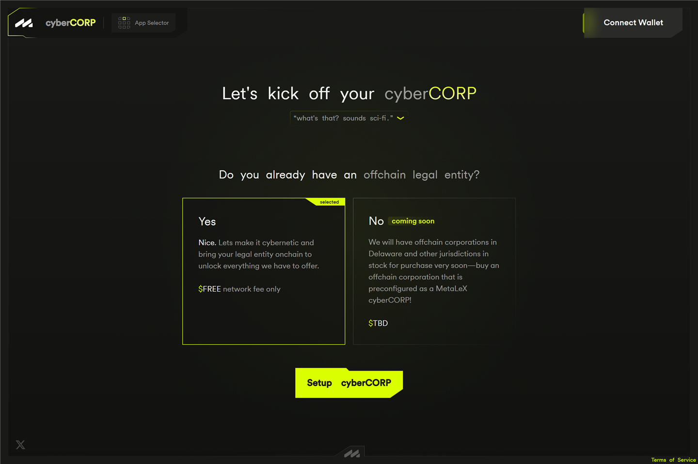
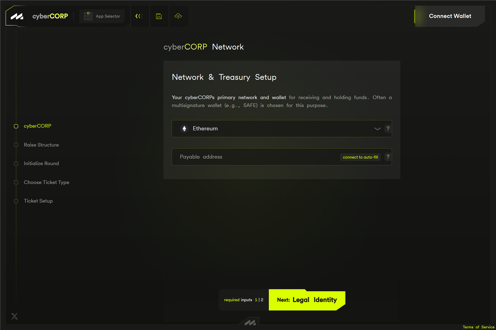

# The cyberCORPs app — manage your company

The **cyberCORPs app** (`cybercorps.metalex.tech`) is where a company is
created and run. If you are a founder or officer, this is your company's
onchain control panel. Once a company is selected, a **sidebar** on the left
navigates its areas:

* **mission control** — the live company record: what's true now and what needs action.
* **Incorporation Hub** — the onchain formation record and founding documents.
* **Documents** — formation mail, notices and filings; boardRoom and cyberSign links.
* **boardRoom** — officers, governance documents, and board approvals.
* **capTable** — tokenized and untokenized positions in one unified cap
  table.
* **grants** — equity awards (options, RSUs, restricted stock) with onchain
  vesting.
* **cyberRaise** — jumps to your raises in [cyberRAISE](cyberraise.md).
* **Tokenization Hub** — the equity hub: configure, issue, and manage tokenized
  securities.
* **cyberSign** — sign and countersign the company's legal agreements (opens
  MetaLeX's standalone signing app).

Hovering a sidebar item shows a short description of the area. The
**Search** button in the header (or Ctrl+K / ⌘K) opens a search across the
app's pages and, for a company your profile owns, its stakeholders and cap
table positions. The three largest areas have their own guides:
[the cap table](captable.md),
[token grants and onchain vesting](grants.md), and
[the boardRoom](boardroom.md). This page covers the two ways to get a
company into the app, the Tokenization Hub, and how the areas fit
together.

> **Fundraising rounds are not here.** Rounds are created and run in
> [cyberRAISE](cyberraise.md). The cyberCORPs app is about the company
> itself and its register of holders.

## Getting started

### Has your company already been legally formed?

The first question the app asks is whether your company **already exists as
a legal entity** (a Delaware corp, an LLC, etc.):

* **Yes** — you set up your existing company on MetaLeX, free of charge
  (network fee only): one wallet transaction creates its public onchain
  company record. This is the three-step wizard below.
* **No** — **Form a company** runs the whole thing in one guided flow, for
  a flat **\$1,000, all inclusive, paid in USDC**: the state filing and
  formation documents, filing of the initial tax documents, a 30-minute
  lawyer consultation with @lex\_node on Telegram, and free lifetime
  access to the cap-table features — fully synchronous and in-app, no
  sales calls. The public onchain company record is created as part of the
  process. See [Forming a new company](#forming-a-new-company-llc-or-c-corp).

A cyberCORP is best understood as a *digital twin* of your real company —
and on the formation path, the app arranges for the real company too.

### Set up an existing company

Setup is a three-step wizard. Your progress is saved as you go.

**Step 1 — Network:**

* **Network & Treasury Setup** — the chain (Ethereum, Arbitrum, or Base) and
  a *payable address* — the address that receives payments for the company.
  A Safe multisig is recommended here; an auto-fill button can insert your
  connected wallet.

**Step 2 — Legal Identity:**

* **Founder identity** — the founder/officer name and title. This is always
  public, and this address holds the company's primary admin authority.
* **Identity** — the cyberCORP name, a primary contact (Telegram, X, email,
  or phone), the legal entity type, and the jurisdiction of formation.

**Step 3 — Public Profile:**

* A description, profile image, and website, whitepaper, and document links.

The final **Deploy cyberCORP** button is an onchain transaction. When it
confirms, your company exists onchain.

> Bringing a company onchain has legal prerequisites: the company's
> governing documents need to designate the onchain system as its official
> register. MetaLeX provides templates for this — involve your counsel.

> **Under the hood.** “Deploy cyberCORP” calls the protocol's
> [`CyberCorpFactory`](../reference/factories.md), which deploys your
> [`CyberCorp`](../reference/contracts/CyberCorp.md) contract and its suite
> (issuance, deal, and round managers) and a `BorgAuth` access-control
> contract in one transaction. The “founder identity” address becomes an
> officer in [BorgAuth](../reference/access-control.md). For the full
> walkthrough at the contract level, see the tutorial
> [Incorporate a cyberCORP](../tutorials/incorporate-a-cybercorp.md); for
> *why* the chain can be the official register, see
> [Constitutive vs. pointer tokenization](../explanation/constitutive-vs-pointer.md).

## Forming a new company (LLC or C-Corp)

**Form a company** opens a single long-page form (not a wizard), headed
**Incorporate your company**, or **Form your LLC** once you pick an LLC.
It gathers everything the filing and the onchain record need. Nothing is
saved automatically — a dialog on a fresh session tells you to save with
the disk icon and to **keep the session link**, which reopens your saved
draft in the same browser.

### Choosing an entity

At the top of the form, an **Entity guidance** panel asks **Which entity
fits your plans?** You can work through its questions (**Help me
choose**), discuss your plans with GAIBE, MetaLeX's AI agent (**Talk to
GAIBE first**), or go straight to the form (**I already know my entity
type ↓**). The questions cover where the team and the business are, how
you expect to fund the company and capture value, owners and treasury,
and any token plans: token holdings, foreign owners, whether a launchpad
will prescribe your structure and when, the proposed sale, and later
token entities. Every question accepts **Not sure yet**.

**Your starting direction** then lists one or more directions. Each names
the role the entity plays, explains why it fits, gives the next step,
and recommends a formation state. A venture-backed project is pointed at
a Delaware corporation; other answers lead to an LLC, an LLC taxed as a
pass-through to hold tokens, or a US nonstock corporation (which has its
own formation process outside this form). When a launchpad that
prescribes its own entity structure is in the plan (MetaDAO and Umia are
the examples the guide gives), the direction is to follow that
launchpad's onboarding; this form does not create the launchpad's
vehicle. Depending on your answers, the result adds:

* **Token launch structure and timing** — a staged offshore structure
  (for example, a Cayman foundation, with a BVI token issuer evaluated
  later) or the launchpad's prescribed structure, with the sources the
  framework relies on and a cost estimate.
* **Formation state, taxes and additional registrations** — the state
  recommendation, the tax consequences of the choice, and a **One-way
  doors** box listing tax decisions that are expensive or impossible to
  reverse.
* A financing card (for example **Prepare your first investment**) when
  you plan venture funding or private financing before a token sale. **Save
  and continue my financing plan** saves a private financing plan and
  continues in [cyberRAISE](cyberraise.md).

The guide only advises. The form changes when you choose **Set this draft
to {state} {C-Corp or LLC} for {role}**, which sets the entity type and
state and, if either changed, clears the name-search and legal
attestations so you make them again. If your answers call for two
companies (an operating corporation and a treasury LLC), **Prepare the
two companies separately** saves one draft for each in this browser,
listed under **My formation orders**. The guide labels its result
"preliminary guidance … not a legal or tax opinion". **Talk to the
MetaLeX team ↗** opens a Telegram chat with MetaLeX.

### What the form asks for

In order:

* **Company** — entity type (C-Corporation or LLC), the legal name and its
  ending, up to two optional **backup company names** (saved for manual
  follow-up — automated filing submits only the reviewed primary name),
  and the state of formation. For Delaware and a few other states the form
  links the state's business-name database and has you attest **"I
  searched the … database and my proposed primary name appears
  available"** — the attestation resets if you later change the name. A
  Delaware-specific preflight also catches names that are too long,
  contain non-printable characters, or use approval-sensitive terms
  (bank, trust, insurance, university). Search results are advisory; the
  state makes the final call when it reviews the filing. The section also
  asks for the **Business industry**, picked from the formation partner's
  list, and a **Business Description** of at most 50 characters, the
  limit of the IRS EIN application.
* **Responsible party** (mostly private) — the IRS responsible party who
  signs the tax paperwork, with the option to also list them as the first
  public officer of the onchain record. A **Reuse your MetaLeX profile**
  card can fill blank fields here (legal name, email, country of
  residence, phone, mailing address) from the **Private formation
  details** saved in your profile editor. Nothing is copied until you
  choose **Reuse profile details**, and **Undo profile prefill** reverses
  it.
* **Capitalization** (always private) — authorized share count (at most
  2,147,483,647, the formation service's limit) and par value for a
  C-Corp; the member list (ownership totalling 100%) for an LLC.
* **Officer roles** — President, Secretary, Treasurer, Director, each
  defaulting to the responsible party, each optionally listed publicly.
* **Proposed initial ownership** (always private) — proposed Common Stock
  allocations, saved **encrypted** as a private setup plan. The form is
  explicit that this does not create positions, reserve shares, or
  promise stock — it pre-stages your cap table for later.
* **Public company record** (always public) — the founding wallet, the
  treasury address, the public contact and first public officer, and the
  optional profile. On this path the network is **locked to the payment
  chain** (Ethereum mainnet in production) rather than chosen freely.
* A **legal attestation** that the details are accurate and the public
  values are approved for permanent onchain publication.

**Review incorporation** (**Review LLC formation** for an LLC) opens a
**Final review** that groups everything by disclosure — private filing
details, the private setup plan, and the public record — and states the
service price (\$1,000, paid in USDC, with network gas shown separately
by your wallet), before **Save and continue**. The form shows the price
only on this screen.

### Paying and what happens next

**Pay 1,000 USDC and start incorporation** (**… and start LLC
formation** for an LLC) runs two authorization steps that settle as
**one onchain transaction**: a gasless payment authorization (a free
typed-data signature that moves no funds by itself), then a single
company-setup transaction that pays the \$1,000 USDC and creates your
public company record. The state filing goes to MetaLeX's formation
partner, doola, only after both are verified.

The **Formation Status** page then tracks the whole order. Its **Company
formation** checklist runs from request accepted through state filing,
required signatures, company incorporated / LLC formed and EIN issued to
documents available. The page also holds the signing sessions for IRS
Forms SS-4 and 8821 (**Create fresh signing session**) and authenticated
downloads of your private legal documents, and it refreshes itself while
anything is in flight. **My formation orders** (in the profile dropdown)
lists every formation you have running.

Once the public company record exists and your profile holds an owner
wallet, the status page opens the **Incorporation Hub** for you (it
stays on the status page while payment, the state submission or
replacement names are still pending). The rest arrives as tasks in
**mission control**: publish your selected officers to
the onchain roster from the boardRoom, review the auto-created **draft**
cap-table positions from your private setup plan (visible, non-counting
drafts — no stock is issued), onboard any stakeholders who don't have
wallets yet via invitation links, and finish each issuance from the cap
table's Securities status queue (review cash terms, the federal
exemption, and the board approval, then record it). Cap-table setup opens
as soon as the state filing completes — you don't wait for the EIN. A
saved setup plan you no longer want can be discarded at any time without
touching the company or the cap table.

> **Under the hood.** The payment and the company-record deployment are
> one Multicall3 batch: a USDC `transferWithAuthorization` plus the
> factory's `deployCyberCorp`. Within the batch the two execute — or
> revert — together. The one edge case: a signed payment authorization
> is submittable by anyone, so if it gets mined separately before your
> batch, the fee (which only ever pays MetaLeX) transfers there and the
> batch reverts on the used nonce without deploying — the status page's
> recovery actions (verify transaction hash, reset payment attempt)
> reconcile exactly this. See
> [Integrate from a frontend](../how-to/integrate-from-frontend.md#atomic-fee--formation-via-multicall3).

### If the filing fails or a name is rejected

A failed formation shows **Formation needs attention** with the reason,
on the status page and in the Incorporation Hub. While the formation
partner has not yet accepted the order, **Edit saved details** reopens
the form so you can fix what was rejected (a business description over
50 characters, for example), then **Review corrections** and **Save and
resubmit filing**. The company name, entity type, state, share terms and
officer selections stay as recorded, and your payment is reused. **Retry
with saved details** resubmits without changes.

If the state rejects every submitted company name, the status page shows
**New company names needed** and lists the names already rejected. Enter
a first-choice replacement and up to two more, then **Submit replacement
names**. The public company record is never changed automatically: once
the state files under a new name, a notice shows the difference and
**Update legal name with wallet →** opens the [admin](#admin) area to
change the onchain name with a transaction.

## mission control — the company dashboard

Once your cyberCORP exists, **mission control** shows the live company
record: a compact identity strip up top and, below it, an **Operations**
dashboard built from the same data as the cap table. A badge counts the
open tasks and jumps to the **Tasks and reminders** card, which collects
what needs action:

* **Contract upgrades.** When any of the company's contracts differs from
  the reference implementation its factory publishes, the first task
  reads **Contract upgrade available** (or **N contract upgrades
  available**) and names the contracts. It opens the [Upgrade](#upgrade)
  page. This is how the owners of an existing company learn that a newer
  protocol release, such as v5, is available to them.
* **Formation steps.** An in-flight formation surfaces here: payment,
  filing, signatures, replacement company names, officer publishing, and
  setup steps, until the journey is done.
* **Annual reports.** For a company formed through the app, notices such
  as **Annual report due in N days** or **Annual report overdue** link to
  the [annual reports](#annual-reports) panel.
* **Cap table and compliance.** Failed cap table checks, draft securities
  waiting, valuation (FMV) and 83(b) reminders, project-token setup, and
  stakeholders not yet onboarded.

If a live check cannot be read, the list starts with **Some live checks
are unavailable**: reload before relying on the dashboard, because
unreadable data is never treated as clear.

For a **brand-new company** (no stakeholders or positions yet), mission
control leads with a **“Get set up — what's your next move?”** grid of
cards:

* **Start or manage a cyberRaise** — jumps to [cyberRAISE](cyberraise.md).
* **Open Tokenization Hub** — the securities console.
* **Manage your capTable.**
* **Enter the boardRoom.**

(On smaller screens, where the sidebar is hidden, the grid adds cards for
the Incorporation Hub, grants, and cyberSign and doubles as the app's
navigation.)

Once the company has a record, those destinations live in the sidebar and
mission control leads with the record itself.

## Incorporation Hub

The **Incorporation Hub** is the company's formation record. For a
company formed through the app it combines the private state filing with
the public onchain record; for any other company it shows the public
record and founding documents. Its header links to **My formation
orders** and **Form a new company**.

* **Company identity** — the legal name, entity type, and jurisdiction
  from the formation order.
* **State formation record** (private) — the overall status, state
  filing status, filing date and number, the EIN, and any **Required
  signatures** (IRS Form SS-4 or 8821, each with **Review and sign**), for
  a company formed through the app. Failure and name notices from the
  formation appear above it.
* **Public company record** (onchain, public) — legal name, entity type,
  jurisdiction, dispute-resolution method, the date the company went
  onchain, the contact, the treasury (company payable) address, and
  the addresses of the company's contracts (cyberCORP, BorgAuth, and the
  issuance, deal, and round managers), each linked to a block explorer.
* A read-only officer roster with a **Manage officers in boardRoom →**
  hand-off — officer changes happen in the boardRoom, not here.
* **Mail, notices & filings** (private) — the legal notices, mail scans,
  and filing records doola provides for a company formed through the app,
  searchable and filterable by type, each with **Open / download ↗**. Only
  the account that submitted the formation sees them.
* **Public onchain agreements** — the agreements permanently published to
  this company record at formation.

To create another company, use **Form a new company** here, or the
cyberCORP selector's **Setup your cyberCORP**, which restarts the
onboarding choice.

It is described alongside the boardRoom in
[The boardRoom and Incorporation Hub](boardroom.md#the-incorporation-hub).

### Annual reports

For a company formed through the app, the Incorporation Hub also has an
**Annual reports** panel (under **Ongoing compliance**) showing the next
calendar deadline, the last filing, and the state's filing requirement.
**Prepare {year} report** opens the report form; **Prepare report and fix
fee** saves the report and locks in the state fee. Under **Payment and filing
confirmation** you pay that fee (**Pay \$X state fee**, in USDC on
Ethereum mainnet; MetaLeX adds no service fee), tick the authorization,
and choose **Confirm filing with doola**. A report with no state fee
needs only the confirmation. A confirmed report cannot be replaced.

## Documents

The **Documents** area gathers the company's document stores in one
place:

* **Mail, notices & filings** — the same private panel as in the
  Incorporation Hub.
* **Governance documents** — **Open governance documents** goes to the
  boardRoom's registry-backed archive.
* **Sign with cyberSign** — **Open cyberSign ↗** opens MetaLeX's signing
  app; an existing agreement's own signing link opens that agreement.

The page also shows **Formation documents** and **Standalone templates**
cards. Document preparation and templates are not enabled in the
production app, and both cards say so; the formation card links to the
Incorporation Hub for filing status and company records.

## boardRoom

The **boardRoom** is the corporate-authority hub: the officer roster, the
board of directors, the company payment destination, governance documents,
and **board approvals** — written consents of the board that can gate
specific securities issuances. It also holds the **Transfer cyberCORP**
hand-over flow and a preview of the coming BORG board multisig.

The full guide, including how directors are seated, how consents route for
signature, and what goes to public IPFS, is
[The boardRoom and Incorporation Hub](boardroom.md).

## The Tokenization Hub — your equity hub

The Tokenization Hub is the company's securities console. Like every
company area, it opens for a signed-in profile that has one of the
cyberCORP's owner wallets linked (see [Good to know](#good-to-know)).

The Tokenization Hub displays and manages the company's onchain securities
records. For a cyberCORP whose governing documents designate the Tokenized
Stock Ledger System as its official stock ledger, these records form part of
that ledger. The app does not infer that legal status from tokenization alone.

### Classes and series

The Hub's main view, **Classes and series**, groups the company's
certificate printers under their legal class (**Legal class · …**), each
with an **Add series** button. A printer with no recorded legal identity
sits under **Unclassified or unresolved**, and a saved cap table line that
has no printer yet offers **Configure or resume tokenization** or
**Record legal identity**. Each class or series panel shows:

* its **Registered units** and status, including whether scrip is
  enabled;
* **Class delivery permission** — the class default for moving
  certificates between wallets, toggled from the panel with an onchain
  transaction. A v5 printer adds **Registered-owner transfer permission
  (v5)**, which separately controls changes of a certificate's registered
  owner; a v4 printer has the delivery toggle only. Per-certificate
  overrides and restriction hooks still apply;
* if scrip is enabled — the scrip ratio, the de-scrip threshold, and a
  breakdown of how much of the class is in certificate vs. scrip form;
* an **Ownership State** summary — active certificates and registered
  holders, with any it could not resolve counted separately.

Expanding a panel adds three working sections:

* **Legal class and terms** — the legal identity behind the line and its
  versioned terms: **Attach legal identity**, **Propose terms version**,
  then a current officer's **Approve with wallet** (a free signature) or
  **Record external approval**, and **Activate**. See
  [Legal classes, series and versioned terms](captable.md#legal-classes-series-and-versioned-terms).
* **Tokenize cap table units** — the untokenized cap table positions
  linked to this printer; **Tokenize units** mints a certificate for some
  or all of a position's units to the holder's linked wallet. It needs a
  v5 company and activated legal terms. See
  [Tokenizing part of a position](captable.md#tokenizing-part-of-a-position-v5-companies).
* **Scripify whitelist** (classes with scrip) — whether only listed
  certificates can be scripified, with **Turn on** / **Turn off** and
  **Add** / **Remove** per certificate. For private shares the app
  recommends turning it on and listing only the company's reserve and FBO
  certificates, so vesting and restricted shares can't be converted into
  transferable scrip. Each change is an onchain transaction, on v4 and v5
  companies alike.

### Issued Securities

Below the classes, a table of issued securities (security, active
certificates, status, units represented, and whether delivery is
enabled). Expanding a class shows:

* its **certificates** — the individual cyberCERTs (your register of
  holders), with registered owner (and custody wallet, where different),
  wallet, ID, agreement, units, issue date, and contact, and
* its **scrip holders** — holders of the fungible cyberSCRIP form.

Voided certificates are hidden with the **hide VOIDed positions**
checkbox. If a holder has requested de-scripification, a banner prompts
you to review it. Opening a certificate shows its cyberCERT page, where
the company's owners and the current holder can **Download PDF**.

Three buttons at the top of the Tokenization Hub: **Cap Table**, **Add
class or series**, and **+ Issue security**.

> **Under the hood.** Each security *class* is a
> [`LedgerEntryToken`](../reference/contracts/LedgerEntryToken.md) (cert
> printer) contract.
> Each *certificate* is a **cyberCERT** — an ERC-721 “Ledger Entry Token” —
> and the set of them is your register of holders. Each scrip token is a
> [`CyberScrip`](../reference/contracts/CyberScrip.md) ERC-20. A cyberCERT
> and its cyberSCRIP are the same security in two forms; see
> [The dual-token model](../explanation/dual-token-model.md).

## Creating a security class

Before you can issue a security, its class must exist. Each class/series
line gets its own printer contract. **Add class or series** walks through
three steps, and only the last one is onchain:

1. **Legal class and series** — **What are you adding?** (a class without
   a series, or a series of a class), the legal class (new or existing),
   the **Legal class name** and **Legal series name**, the **Governing
   document reference**, the **Instrument type** (SAFE, SAFT, SAFTE, token
   warrant, token purchase agreement, convertible note, common stock, or
   preferred stock), and an optional protocol series category. **Save
   legal identity** saves this offchain.
2. **Tokenization settings** — the **Certificate template** (for example
   the Reg D or Reg S variant of a SAFE), a **Token name** and **Ticker**
   (both prefilled), and the certificate document, uploaded as a PDF or
   given as a URI. **Save tokenization settings** saves them.
3. **Review and deploy** — **Deploy printer** sends the transaction. If
   the wallet's result is lost, paste the **Transaction hash from your
   wallet** and choose **Check transaction and finish linking**.

Setting up a printer requires a current company officer and supported
company and issuance-manager versions on the network; v4 and v5
companies are both supported. The instrument list does not include stock
options or restricted stock and token awards; a cap table line of an
unsupported type shows **This cap table line cannot be configured here**
and points back to the cap table.

> **Under the hood.** This deploys a new `CyberCertPrinter` for the chosen
> [security type](../reference/security-types.md). The instrument-specific
> terms are handled by a [certificate extension](../reference/extensions.md).

## Issuing a certificate

**+ Issue security** opens *Issue New Security*, where you mint a
cyberCERT to a holder. You pick the class/series, then fill in the
**certificate details**:

* **Investor details** — the holder's name (with profile lookup) and
  address.
* **Security detail** — the number of units represented, the investment
  amount (denominated in the class's payment token — USDC by default), and
  the issuance date (which must be in the past).
* **Certificate-specific terms** — instrument terms that depend on the
  security type (a SAFE's custom provisions; a SAFT's unlock schedule; etc.).
* **Signing officers** — the officer(s) signing the certificate.
* **Legal terms** — the dispute-resolution method and the governing legal
  document.

Issuing takes **two approvals**: first the signing officer signs the
certificate (a free signature), then you confirm the onchain transaction
that mints it.

> **Under the hood.** The transaction calls the
> [`IssuanceManager`](../reference/contracts/IssuanceManager.md), which
> mints the cyberCERT on the class's `CyberCertPrinter` and records the
> holder as the registered owner. See the how-to
> [Issue a cyberCERT](../how-to/issue-a-cybercert.md).

## Enabling scrip (scripify)

To give a security a tradable, fungible form, you *scripify* its class. The
*Scrip Configuration* screen asks for:

* the **scrip ratio** — how many scrip tokens equal one share. **This is
  permanent**, so choose carefully; a confirmation step echoes the exact
  ratio back to you before anything is deployed.
* the **de-scrip threshold** — the minimum amount of scrip that can be
  converted back to a certificate (adjustable later).
* **de-scrip handling** — currently fixed to **Founder Approval**
  (registered holders de-scripify automatically; new holders need your
  approval). An **Auto** mode is shown but not yet enabled.
* **Who can scripify** — **Only whitelisted certificates can be
  scripified (recommended for private shares)**, checked by default. The
  list starts with the certificates the cap table links as a stock plan's
  reserve in this class; without it, any holder of record can turn shares
  into transferable scrip, including unvested and restricted shares. You
  manage the list later from the class's **Scripify whitelist**.
* **clawback** — an optional, one-way **“No clawback”** switch that
  permanently disables the issuer's force-transfer / freeze / burn override
  for the class. Required for grants that promise vested shares are
  irrevocably the recipient's; leave it off to keep the issuer override for
  compliance.

Scripify requires your Issuance Manager to be on the latest version; if it
isn't, the form points you to the **Upgrade** page first.

> **Under the hood.** Scripify deploys a
> [`CyberScrip`](../reference/contracts/CyberScrip.md) ERC-20 for the class.
> Holders can then convert certificate units to scrip and back. The
> mechanics — partial scripification, the scrip ratio, and the two
> recertification paths — are covered in the tutorial
> [Scripify and settle a secondary trade](../tutorials/scripify-and-settle.md).

## Approving de-scripification

When a scrip holder wants to become a registered holder, they request
de-scripification. You approve it from the Tokenization Hub's
pending-request banner: the *Approve De-scripification* screen pre-fills
the holder and
share amount, you complete and sign the certificate details, and confirm.
The holder is then put on the register. Approval needs activated legal
terms for the class or series (see **Legal class and terms** under
[Classes and series](#classes-and-series)); without them the screen
explains why and links back to the class in the Tokenization Hub.

> **Under the hood.** Issuer approval is the moment that matters legally —
> it is when a new holder is added to the register of record. See
> [The dual-token model](../explanation/dual-token-model.md) and
> [Compliance architecture](../explanation/compliance-architecture.md).

## The cap table

The **capTable** area (in beta) is the company's unified capitalization
workspace: offchain positions you record by hand or import, and the
tokenized certificates from the Tokenization Hub, side by side in one
cap table, with an AI-assisted import for bringing in a cap table from any
format. Modeling and compliance tooling (round modeling, exit waterfall,
§219 lists, 409A / Rule 701 / 3921 / 83(b) records) lives alongside it.
After an in-app formation, this is also where the requested Common Stock
class and the draft positions from your private setup plan land. For an
LLC, the area is an **LLC cap table** instead: capital-interest units
grouped by legal class, with membership admissions recorded separately
(see [LLC cap tables](captable.md#llc-cap-tables)).

Two guides cover it: [The cap table](captable.md) for viewing,
importing, and tokenizing positions, and
[Cap-table records, modeling and compliance](captable-tools.md) for the
tools.

## Grants

The **grants** area manages equity awards to service providers — options,
RSUs, and restricted stock that vest over time, escrowed onchain as scrip
so the chain enforces the schedule. Recipients get their own **My grants**
view with sign, claim, and exercise actions, no company login needed.

The full guide is [Token grants and onchain vesting](grants.md).

## For stakeholders: invitations and My holdings

Companies onboard their stakeholders with **invitation links** (managed
from the cap table's **Invitations** panel — also where a formation's
walletless stakeholders get onboarded). Claiming one attaches the
stakeholder's wallet to their record and opens **My holdings** — their
scoped portal of positions, certificates, documents, and grants.

The holder's side of the app — My holdings, the certificate page, and
transfers, scripify, and de-scripify from the portfolio — is
[For holders: your securities](holders.md).

## Admin

The **admin** area edits the company profile. The top half is the **public
profile** (description, image, links) — a plain save, no transaction. Below
it, an **onchain details** section lets the owner update the cyberCORP
name, the payable address, and the officer roster — these are onchain
transactions, sent from an owner wallet. Removing an officer whose wallet
holds the company's grants authority shows a warning you must
acknowledge first (see [The grants authority](grants.md#the-grants-authority)).

## Upgrade

New companies are created on the current protocol release (v5). An
existing company keeps the contract version it was deployed with until
its owners upgrade it, and the app adapts to whichever version the
company runs. When an upgrade is available, mission control lists it as
its first task, which links here. The scripify form also sends you here
when the Issuance Manager is out of date.

The **Upgrade** page lists your company's contracts — CyberCorp, Deal
Manager, Issuance Manager, Round Manager — and, under **Issuance
Upgrades**, the CyberCertPrinter and CyberScrip (cyberCERT/cyberSCRIP)
implementations. Each row shows the contract, the factory it is bound to,
its current implementation and the reference that factory publishes, the
current and latest versions, and a status:

* **Up to date** — the contract runs the factory's reference.
* **Upgrade available** — a newer version is published; **Upgrade** sends
  the transaction. (**Switch available** means the implementation differs
  from the reference at the same version number.)
* **Shared beacon** — the contract runs shared code that the company
  cannot upgrade from here; it is not counted as an upgrade.
* **Not deployed**, **Implementation unknown**, or **Reference
  unavailable** — nothing can be sent until the reads succeed.

To upgrade an existing company, open the task (or the page), review the
versions, and choose **Upgrade** on each row that offers it. The page
asks you to upgrade contracts one at a time, each in its own transaction,
and **Refresh versions** rereads them afterwards. You upgrade only when
you choose; upgrades are never forced.

Finish every row before you run deals, rounds or issuance. Contracts on
different versions call functions the other version does not have, so a
company left part-way (a new Issuance Manager next to an old Deal
Manager, say) can see those actions fail until the rest are upgraded.
After the upgrade, each class panel in the Tokenization Hub shows
**Registered-owner transfer permission (v5)**, which starts off on an
upgraded printer. Until it is on, changing a certificate's registered
owner and settling secondary trades on that class fail; turn it on for
the classes that should allow them (see
[Classes and series](#classes-and-series)).

> **Under the hood.** Upgrades use a **co-approval** model: MetaLeX
> publishes a new implementation, and your company opts in — neither side
> can act alone. See [Upgrade model](../reference/upgrade-model.md) and
> [Co-approval upgradeability](../explanation/co-approval-upgradeability.md).
> Each contract is compared with the reference published by the factory
> it is bound to, which is the factory its own upgrade check reads.

## The public company page

Every cyberCORP also has a **public company page** that anyone can open
without a wallet or sign-in, at
`cybercorps.metalex.tech/company/{chainId}/{address}`. It shows what the
chain and the public MetaLeX indexer record about the company: entity
facts, its contracts and their deployed versions, current officers,
security classes onchain, the agreements registered when the company was
deployed, its public rounds, and a chronology of onchain events. A
closing section, **What this page does not show**, lists what is left
out: state filing status or good standing, the cap table, document
contents, private rounds and investors, contact details, and anything
held offchain. cyberRAISE round pages link to it, and companies formed
through the MetaDAO and Umia launchpads are listed in a public directory
at `cybercorps.metalex.tech/company`. See
[Public company pages](metadao.md#public-company-pages) for the full
layout and the directory.

## Good to know

* **Company access follows your profile.** Company pages open for a
  signed-in profile that has one of the company's owner wallets linked.
  If yours does not, the page names the owner wallets on record so you
  can switch to or link the right one. Signing a company transaction
  still needs an owner wallet connected on the company's network; a
  notice on the page says which wallet and offers to switch.
* **Failed reads are shown as failures.** If the company record can't be
  verified, the page says **Could not load cyberCORP** and offers **Retry
  company record**; if a page fails to load at all, it shows **Unable to
  load this page** with **Try again**.
* **Every change to the register is a transaction.** Issuing, transferring,
  scripifying, and approving cost a small amount of gas. Offchain cap-table
  entries, drafts, and profile edits are plain saves.
* **You keep control.** MetaLeX cannot issue your securities, move your
  funds, or change your register — see
  [The role of MetaLeX](../explanation/role-of-metalex.md).
* **Nothing is hidden offchain.** Anyone you authorise can verify the
  register directly.
