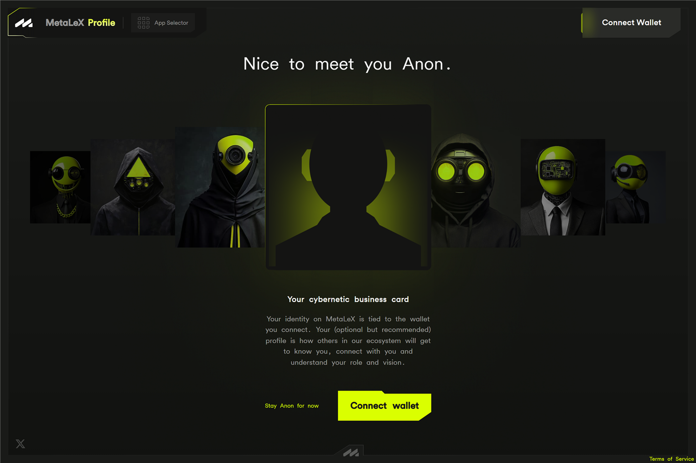

# Your profile

Your **profile** (`profile.metalex.tech`) is your MetaLeX identity. It
belongs to your MetaLeX account — which can hold **several linked
wallets** — and stays with you when you switch between them, shared
across all the apps: when a founder reviews your Expression of Interest,
or your name appears on a certificate, it comes from here.

A profile is **optional but recommended**. You can also stay anonymous.

## Creating your profile (onboarding)

1. Connect a wallet and **Sign in** — a one-time, free signature that
   creates your account and its profile record.
2. Pick a profile picture and enter a name — or **connect your X/Twitter**
   to auto-fill both.

Prefer not to? **Stay Anon for now** skips the whole step.

If you were onboarded as a stakeholder through a company's invitation
link, your name pre-fills from the stakeholder record — and starts visible
only to companies you hold with, until you choose to make it public.

## Your profile page

Your profile page (*Account Profile*) is a public-facing card showing your
picture, name, bio, social links, your **LeXcheX accreditation status**,
and your **MetaLeX account addresses** — every wallet linked to the
account, plus any multisigs. If you are a founder, your founder title (e.g. “Founder of …”)
is derived from your cyberCORPs onchain and shown automatically. Your own
profile also shows a public **platform activity** card — your cyberCORPs
and how long you've been cybernetic if you're a founder, your closed
investments if you're an investor.

To edit it, sign in (**auth to edit profile**), then open the edit form:

* **Your PFP and details** — picture, name, and bio.
* **Accreditation** — shows your LeXcheX status, with a link out to
  [LeXcheX](lexchex.md) to get accredited. Until you are accredited, public
  rounds are not open to you. Once accredited, this section shows a
  validity countdown with **view certificate** and **renew certificate**
  links.
* **Socials** — verify your X/Twitter account (via its sign-in) and your
  Telegram (via the Telegram login widget). This is also where you can
  **enable Telegram notifications** (below).
* **Website and additional info.**
* **Privacy** — name, socials, website, and additional info each carry a
  visibility control with four settings: public, private, viewable to all
  founders, or viewable to connected founders only. (Your picture and bio
  are always public.)

Saving your profile is a plain save — no transaction, no gas.

## Wallet settings

**Wallet Settings** (in the account dropdown) manages the wallets behind
your account: the **linked wallets** that carry your profile, the
**unlinked wallets** connected in this browser (with a one-click
**Link**), which wallet is currently **active** for transactions, and a
**Connect another wallet** action. A wallet can be unlinked again — with
one exception: an *embedded* wallet created by MetaLeX as part of your
profile can't be unlinked.

## Notifications

MetaLeX notifications arrive over **Telegram**. In the profile's Socials
section, **Enable notifications** opens a private chat with the MetaLeX
bot; once started, the bot messages you about your offers, deals, and
investments — offers submitted/accepted/rejected, deals ready to sign or
finalized, certificates assigned or transferred, agreements ready and
fully signed, rounds closing — each with a link straight to the relevant
page. In the chat, `/status` shows your subscription and `/stop` ends it.

Inside the apps, notification counters also appear on the cyberRAISE
sidebar (on **Portfolio** for investors, **Raise** for founders with
pending EOIs).

## Delegation

The **delegation** page is for people who sign on behalf of a **Safe
multisig**. Collecting multisig signatures for every legal agreement is
slow, so delegation lets a Safe grant agreement-signing authority to a
single wallet.

To set it up: pick the chain, enter your Safe address (it must be a
multisig that lists you as an owner), and set an expiry date (it defaults
to about six months out). **Sign delegation** proposes a Safe transaction —
you then complete it from your Safe's own interface, where your co-signers
approve it.

After that, the delegated wallet can sign cyberAgreements on the Safe's
behalf until the delegation expires.

> **Under the hood.** Delegation registers the delegate against the
> protocol's agreement layer, so a signature from the delegate counts as a
> signature from the Safe when executing a cyberAgreement. Background:
> [CyberAgreementRegistry](../reference/contracts/CyberAgreementRegistry.md)
> and [Sign a cyberAgreement](../how-to/sign-a-cyberagreement.md).

## Good to know

* Your profile follows your **account**, not a single wallet: act from
  any of your linked wallets and it's still you. A wallet that isn't
  linked to your account has its own (or no) profile — link it in
  Wallet Settings. (One exception is wallet-bound by design: the LeXcheX
  credential itself lives in the wallet that holds it — see
  [LeXcheX](lexchex.md).)
* Verifying socials and accreditation builds trust with founders reviewing
  your investments — worthwhile if you intend to invest in founder-approval
  rounds. Founder profiles without any verified social carry a “no verified
  socials” warning for investors.
