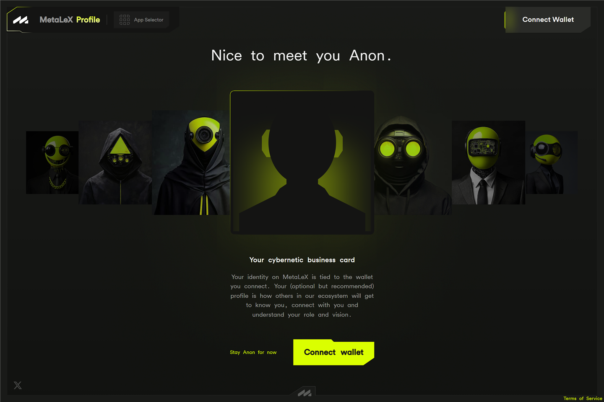

# Your profile

Your **profile** (`profile.metalex.tech`) is your MetaLeX identity, and
every app reads it. When a founder reviews your expression of interest, or
your name appears on a certificate, the details come from here. The profile
belongs to your MetaLeX account, which can hold **several linked wallets**,
so it stays the same when you switch between them. The cyberCORPs app,
cyberRAISE, cyberSign and LeXcheX share one account card and menu, and show
the same profile and wallets.

A profile is **optional but recommended**. You can stay anonymous.

## Create your profile

1. Connect a wallet and **Sign in**. Signing in is a free signature that costs
   no gas, and it creates your MetaLeX account and its profile record.
2. Pick a profile picture. If you don't have one, the preset gallery opens
   on its own (see [Choose a preset picture](#choose-a-preset-picture)).
3. Enter a **Name** (up to 25 characters) and **Continue**.

**Stay Anon for now** skips the whole step.

If a company onboarded you as a stakeholder through an invitation link, your
name prefills from the stakeholder record. It starts out visible only to
companies you hold securities in, until you choose to make it public.

## Edit your profile page

Your profile page (*Account Profile*) is a public card with your picture,
name, bio, social links, your **LeXcheX accreditation status** and your
**MetaLeX account addresses**: every wallet linked to the account, plus any
multisigs. A founder's title (e.g. "Founder of …") comes from their
cyberCORPs onchain and appears automatically. Your own profile also shows a
public **platform activity** card: your cyberCORPs and how long you've been
cybernetic if you're a founder, and your closed investments if you're an
investor.

To edit it, sign in (**auth to edit profile**) and open the edit form:

* **Your PFP**: **Upload picture**, **Choose MetaLeX Pfp** from the preset
  gallery, or **Import Your X Pfp** (**Use X Pfp** once your X account is
  connected).
* **Profile identity**: your **Display Name** (up to 25 characters) and
  bio. Others on MetaLeX see the display name as far as your visibility
  setting allows. A nickname or pseudonym is fine and need not match the
  legal name you use to form a company.
* **Private formation details**: your legal first and last name, phone
  number, country of residence and mailing address, for when you act as a
  company's responsible party. Only you see them; profile visitors never
  do. They are copied into a formation request only when you choose
  **Reuse profile details** there (see [Form a company](formation.md)). If
  you stay linked as the company's first public officer, your legal name
  also fills that officer's onchain record, which is permanently public;
  you can review it before publishing.
* **Accreditation**: your LeXcheX status, with a link to
  [LeXcheX](lexchex.md) to get accredited. Public rounds stay closed to you
  until you are. Once you are accredited, the section shows a validity
  countdown with **view certificate** and **renew certificate** links.
* **Socials**: **Verify X Account** through X's own sign-in, and **Verify
  Telegram Account** through the Telegram login widget. If verification
  fails, the form says why: the X account is already linked to another
  MetaLeX account, X declined the authorization, or "X verification isn't
  available here" when X sign-in isn't enabled. This is also where you
  turn on [Telegram notifications](#get-notifications-on-telegram).
* **Additional Details**: website and additional info.
* **Privacy**: name, socials, website and additional info each have a
  visibility setting: public, private, viewable to all founders, or
  viewable to connected founders only. Your picture and bio are always
  public.

Saving your profile is a plain save with no transaction or gas. The public
profile and the private formation details save separately; if only one of
them saves, the form says which and keeps your edits.

### Choose a preset picture

The preset gallery (*Pick a PFP that fits your role and style*) has more
than 80 pictures, most of them designs of LeXbot, the MetaLeX mascot,
grouped by theme: Ethereum, Solana, Zcash, Bitcoin, MetaDAO and others. Any
account can use any preset, and none is reserved for one person. Clicking a
picture opens an enlarged preview. Step through the gallery with the arrows
or your arrow keys, then choose **Use this PFP**, or **Keep this PFP** if
it is already yours. Closing the preview returns you to the gallery without
changing anything.

## Use several wallets with one account

Your profile belongs to your account. The wallet you have **active** signs
and sends transactions, and switching it never changes which profile you
are signed into. The account card in the header shows both the signed-in
profile and the active wallet. A **!** marker on the card means the active
wallet isn't linked to your profile.

Clicking the card opens the account menu: **Profile**, **Wallet Settings**,
the wallets connected in this browser (click one to make it active), **Link
another wallet** and **Sign out**. In the cyberCORPs app and cyberRAISE the
menu also has **Your Multisigs**, **Delegation Settings**, **My grants**
and **My formation orders**. From cyberSign and LeXcheX, **Profile** and
**Wallet Settings** open the profile app in a new tab.

### Link a wallet

**Link another wallet** asks you to connect a wallet and sign a short
authorization message with it. Selecting a connected wallet that isn't
linked yet (**Authorize** on its Wallet Settings row) shows your profile and
the wallets already on it, and **Link wallet** asks for the same signature.
The signature is free and single-use, and it expires after a few minutes. A
wallet already authorized for your profile isn't asked again. The wallet
itself has to sign, so a smart-contract wallet such as a Safe can't be
linked this way; to act for a Safe, use
[delegation](#delegate-signing-for-a-safe).

A wallet that belongs to a different MetaLeX profile can't be linked to
yours, and profiles are never merged. If your sign-in has picked up such a
wallet, a **Wallet link needs attention** notice explains that it can't
authorize payments or account changes for this account. If the other
profile is yours, unlink the wallet in Wallet Settings, then use **Sign in
with …** to sign in with that wallet and reach that profile (**Stay on this
account** keeps you where you are). If it isn't yours, or it is the only
wallet on the account, contact support.

If a wallet you sign in or link with carries a profile that no MetaLeX
account has claimed, that profile, with its history, is recovered into your
account automatically, and linking the wallet shows **Profile recovered**.
A wallet you have unlinked from your account is not recovered this way.

An **Authorize your wallets** prompt may point you to Wallet Settings to
choose the wallets for your profile and sign a fresh authorization for
each. **Later** dismisses it. Your existing profiles and their records stay
unchanged either way.

### Manage wallets in Wallet Settings

**Wallet Settings**, in the account menu, lists your **Linked Wallets**,
the active one first, and any **Unlinked Wallets** connected in this
browser, with **Link another wallet** at the bottom. Each row is labeled
with the wallet's type and status, for example *active · profile linked*:

* *not connected* marks a linked wallet that isn't connected in this
  browser;
* *login linked · profile unverified* marks a wallet your sign-in knows
  about but your profile hasn't authorized, and **Authorize** adds it;
* *another profile* marks a wallet that belongs to a different profile.

A linked wallet can be unlinked only when at least one other linked wallet
remains on the account. An *embedded* wallet created by MetaLeX as part of
your profile can't be unlinked. Unlinking takes effect at once: the wallet
stops giving this account access to company workspaces, private documents
and Safe-owner permissions. If it was the active wallet, another connected
linked wallet becomes active. Linking it again needs a fresh authorization
signature.

When the active wallet is your embedded wallet, Wallet Settings also shows
**Embedded wallet confirmation prompts**, where you choose whether
transactions and signatures skip the confirmation popup. The wallet still
signs in your browser with your key; only the popup is hidden.

## Get notifications on Telegram

MetaLeX sends notifications over **Telegram**. In the profile's Socials
section, **Enable notifications** opens a private chat with the MetaLeX
bot. Once you start it, the bot messages you about your offers, deals and
investments: offers submitted, accepted or rejected; deals ready to sign or
finalized; certificates assigned or transferred; agreements ready and fully
signed; rounds closing. Each message links to the relevant page. In the
chat, `/status` shows your subscription and `/stop` ends it.

Inside the apps, the cyberRAISE sidebar shows counters too: on
**Portfolio** for investors, and on **Raise** for founders with pending
EOIs.

## Delegate signing for a Safe

The **delegation** page is for people who sign for a **Safe multisig**.
Collecting multisig signatures for every legal agreement is slow, so a Safe
can grant agreement-signing authority to a single wallet.

Pick the chain, enter your Safe address (a multisig that lists you as an
owner) and set an expiry date, which defaults to about six months out.
**Sign delegation** proposes a Safe transaction, which you complete in your
Safe's own interface, where your co-signers approve it. The delegated
wallet can then sign cyberAgreements for the Safe until the delegation
expires.

> **Under the hood.** Delegation registers the delegate with the protocol's
> agreement layer, so a signature from the delegate counts as a signature
> from the Safe when a cyberAgreement executes. Background:
> [CyberAgreementRegistry](../reference/contracts/CyberAgreementRegistry.md)
> and [Sign a cyberAgreement](../how-to/sign-a-cyberagreement.md).

## Good to know

* **Your profile follows your account.** Act from any linked wallet and
  it's still you. A wallet that isn't linked to your account has its own
  profile or none; link it in Wallet Settings. The LeXcheX credential is
  the exception: it stays in the wallet that holds it (see
  [LeXcheX](lexchex.md)).
* **Company access follows your profile too.** If any wallet linked to your
  profile owns a company, you can open and work in that company's workspace
  while another linked wallet is active, or with no wallet connected.
  Signatures and transactions for the company still need an authorized
  wallet on the company's network. When the active wallet isn't one, the
  app says "Your profile has access to this company. Company signatures
  still require an authorized wallet and network.", names the wallets to
  use, and offers **Switch to …** and **Connect signing wallet**. Access is
  checked against the chain again as you work, so it ends when the wallet
  loses its role or you unlink it.
* **What cyberSign shows.** The other parties to an agreement see your
  picture and, if it is public, your name; a name visible only to founders
  stays hidden there. cyberSign fills your name into an agreement only from
  a public profile name, and you can edit or clear it before signing.
* **Verified socials help when you invest.** Verified socials and
  accreditation build trust with founders reviewing your offers in
  founder-approval rounds. Founder profiles without a verified social carry
  a "no verified socials" warning for investors.
