## Architectures

- All MetaLeX-controlled contracts (shown in the diagram below as the `Metalex` box) are `UUPSUpgradeable` so they have permanent addresses and are upgradeable by MetaLeX
  - Deployed instances include `CyberAgreementRegistry`, `CyberCorpFactory`, `CyberCorpSingleFactory`, `*ManagerFactory` and `CertificateUriBuilder`
  - Permanent addresses allow us to provide a stable parameter lookup for all deployed instances (ex. reference implementations, fee ratios, etc.)
- MetaLeX-controlled factory-deployed instances are `UUPSUpgradeable` as well, but owned instead by the corresponding company owners (shown in the diagram below as the `CorpA` and `CorpB` boxes)
  - Deployed instances include `CyberCorp`, `*Manager`
  - This allows a co-approval structure for future upgrades: MetaLeX can release new implementations 
    but cannot unilaterally upgrade existing instances without corresponding company owner's approval and vice versa,
    company owner cannot unilaterally upgrade them to arbitrary implementations outside MetaLeX-approved releases
- Factories can be nested. For example, individual company-owned `IssuanceManager` is also a factory 
  that deploys `CyberCertPrinter` and `CyberScrip`
- `IssuanceManager`-deployed instances are `BeaconProxy` referencing a singular implementation (`UpgradeableBeacon`)
  - Deployed instances include `CyberCertPrinter`, `CyberScrip`
  - `IssuanceManager` is owned by the company owner, but the same co-approval structure applies to upgrading the deployed instances: MetaLeX can release new implementations
    but cannot unilaterally upgrade existing instances without corresponding company owner's approval and vice versa,
    company owner cannot unilaterally upgrade them to arbitrary implementations outside MetaLeX-approved releases 
  - Once co-approved, upgrades to the `UpgradeableBeacon` will apply to all deployed instances at once. 
    This is designed so because the company has unilateral power over its deployment and does not need further individual co-approvals

```mermaid
classDiagram
    direction TB

    namespace Metalex {
        class CertificateUriBuilder {
            <<UUPSUpgradeable>>
            +upgradeToAndCall()
        }
        
        class CyberAgreementRegistry {
            <<UUPSUpgradeable>>
            +upgradeToAndCall()
        }
        
        class CyberCorpFactory {
            <<UUPSUpgradeable>>
            +upgradeToAndCall()
        }
    
        class CyberCorpSingleFactory {
            <<UUPSUpgradeable>>
            +upgradeToAndCall()
            +setRefImplementation()
        }
        
        class IssuanceManagerFactory {
            <<UUPSUpgradeable>>
            +upgradeToAndCall()
            +setRefImplementation()
            +setCyberCertPrinterRefImplementation()
            +setCyberScripRefImplementation()
        }
        
        class DealManagerFactory {
            <<UUPSUpgradeable>>
            +upgradeToAndCall()
            +setRefImplementation()
        }
        
        class RoundManagerFactory {
            <<UUPSUpgradeable>>
            +upgradeToAndCall()
            +setRefImplementation()
        }    
    }
    
    namespace ReleaseV1 {
        class CyberCorpImplV1
        class IssuanceManagerImplV1
        class DealManagerImplV1
        class RoundManagerImplV1
        class CyberCertPrinterImplV1
    }
    
    namespace ReleaseV2 {
        class CyberCorpImplV2
        class IssuanceManagerImplV2
        class DealManagerImplV2
        class RoundManagerImplV2
        class CyberCertPrinterImplV2
        class CyberScripImplV2
    }
    
    namespace CorpA {
        class CyberCorpA {
            <<UUPSUpgradeable>>
            +upgradeToAndCall()
        }        
        class IssuanceManagerA {
            <<UUPSUpgradeable>>
            +upgradeToAndCall()
            +upgradeCertPrinterBeaconImplementation()
            +upgradeScripBeaconImplementation()
        }
        class CyberCertPrinterBeaconA {
            <<UpgradeableBeacon>>
            +upgradeTo()
        }
        class CyberScripBeaconA {
            <<UpgradeableBeacon>>
            +upgradeTo()
        }        
        class DealManagerA {
            <<UUPSUpgradeable>>
            +upgradeToAndCall()
        }
        class RoundManagerA {
            <<UUPSUpgradeable>>
            +upgradeToAndCall()
        }        
        class CyberCertPrinterA1            
        class CyberCertPrinterA2            
        class CyberScripA1            
    }
    
    namespace CorpB {
        class CyberCorpB {
            <<UUPSUpgradeable>>
            +upgradeToAndCall()
        }        
        class IssuanceManagerB {
            <<UUPSUpgradeable>>
            +upgradeToAndCall()
            +upgradeCertPrinterBeaconImplementation()
            +upgradeScripBeaconImplementation()
        }
        class CyberCertPrinterBeaconB {
            <<UpgradeableBeacon>>
            +upgradeTo()
        }        
        class DealManagerB {
            <<UUPSUpgradeable>>
            +upgradeToAndCall()
        }
        class RoundManagerB {
            <<UUPSUpgradeable>>
            +upgradeToAndCall()
        }        
        class CyberCertPrinterB1
    }
    
    %% Metalex
    
    CyberCorpFactory --> CyberAgreementRegistry : depend on
    CyberCorpFactory --> CertificateUriBuilder : depend on
    CyberCorpFactory --> CyberCorpSingleFactory : depend on
    CyberCorpFactory --> IssuanceManagerFactory : depend on
    CyberCorpFactory --> DealManagerFactory : depend on
    CyberCorpFactory --> RoundManagerFactory : depend on
    
    CyberCorpSingleFactory --> CyberCorpImplV2 : refImplementation
    
    IssuanceManagerFactory --> CyberCertPrinterImplV2: cyberCertPrinterRefImplementation
    IssuanceManagerFactory --> CyberScripImplV2: cyberScripRefImplementation
    IssuanceManagerFactory --> IssuanceManagerImplV2: refImplementation
    
    DealManagerFactory --> DealManagerImplV2: refImplementation
    RoundManagerFactory --> RoundManagerImplV2: refImplementation
    
    %%CorpA
    
    CyberCorpImplV2 <-- CyberCorpA : implementation
    IssuanceManagerImplV2 <-- IssuanceManagerA : implementation
    IssuanceManagerA <-- CyberCertPrinterBeaconA : owned by
    IssuanceManagerA <-- CyberScripBeaconA : owned by
    CyberCertPrinterImplV2 <-- CyberCertPrinterBeaconA : implementation
    CyberScripImplV2 <-- CyberScripBeaconA : implementation
    DealManagerImplV2 <-- DealManagerA : implementation
    RoundManagerImplV2 <-- RoundManagerA : implementation    
    CyberCertPrinterBeaconA <-- CyberCertPrinterA1: beacon    
    CyberCertPrinterBeaconA <-- CyberCertPrinterA2: beacon
    CyberScripBeaconA <-- CyberScripA1: beacon
        
    %%CorpB
    
    CyberCorpImplV1 <-- CyberCorpB : implementation
    IssuanceManagerImplV1 <-- IssuanceManagerB : implementation
    IssuanceManagerB <-- CyberCertPrinterBeaconB : owned by
    CyberCertPrinterImplV1 <-- CyberCertPrinterBeaconB : implementation
    CyberCertPrinterBeaconB <-- CyberCertPrinterB1: beacon    
    DealManagerImplV1 <-- DealManagerB : implementation
    RoundManagerImplV1 <-- RoundManagerB : implementation
```

