## Architectures

- All MetaLeX-controlled contracts are shown in the diagram below in the `Metalex` box
  - Legacy architectures use beacon-proxy pattern so upgrades are unilateral
  - V3 architectures migrate to `UUPSUpgradeable` pattern so company owners have more autonomy in upgrade cadence (i.e. co-approval)
  - All future `CyberCorp` and `*ManagerFactory` deployments will use v3 architectures
  - Legacy cyber corp deployments will continue using beacon-proxy pattern for receiving upgrades
- V3 `CyberCorp`, `*Manager` are individually upgradeable and owned by the corresponding company owners (shown in the diagram as the `CorpA_deployed_after_v3` box)
  - This allows a co-approval structure for future upgrades: MetaLeX can release new implementations 
    but cannot unilaterally upgrade existing instances without corresponding company owner's approval; vice versa,
    a company owner cannot unilaterally upgrade them to arbitrary implementations outside MetaLeX-approved releases
- Factories can be nested. For example, individual company-owned `IssuanceManager` is also a factory 
  that deploys `CyberCertPrinter` and `CyberScrip`
  - In v3, such instances will remain using beacon-proxy patterns because they are owned by the same company owner, and they are expected to upgrade together. 
    Using beacon-proxy patterns will make upgrades simpler and can be done in batches
  - The same co-approval structure still applies: MetaLeX can release new implementations
    but cannot unilaterally upgrade existing instances without corresponding company owner's approval; vice versa,
    company owner cannot unilaterally upgrade them to arbitrary implementations outside MetaLeX-approved releases 
  - Once co-approved, upgrades to the `UpgradeableBeacon` will apply to all downstream `ProxyBeacon` instances at once

```mermaid
classDiagram
    direction TB

    namespace Metalex {
        class CertificateUriBuilder {
            <<UUPSUpgradeable>>
            +upgradeToAndCall()
        }
        
        class CyberAgreementRegistry {
            <<UUPSUpgradeable>>
            +upgradeToAndCall()
        }
        
        class CyberCorpFactory {
            <<UUPSUpgradeable>>
            +upgradeToAndCall()
        }
        
        class RoundManagerFactory {
            <<UUPSUpgradeable>>
            +upgradeToAndCall()
            +setRefImplementation()
        }
    
        class CyberCorpSingleFactory {
            <<UUPSUpgradeable>>
            +upgradeToAndCall()
            +setRefImplementation()
        }
        
        class IssuanceManagerFactory {
            <<UUPSUpgradeable>>
            +upgradeToAndCall()
            +setRefImplementation()
            +setCyberCertPrinterRefImplementation()
            +setCyberScripRefImplementation()
        }
        
        class DealManagerFactory {
            <<UUPSUpgradeable>>
            +upgradeToAndCall()
            +setRefImplementation()
        }
        
        class LegacyCyberCorpSingleFactory {
            +upgradeImplementation()
        }
        
        class LegacyDealManagerFactory {
            +upgradeImplementation()
        }
        
        class LegacyIssuanceManagerFactory {
            +upgradeImplementation()
        }        
    }
   
    namespace ReleaseV3 {
        class CyberCorpImplV3
        class IssuanceManagerImplV3
        class DealManagerImplV3
        class RoundManagerImplV3
        class CyberCertPrinterImplV3
        class CyberScripImplV3
    }
    
    namespace CorpA_deployed_after_v3 {
        class CyberCorpA {
            <<UUPSUpgradeable>>
            +upgradeToAndCall()
        }        
        class IssuanceManagerA {
            <<UUPSUpgradeable>>
            +upgradeToAndCall()
            +upgradeCertPrinterBeaconImplementation()
            +upgradeScripBeaconImplementation()
        }
        class CyberCertPrinterBeaconA {
            <<UpgradeableBeacon>>
            +upgradeTo()
        }
        class CyberScripBeaconA {
            <<UpgradeableBeacon>>
            +upgradeTo()
        }        
        class DealManagerA {
            <<UUPSUpgradeable>>
            +upgradeToAndCall()
        }
        class RoundManagerA {
            <<UUPSUpgradeable>>
            +upgradeToAndCall()
        }        
        class CyberCertPrinterA1 {
            <<BeaconProxy>>
        }            
        class CyberCertPrinterA2 {
            <<BeaconProxy>>
        }            
        class CyberScripA1 {
            <<BeaconProxy>>
        }            
    }
    
    namespace MetalexLegacyBeacons {
        class LegacyCyberCorpBeacon {
            <<UpgradeableBeacon>>
            +upgradeTo()
        }
        
        class LegacyDealManagerBeacon {
            <<UpgradeableBeacon>>
            +upgradeTo()
        }
        
        class LegacyIssuanceManagerBeacon {
            <<UpgradeableBeacon>>
            +upgradeTo()
        }
    }
    
    namespace LegacyCorpB_migrated_after_v3 {
        class CyberCorpB {
            <<BeaconProxy>>
        }        
        class IssuanceManagerB {
            <<BeaconProxy>>
            +upgradeCertPrinterBeaconImplementation()
            +upgradeScripBeaconImplementation()
        }
        class DealManagerB {
            <<BeaconProxy>>
        }
        class RoundManagerB {
            <<UUPSUpgradeable>>
            +upgradeToAndCall()
        }
        class CyberCertPrinterBeaconB {
            <<UpgradeableBeacon>>
            +upgradeTo()
        }        
        class CyberCertPrinterB1 {
            <<BeaconProxy>>
        }
        class CyberScripBeaconB {
            <<UpgradeableBeacon>>
            +upgradeTo()
        }
    }
    
    %% Metalex
    
    CyberCorpFactory --> CyberAgreementRegistry : depend on
    CyberCorpFactory --> CertificateUriBuilder : depend on
    CyberCorpFactory --> CyberCorpSingleFactory : depend on
    CyberCorpFactory --> DealManagerFactory : depend on
    CyberCorpFactory --> IssuanceManagerFactory : depend on
    CyberCorpFactory --> RoundManagerFactory : depend on
    
    CyberCorpSingleFactory --> CyberCorpImplV3 : refImplementation
    
    IssuanceManagerFactory --> IssuanceManagerImplV3: refImplementation
    IssuanceManagerFactory --> CyberCertPrinterImplV3: cyberCertPrinterRefImplementation
    IssuanceManagerFactory --> CyberScripImplV3: cyberScripRefImplementation
    
    DealManagerFactory --> DealManagerImplV3: refImplementation
    RoundManagerFactory --> RoundManagerImplV3: refImplementation        
    
    %% CorpA_deployed_after_v3
    
    CyberCorpImplV3 <-- CyberCorpA : implementation
    IssuanceManagerImplV3 <-- IssuanceManagerA : implementation
    IssuanceManagerA <-- CyberCertPrinterBeaconA : owned by
    IssuanceManagerA <-- CyberScripBeaconA : owned by
    CyberCertPrinterImplV3 <-- CyberCertPrinterBeaconA : implementation
    CyberScripImplV3 <-- CyberScripBeaconA : implementation
    DealManagerImplV3 <-- DealManagerA : implementation
    CyberCertPrinterBeaconA <-- CyberCertPrinterA1: beacon    
    CyberCertPrinterBeaconA <-- CyberCertPrinterA2: beacon
    CyberScripBeaconA <-- CyberScripA1: beacon
    RoundManagerImplV3 <-- RoundManagerA : implementation    
    
    %% LegacyMetalex
    
    LegacyCyberCorpSingleFactory <-- LegacyCyberCorpBeacon: owned by    
    LegacyDealManagerFactory <-- LegacyDealManagerBeacon: owned by    
    LegacyIssuanceManagerFactory <-- LegacyIssuanceManagerBeacon: owned by        
    
    CyberCorpImplV3 <-- LegacyCyberCorpBeacon : implementation
    DealManagerImplV3 <-- LegacyDealManagerBeacon : implementation
    IssuanceManagerImplV3 <-- LegacyIssuanceManagerBeacon : implementation

    %% LegacyCorpB_migrated_after_v3
    
    LegacyCyberCorpBeacon <-- CyberCorpB : beacon
    LegacyIssuanceManagerBeacon <-- IssuanceManagerB : beacon
    IssuanceManagerB <-- CyberCertPrinterBeaconB : owned by
    IssuanceManagerB <-- CyberScripBeaconB : owned by
    LegacyDealManagerBeacon <-- DealManagerB : beacon
    CyberCertPrinterImplV3 <-- CyberCertPrinterBeaconB : implementation
    CyberCertPrinterBeaconB <-- CyberCertPrinterB1: beacon    
    CyberScripImplV3 <-- CyberScripBeaconB : implementation        
    RoundManagerImplV3 <-- RoundManagerB : implementation
```

