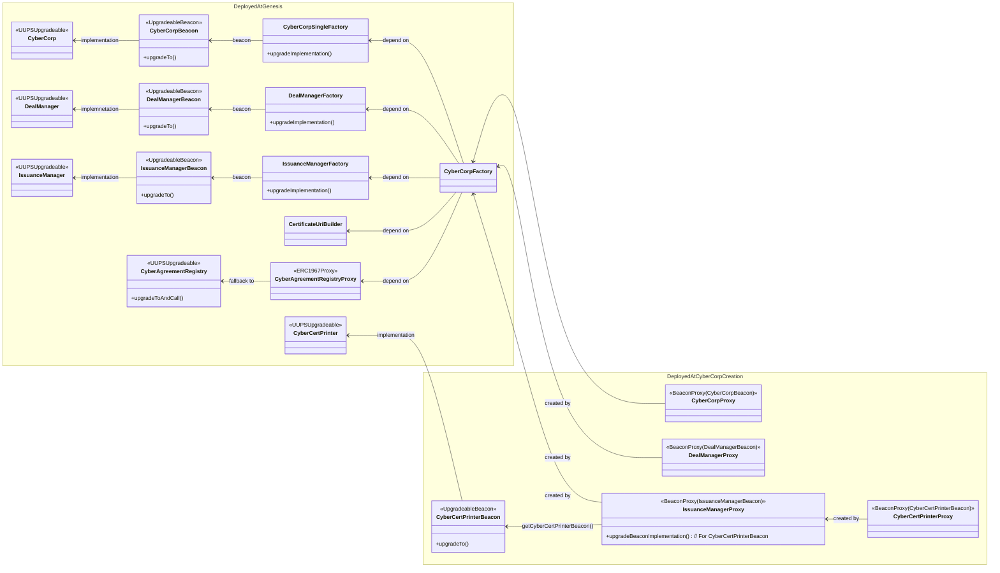

## Architectures

```mermaid
classDiagram
    direction LR

    namespace DeployedAtGenesis {
        class CyberCorp {
            %% TODO Is it necessary? 
            %%   - Only its factory is authorized, and the factory does not implement logic to call `upgradeToAndCall()` anyways
            %%   - It is an implementation behind a `UpgradableBeacon` anyways, it shouldn't matter if the implementation itself is immutable or not
            <<UUPSUpgradeable>>
        }
        class CyberCorpBeacon {
            <<UpgradeableBeacon>>
            +upgradeTo()
        }
        class CyberCorpSingleFactory {
            +upgradeImplementation()
        }
        class CyberCorpFactory
        
        class DealManager {
            %% TODO Is it necessary? 
            %%   - Only its factory is authorized, and the factory does not implement logic to call `upgradeToAndCall()` anyways
            %%   - It is an implementation behind a `UpgradableBeacon` anyways, it shouldn't matter if the implementation itself is immutable or not
            <<UUPSUpgradeable>>
        }
        class DealManagerBeacon {
            <<UpgradeableBeacon>>
            +upgradeTo()
        }    
        class DealManagerFactory {
            +upgradeImplementation()
        }
        
        class IssuanceManager {
            %% TODO Is it necessary? 
            %%   - Only its factory is authorized, and the factory does not implement logic to call `upgradeToAndCall()` anyways
            %%   - It is an implementation behind a `UpgradableBeacon` anyways, it shouldn't matter if the implementation itself is immutable or not
            <<UUPSUpgradeable>>
        }
        class IssuanceManagerBeacon {
            <<UpgradeableBeacon>>
            +upgradeTo()
        }
        class IssuanceManagerFactory {
            +upgradeImplementation()
        }
        
        class CertificateUriBuilder
        
        class CyberAgreementRegistry {
            <<UUPSUpgradeable>>
            +upgradeToAndCall()
        }
        class CyberAgreementRegistryProxy {
            <<ERC1967Proxy>>
        }    
    
        class CyberCertPrinter {
            %% TODO Is it necessary? 
            %%   - Only its factory is authorized, and the factory does not implement logic to call `upgradeToAndCall()` anyways
            %%   - It is an implementation behind a `UpgradableBeacon` anyways, it shouldn't matter if the implementation itself is immutable or not
            <<UUPSUpgradeable>>
        } 
    }
    
    namespace DeployedAtCyberCorpCreation {
        class CyberCorpProxy {
            <<BeaconProxy(CyberCorpBeacon)>>
        }
        
        class DealManagerProxy {
            <<BeaconProxy(DealManagerBeacon)>>
        }
        
        class IssuanceManagerProxy {
            <<BeaconProxy(IssuanceManagerBeacon)>>
            +upgradeBeaconImplementation() // For CyberCertPrinterBeacon
        }
        
        class CyberCertPrinterBeacon {
            <<UpgradeableBeacon>>
            +upgradeTo()
        }            
        class CyberCertPrinterProxy {
            <<BeaconProxy(CyberCertPrinterBeacon)>>
        }
    }
    
    CyberCorp <-- CyberCorpBeacon : implementation
    CyberCorpBeacon <-- CyberCorpSingleFactory : beacon
    CyberCorpSingleFactory <-- CyberCorpFactory : depend on
    
    DealManager <-- DealManagerBeacon : implemnetation
    DealManagerBeacon <-- DealManagerFactory : beacon
    DealManagerFactory <-- CyberCorpFactory : depend on
    
    IssuanceManager <-- IssuanceManagerBeacon : implementation
    IssuanceManagerBeacon <-- IssuanceManagerFactory : beacon
    IssuanceManagerFactory <-- CyberCorpFactory : depend on

    CertificateUriBuilder <-- CyberCorpFactory : depend on
    
    CyberAgreementRegistry <-- CyberAgreementRegistryProxy : fallback to
    
    CyberAgreementRegistryProxy <-- CyberCorpFactory : depend on
    
    CyberCorpFactory <-- CyberCorpProxy : created by
    CyberCorpFactory <-- IssuanceManagerProxy : created by        
    CyberCorpFactory <-- DealManagerProxy : created by
    
    CyberCertPrinter <-- CyberCertPrinterBeacon : implementation    
    CyberCertPrinterBeacon <-- IssuanceManagerProxy : getCyberCertPrinterBeacon()
    IssuanceManagerProxy <-- CyberCertPrinterProxy : created by    
```
