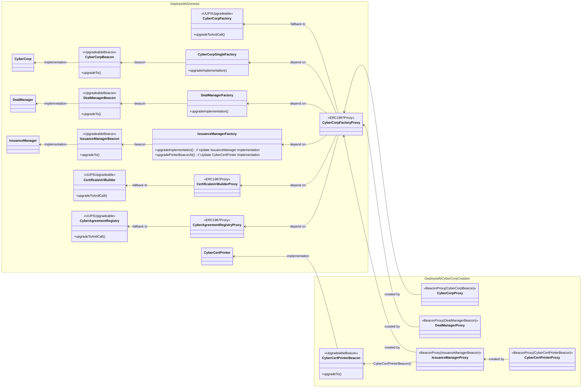

## Architectures

- All singletons are `ERC1967Proxy` referencing a `UUPSUpgradeable` implementation so that they are upgradeable and
  have permanent addresses. These include `CyberCorpFactory`, `CyberAgreementRegistry` and `CertificateUriBuilder`. 
- In contrast, other peripheral factories are immutable and are upgraded by replacement (ex. swapping modules of `CyberCorpFactory`)
- Factory-deployed instances are `BeaconProxy` referencing a singular implementation (`UpgradeableBeacon`).
  Therefore, upgrades to the `UpgradeableBeacon` will apply to all proxy instances at once
- Factories can be nested. `IssuanceManagerProxy` is a `BeaconProxy` but also a factory that deploys `CyberCertPrinterProxy`
  and manage their implementation through `CyberCertPrinterBeacon`
- In the future, we may implement separate governance on individual corps or certificates upgrades.
  In such case, we will transition away from the beacon architecture to enable independent upgrades

