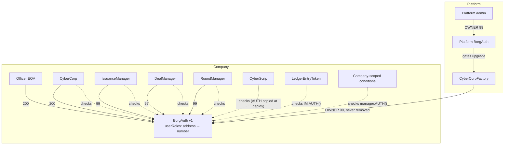
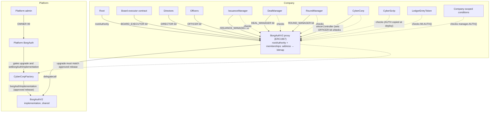

# Company auth — v1 vs. v2

Source: branch `feat/borgauth-upgrade` (`ce6ed47b`). v1 = `BorgAuth` (`src/libs/auth.sol`). v2 = `BorgAuthV2`
(`src/BorgAuthV2.sol`). Only `CyberCorpFactory.deployCyberCorpWithGovernance` creates a v2 company. All other
deploy entry points (`deployCyberCorp`, `deployCyberCorpAndCreateOffer`, `deployCyberCorpAndCreateRound`,
`PumpCorpFactory`) still create a v1 company.

## Terms

- **v1 role:** one number for each address (`userRoles`). A check passes when the number is equal to or more
  than the required number. So 200 passes every check that 99 passes.
- **v2 role:** one bit in the address's `memberships` bitmap. An address can hold many roles. A role gives
  nothing by itself. It counts only through a permission.
- **v2 permission:** a named action (`ISSUE_SECURITIES`, ...). A `pure` table (`rolesForPermission`) maps each
  permission to the roles that hold it. Contracts check permissions, not roles.
- **v2 root:** one address in `rootAuthority`. Root is not a role bit. Root holds `CONFIGURE_PROTOCOL` and
  `APPROVE_UPGRADE` alone, and `MANAGE_OFFICERS` as an override.

## v1 architecture

Legend: a solid arrow means "holds this role in". A dotted arrow means "reads this auth for its access checks".

- Every address with 99 or more can call `updateRole`, `setRoleAdapter` and `zeroOwner`. That includes each
  officer.
- An officer (200) passes every owner and admin check, so an officer is the company's full admin.
- The factory keeps OWNER (99) on each v1 company. A factory upgrade can use that role.
- IssuanceManager, DealManager and RoundManager each hold OWNER (99). Each one passes every owner check on
  every company contract, but a contract acts only through calls in its own code. The managers have no
  generic call path and do not call `updateRole`. A manager upgrade can change that.

## v2 architecture

- Each consumer calls `CorporateAuthCheck.requirePermission`. It asks the auth contract `supportsCorporateAuth()`.
  If yes, it checks the v2 permission. If no, it checks the v1 number. So one consumer build serves both
  versions.
- The factory is the temporary root while it deploys the company. `completeSetup` then gives root to the
  supplied address. After that, the factory has no role. It still decides which implementation root can
  upgrade to.
- The legacy v1 functions (`updateRole`, `onlyRole`, `setRoleAdapter`, owner transfer) revert on v2.

## Permission table (v2)

| Permission                | Root | Board executor | Officer | Issuance Mgr | Deal Mgr | Round Mgr | Director |
|---------------------------|------|----------------|---------|--------------|----------|-----------|----------|
| `CONFIGURE_PROTOCOL`      | yes  |                |         |              |          |           |          |
| `APPROVE_UPGRADE`         | yes  |                |         |              |          |           |          |
| `MANAGE_OFFICERS`         | yes  | yes            |         |              |          |           |          |
| `SIGN_AS_OFFICER`         |      |                | yes     |              |          |           |          |
| `COMPANY_OPERATIONS`      |      |                | yes     |              |          |           |          |
| `MANAGE_DEALS`            |      |                | yes     |              |          |           |          |
| `MANAGE_ROUNDS`           |      |                | yes     |              |          |           |          |
| `TRANSFER_POLICY`         |      |                | yes     |              |          |           |          |
| `MANAGE_SECURITY_CLASSES` |      |                | yes     |              | yes      | yes       |          |
| `ISSUE_SECURITIES`        |      |                | yes     |              | yes      | yes       |          |
| `ADMINISTER_CERTIFICATES` |      |                | yes     |              | yes      | yes       |          |

- The Root column is not in `rolesForPermission`. The first branch of `hasPermission` checks it. For
  `CONFIGURE_PROTOCOL` and `APPROVE_UPGRADE`, it returns `account == rootAuthority`. For `MANAGE_OFFICERS`,
  it returns true for root after setup. All other callers go on to the role table.
- The Issuance Manager bit maps to no permission. The IssuanceManager acts on its own contracts through
  self-call paths and the exact-`issuanceManager` checks in tokens.
- The Director bit maps to no permission.

## Who can set what (v2)

| Target                             | Who can change it                         | Function                                                               | Rules                                                                                |
|------------------------------------|-------------------------------------------|------------------------------------------------------------------------|--------------------------------------------------------------------------------------|
| Root                               | Root, then the nominee accepts            | `proposeRootTransfer` → `acceptRootTransfer`                           | Two steps. A new or zero proposal cancels the old nominee.                           |
| OFFICER bit                        | Board executor or root, through CyberCorp | `CyberCorp.addOfficer / updateOfficer / removeOfficer(At)`             | Only CyberCorp (`officerController`) can write this bit. Other bits stay the same.   |
| BOARD_EXECUTOR bit                 | Root                                      | `setMembership`                                                        | The account must be a contract.                                                      |
| DIRECTOR, manager bits             | Root                                      | `setMembership`                                                        | `setMembership` writes the whole bitmap but reverts if the OFFICER bit would change. |
| Manager addresses in CyberCorp, DM | Root                                      | `CyberCorp.setDealManager` etc., `DealManager.setIssuanceManager` etc. | The role bits do not change. Root must call `setMembership` too.                     |
| Approved auth release              | Platform admin                            | `CyberCorpFactory.setBorgAuthImplementation`                           | Root still approves each company's upgrade.                                          |
| Company auth code                  | Root                                      | `upgradeToAndCall` on the proxy                                        | The target must equal the factory's approved release.                                |

## Self-promotion to officer

| Actor          | v1                                                                    | v2                                                                            |
|----------------|-----------------------------------------------------------------------|-------------------------------------------------------------------------------|
| Officer        | Yes. Can add officers and set any role with `updateRole`.             | No. An officer has no `MANAGE_OFFICERS` and cannot call `setMembership`.      |
| Root           | No root exists.                                                       | Yes. `CyberCorp.addOfficer(root)` through the override. Emits `OfficerAdded`. |
| Board executor | No board exists.                                                      | Yes. `CyberCorp.addOfficer(board)`. The board's own process decides.          |
| Director       | No director exists.                                                   | No. The Director bit gives no permission.                                     |
| Manager        | Holds 99 and passes owner checks, but acts only through its own code. | No. A manager bit gives no `MANAGE_OFFICERS`.                                 |
| Factory        | Holds OWNER (99) for all time.                                        | No role after `completeSetup`.                                                |

Root can also give itself a manager bit with `setMembership`. For example, `DEAL_MANAGER` gives
`ISSUE_SECURITIES` without the officer bit.

## Manager permission coverage (v2)

Suite: `test/CorporateAuthManagerFlows.t.sol`. The company comes from `deployCyberCorpWithGovernance` and
uses real contracts.

Calls from a manager into a permission-gated function:

| Caller        | Target                                         | Permission                | Held | Test                                      |
|---------------|------------------------------------------------|---------------------------|------|-------------------------------------------|
| Deal Mgr      | `IM.createCert` (at proposal)                  | `ISSUE_SECURITIES`        | yes  | `testDealProposeSignPayFinalize`          |
| Deal Mgr      | printer `addIssuerSignature` (at finalize)     | `ADMINISTER_CERTIFICATES` | yes  | `testDealProposeSignPayFinalize`          |
| Deal Mgr      | printer `voidCert` (at void)                   | `ADMINISTER_CERTIFICATES` | yes  | `testDealVoidExpiredVoidsCert`            |
| Deal Mgr      | `IM.createCertPrinter` (new-certs deal)        | `MANAGE_SECURITY_CLASSES` | yes  | `testNewCertsDealCreatesPrinters`         |
| Deal Mgr      | printer `increaseUnitsReserved` (post offer)   | `ADMINISTER_CERTIFICATES` | yes  | `testSecondarySellPostAcceptFinalize`     |
| Deal Mgr      | printer `decreaseUnitsReserved` (finalize)     | `ADMINISTER_CERTIFICATES` | yes  | `testSecondarySellPostAcceptFinalize`     |
| Deal Mgr      | `IM.secondaryTransfer` (finalize)              | `ADMINISTER_CERTIFICATES` | yes  | `testSecondarySellPostAcceptFinalize`     |
| Round Mgr     | `IM.createCertPrinter` (create round)          | `MANAGE_SECURITY_CLASSES` | yes  | `testRoundCreateSubmitAllocate`           |
| Round Mgr     | `IM.createCert` (allocate)                     | `ISSUE_SECURITIES`        | yes  | `testRoundCreateSubmitAllocate`           |
| Round Mgr     | printer `addIssuerSignature` (allocate)        | `ADMINISTER_CERTIFICATES` | yes  | `testRoundCreateSubmitAllocate`           |
| Issuance Mgr  | printers and scrip                             | exact-address check       | n/a  | existing suites                           |

`addEndorsement` has no permission gate. The managers read CyberCorp only through view functions.

Refusals:

| Test                                    | What it checks                                                                 |
|-----------------------------------------|--------------------------------------------------------------------------------|
| `CorporateAuth.t.sol: testPermissionMatrix` | `hasPermission` for every permission and every actor equals the table above. |
| `CorporateAuth.t.sol: testNoPermissionBeforeSetup` | Before `completeSetup`, no actor except the temporary root holds a permission. |
| `testRoundManagerCannotConfigure`       | The Round Manager calls `IM.setUriBuilder` and gets `PermissionDenied`.        |
| `testDealManagerCannotManageRounds`     | The Deal Manager calls `RM.closeRoundNow` and gets `PermissionDenied`.         |
| `testIssuanceManagerCannotSetPolicy`    | The Issuance Manager calls `DM.setSettlementWindow` and gets `PermissionDenied`. |

## Open items

- TODO: Who is the expected root of a new company: MetaLeX, the founder or a company multisig? The code and
  its comments do not say. The plan recommends a governance multisig or a stockholder executor.
- TODO: Should a manager setter also move the manager role bit? Today it does not, the same as v1. An
  automatic revoke can block deals or rounds that are still open on the old manager.
- Migration from v1 to v2 is not built. Every consumer stores or reads its `AUTH` address, so a migration
  must deploy a v2 proxy, copy the roles, and point every consumer at the new address.
