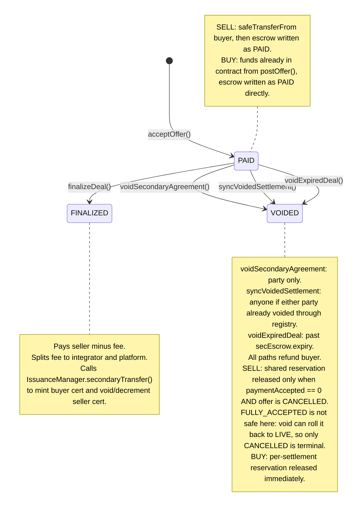
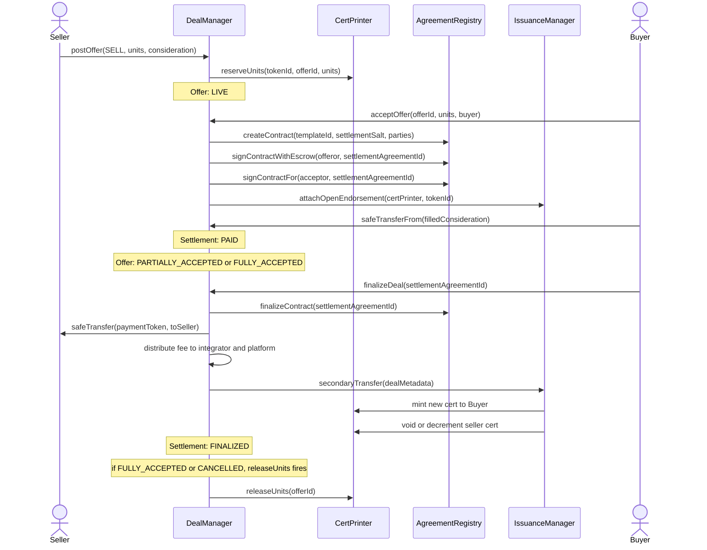
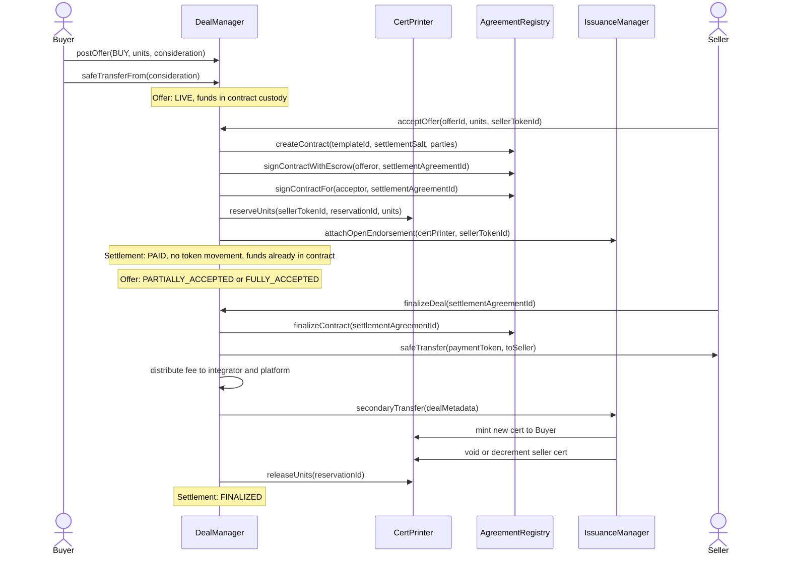
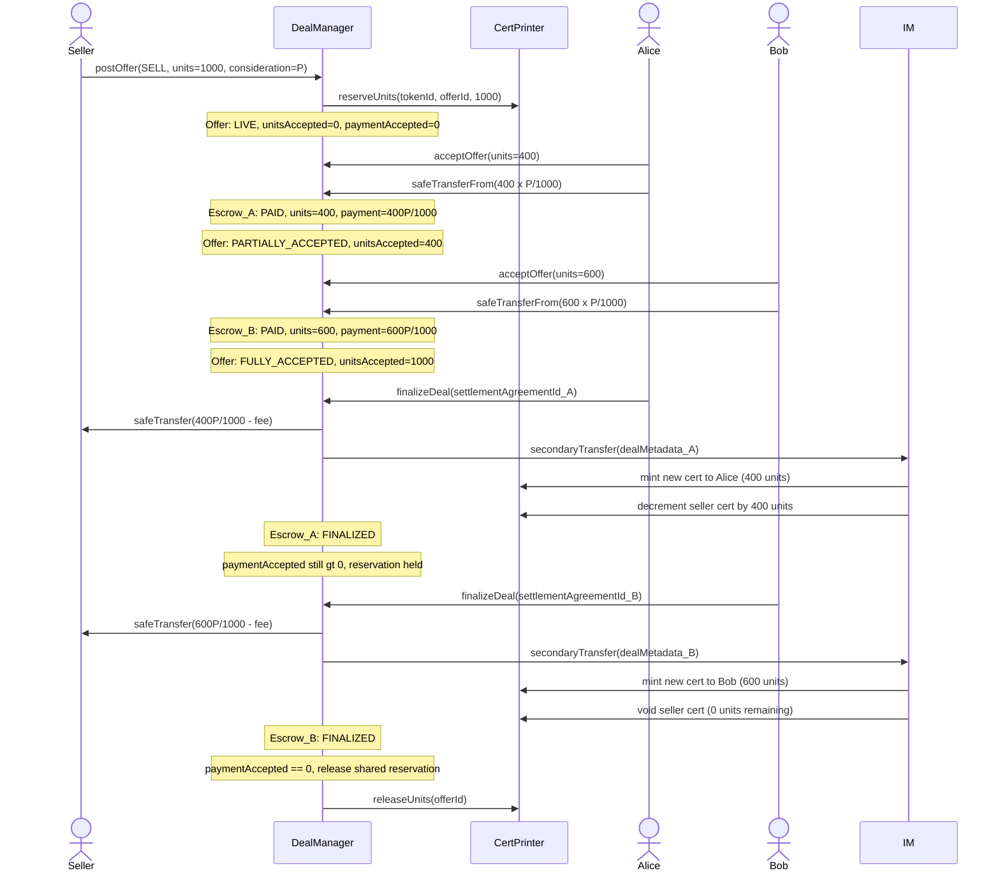
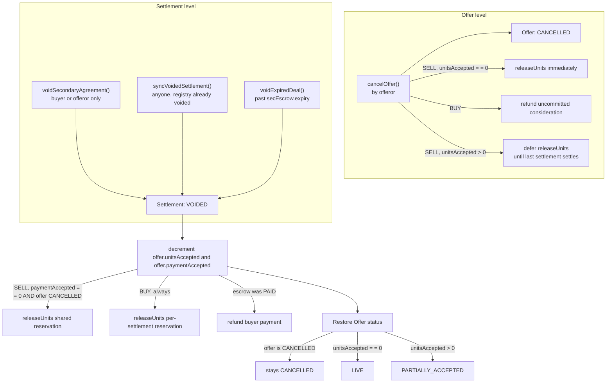

# DealManager Secondary Trade — Full Lifecycle State Machine

Two parallel state machines run concurrently: the **Offer** (one per `postOffer()`) and one or more **Settlement Escrows
** (one per `acceptOffer()`).

---

## 1. Offer State Machine

```mermaid
stateDiagram-v2
    [*] --> LIVE: postOffer()
    LIVE --> CANCELLED: cancelOffer()
    LIVE --> PARTIALLY_ACCEPTED: acceptOffer() partial fill
    LIVE --> FULLY_ACCEPTED: acceptOffer() full fill
    PARTIALLY_ACCEPTED --> FULLY_ACCEPTED: acceptOffer() completes fill
    PARTIALLY_ACCEPTED --> LIVE: settlement voided, unitsAccepted back to 0
    FULLY_ACCEPTED --> LIVE: settlement voided, unitsAccepted back to 0
    FULLY_ACCEPTED --> PARTIALLY_ACCEPTED: settlement voided, unitsAccepted still gt 0
    note right of LIVE
        SELL: reserves units on cert at postOffer
        BUY: pulls full consideration into contract at postOffer
    end note
    note right of CANCELLED
        SELL: releases reservation immediately if no active settlements; otherwise, release it until last settlement settles
        BUY: refunds uncommitted consideration
    end note
    note right of FULLY_ACCEPTED
        EXPIRED is logical only, no status field change.
        Enforced at acceptOffer() when block.timestamp > validUntil.
    end note
```

### Offer status transitions

| From                 | Event                                         | To                   | Notes                                                                                 |
|----------------------|-----------------------------------------------|----------------------|---------------------------------------------------------------------------------------|
| *(none)*             | `postOffer()`                                 | `LIVE`               | SELL: reserves units on cert; BUY: pulls full consideration into contract             |
| `LIVE`               | `cancelOffer()`                               | `CANCELLED`          | SELL: releases reservation if no active settlements; BUY: refunds uncommitted portion |
| `LIVE`               | `acceptOffer()` — partial fill                | `PARTIALLY_ACCEPTED` | `unitsAccepted < units`                                                               |
| `LIVE`               | `acceptOffer()` — full fill                   | `FULLY_ACCEPTED`     | `unitsAccepted == units`                                                              |
| `PARTIALLY_ACCEPTED` | `acceptOffer()` — completes fill              | `FULLY_ACCEPTED`     |                                                                                       |
| `PARTIALLY_ACCEPTED` | settlement voided                             | `LIVE`               | `unitsAccepted` decrements; if back to 0 and not CANCELLED                            |
| `FULLY_ACCEPTED`     | settlement voided, `unitsAccepted` drops to 0 | `LIVE`               | Same logic as `PARTIALLY_ACCEPTED`: status set purely by `unitsAccepted == 0` check   |
| `FULLY_ACCEPTED`     | settlement voided, `unitsAccepted` still > 0  | `PARTIALLY_ACCEPTED` | `unitsAccepted` decrements but offer not empty yet                                    |
| any                  | `block.timestamp > validUntil`                | `EXPIRED` (logical)  | No status field change; enforced at `acceptOffer()`                                   |

---

## 2. Settlement Escrow State Machine (one per `acceptOffer()`)

### Settlement escrow status transitions

| From     | Event                                                 | To          | Notes                                                                                                                                                   |
|----------|-------------------------------------------------------|-------------|---------------------------------------------------------------------------------------------------------------------------------------------------------|
| *(none)* | `acceptOffer()` — SELL offer                          | `PAID`      | `safeTransferFrom` buyer pulls payment; escrow written directly as PAID                                                                                 |
| *(none)* | `acceptOffer()` — BUY offer                           | `PAID`      | Funds already in contract from `postOffer()`; escrow written directly as PAID                                                                           |
| `PAID`   | `finalizeDeal()` — conditions met                     | `FINALIZED` | Pays seller (minus fee), splits fee to integrator/platform, calls `IssuanceManager.secondaryTransfer` to mint buyer cert and void/decrement seller cert |
| `PAID`   | `voidSecondaryAgreement()` — party requests void      | `VOIDED`    | Buyer or offeror only; refunds buyer's payment                                                                                                          |
| `PAID`   | `syncVoidedSettlement()` — registry voided externally | `VOIDED`    | Callable by anyone; guards via `isVoided()` check                                                                                                       |
| `PAID`   | `voidExpiredDeal()` — past `secEscrow.expiry`         | `VOIDED`    | Refunds buyer; releases unit reservation                                                                                                                |

---

## 3. End-to-End Flow

### 3A. SELL Offer (seller posts, buyer accepts)

### 3B. BUY Offer (buyer posts, seller accepts)

---

## 4. Partial Fill State Sequence (SELL offer, two acceptors)

---

## 5. Void / Cancellation Paths

---

## 6. Key Invariants

| Invariant                                                                                                         | Where enforced                                                                                                                                                                  |
|-------------------------------------------------------------------------------------------------------------------|---------------------------------------------------------------------------------------------------------------------------------------------------------------------------------|
| `offerId` never registered in `CyberAgreementRegistry`                                                            | `postOffer()` makes no registry call                                                                                                                                            |
| `settlementAgreementId` always fully signed by both parties at creation                                           | `acceptOffer()`: `signContractWithEscrow(offeror)` + `signContractFor(acceptor)`                                                                                                |
| Settlement escrow status `PAID` is the only state that can be finalized or voided                                 | `finalizeDeal()`, `voidSecondaryAgreement()`, `syncVoidedSettlement()` all guard on `PAID`                                                                                      |
| Buyer's payment enters contract custody before settlement `PAID` is set                                           | SELL: `safeTransferFrom` then status flip in same tx; BUY: custody at `postOffer()`                                                                                             |
| Seller cert units are reserved before any settlement is created                                                   | SELL: `reserveUnits` at `postOffer()`; BUY: `reserveUnits` at `acceptOffer()` per settlement                                                                                    |
| Shared SELL reservation released only when no new acceptances are possible and all in-flight settlements resolved | finalize: `paymentAccepted == 0` + (`FULLY_ACCEPTED` or `CANCELLED`); void: `paymentAccepted == 0` + `CANCELLED` only (`FULLY_ACCEPTED` is unsafe — void can roll it to `LIVE`) |
| Fee always split: integrator portion + platform portion                                                           | `_finalizeSecondaryEscrow`: `integratorFee + platformFee == totalFee`                                                                                                           |
| Conditions checked at `finalizeDeal()`, not at `acceptOffer()`                                                    | `_finalizeSecondaryEscrow`: `conditionCheck(agreementId)`                                                                                                                       |
