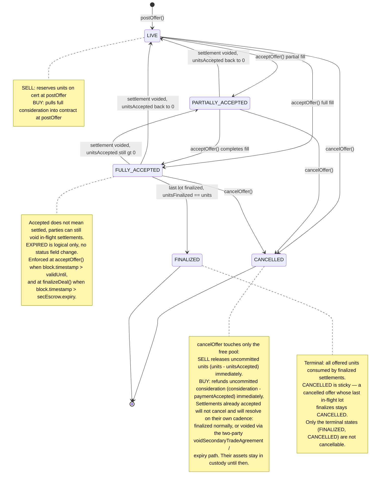
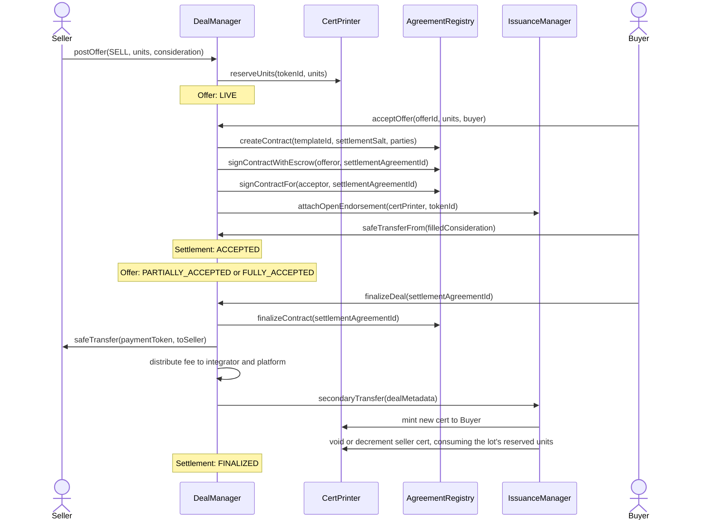
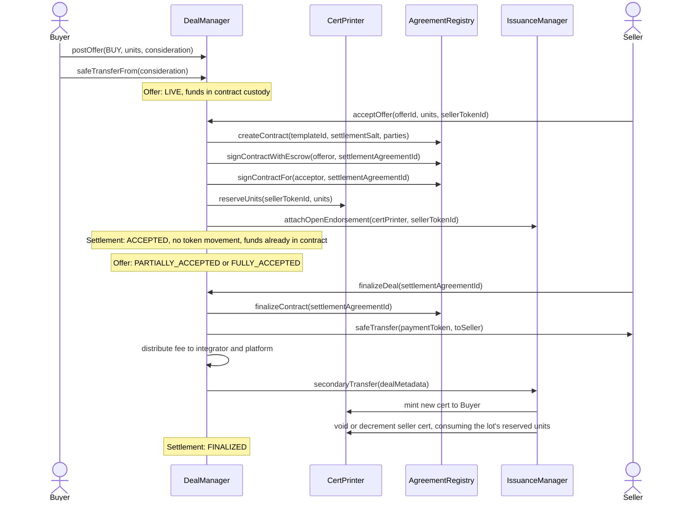
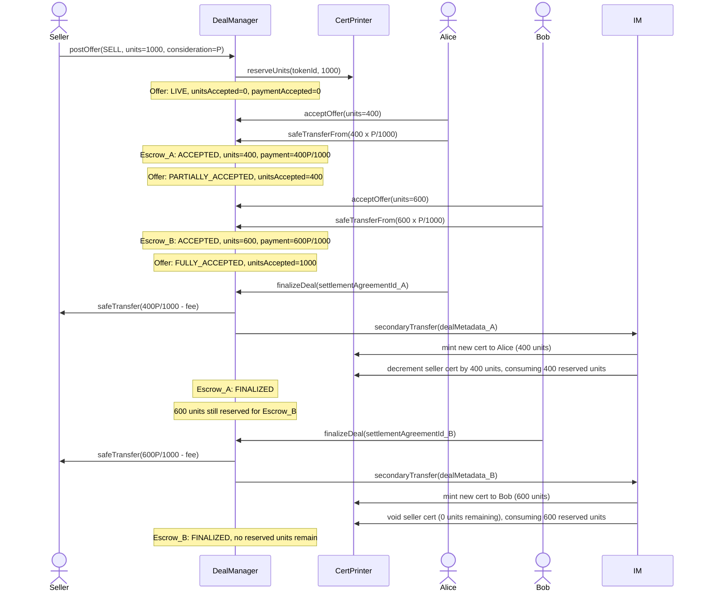
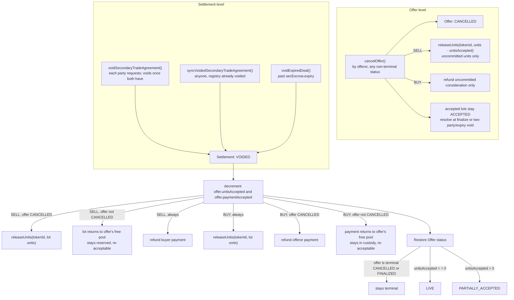

# DealManager Secondary Trade — Full Lifecycle State Machine

Two parallel state machines run concurrently: the **Offer** (one per `postOffer()`) and one or more **Settlement Escrows
** (one per `acceptOffer()`).

---

## 1. Offer State Machine

### Offer status transitions

| From                 | Event                                         | To                   | Notes                                                                                                           |
|----------------------|-----------------------------------------------|----------------------|-----------------------------------------------------------------------------------------------------------------|
| *(none)*             | `postOffer()`                                 | `LIVE`               | SELL: reserves units on cert; BUY: pulls full consideration into contract                                       |
| any non-terminal     | `cancelOffer()`                               | `CANCELLED`          | Releases/refunds only the free pool; accepted settlements will not cancel and will resolve on their own cadence |
| `LIVE`               | `acceptOffer()` — partial fill                | `PARTIALLY_ACCEPTED` | `unitsAccepted < units`                                                                                         |
| `LIVE`               | `acceptOffer()` — full fill                   | `FULLY_ACCEPTED`     | `unitsAccepted == units`                                                                                        |
| `PARTIALLY_ACCEPTED` | `acceptOffer()` — completes fill              | `FULLY_ACCEPTED`     |                                                                                                                 |
| `PARTIALLY_ACCEPTED` | settlement voided                             | `LIVE`               | `unitsAccepted` decrements; if back to 0 and not terminal                                                       |
| `FULLY_ACCEPTED`     | settlement voided, `unitsAccepted` drops to 0 | `LIVE`               | Same logic as `PARTIALLY_ACCEPTED`: status set purely by `unitsAccepted == 0` check                             |
| `FULLY_ACCEPTED`     | settlement voided, `unitsAccepted` still > 0  | `PARTIALLY_ACCEPTED` | `unitsAccepted` decrements but offer not empty yet                                                              |
| `FULLY_ACCEPTED`     | last settlement finalized                     | `FINALIZED`          | `unitsFinalized == units`; terminal and immutable. CANCELLED stays sticky if the offer was cancelled            |
| any                  | `block.timestamp > validUntil`                | `EXPIRED` (logical)  | No status field change; enforced at `acceptOffer()` and at `finalizeDeal()` (settlement expiry)                 |

---

## 2. Settlement Escrow State Machine (one per `acceptOffer()`)

```mermaid
stateDiagram-v2
    [*] --> ACCEPTED: acceptOffer()
    ACCEPTED --> FINALIZED: finalizeDeal()
    ACCEPTED --> VOIDED: voidSecondaryTradeAgreement() (both parties)
    ACCEPTED --> VOIDED: syncVoidedSecondaryTradeAgreement()
    ACCEPTED --> VOIDED: voidExpiredDeal()
    note left of ACCEPTED
        SELL: safeTransferFrom buyer, then escrow written as ACCEPTED.
        BUY: funds already in contract from postOffer(), escrow written as ACCEPTED directly.
    end note
    note right of FINALIZED
        Pays seller minus fee.
        Splits fee to integrator and platform.
        Calls IssuanceManager.secondaryTransfer()
        to mint buyer cert and void/decrement seller cert,
        consuming this lot's reserved units as part of the cert mutation.
    end note
    note right of VOIDED
        voidSecondaryTradeAgreement: each party requests; VOIDED only once both have requested
        (the finalizer-vouched request channel; a lone request only records intent).
        syncVoidedSecondaryTradeAgreement: anyone, once the registry already shows the agreement voided.
        voidExpiredDeal: past secEscrow.expiry.
        Acceptor's asset always returned immediately: SELL refunds the buyer's payment, BUY releases the seller's unit reservation.
        Offeror's asset stays in custody for the next fill, returned only if the offer has been cancelled:
        SELL: corresponding units are freed up for the next fill; released if the offer has been cancelled
        BUY: corresponding funds are freed up for the next fill; refunded if the offer has been cancelled
    end note
```

### Settlement escrow status transitions

| From       | Event                                                 | To          | Notes                                                                                                                                                                                                                        |
|------------|-------------------------------------------------------|-------------|------------------------------------------------------------------------------------------------------------------------------------------------------------------------------------------------------------------------------|
| *(none)*   | `acceptOffer()` — SELL offer                          | `ACCEPTED`  | `safeTransferFrom` buyer pulls payment; escrow written directly as ACCEPTED                                                                                                                                                  |
| *(none)*   | `acceptOffer()` — BUY offer                           | `ACCEPTED`  | Funds already in contract from `postOffer()`; escrow written directly as ACCEPTED                                                                                                                                            |
| `ACCEPTED` | `finalizeDeal()` — conditions met, before expiry      | `FINALIZED` | Reverts past `secEscrow.expiry`; pays seller (minus fee), splits fee to integrator/platform, calls `IssuanceManager.secondaryTransfer` to mint buyer cert and void/decrement seller cert, consuming the lot's reserved units |
| `ACCEPTED` | `voidSecondaryTradeAgreement()` — party requests void      | `VOIDED`    | Each party (offeror or counterparty) requests; the escrow flips to VOIDED only once both have requested (or it is past expiry). A lone request just records intent and the counterparty can still finalize.                  |
| `ACCEPTED` | `syncVoidedSecondaryTradeAgreement()` — registry voided externally | `VOIDED`    | Callable by anyone; guards via `isVoided()` check                                                                                                                                                                            |
| `ACCEPTED` | `voidExpiredDeal()` — past `secEscrow.expiry`         | `VOIDED`    | Callable past expiry only                                                                                                                                                                                                    |

All `VOIDED` paths share the same asset handling, symmetric between sides. The acceptor's asset is returned
immediately: SELL refunds the buyer's payment (pulled per settlement at `acceptOffer()`), BUY releases the seller's
per-settlement unit reservation. The offeror's asset (SELL: reserved units; BUY: consideration) returns to the offer's
free pool and stays in custody, available for the next fill — it is released/refunded only if the offer is `CANCELLED`,
since the lot can never be re-accepted.

---

## 3. End-to-End Flow

### 3A. SELL Offer (seller posts, buyer accepts)

### 3B. BUY Offer (buyer posts, seller accepts)

---

## 4. Partial Fill State Sequence (SELL offer, two acceptors)

---

## 5. Void / Cancellation Paths

---

## 6. Key Invariants

| Invariant                                                                                   | Where enforced                                                                                                                                                                                                                                                       |
|---------------------------------------------------------------------------------------------|----------------------------------------------------------------------------------------------------------------------------------------------------------------------------------------------------------------------------------------------------------------------|
| `offerId` never registered in `CyberAgreementRegistry`                                      | `postOffer()` makes no registry call                                                                                                                                                                                                                                 |
| `settlementAgreementId` always fully signed by both parties at creation                     | `acceptOffer()`: `signContractWithEscrow(offeror)` + `signContractFor(acceptor)`                                                                                                                                                                                     |
| Buyer's payment enters contract custody before settlement `ACCEPTED` is set                 | SELL: `safeTransferFrom` then status flip in same tx; BUY: custody at `postOffer()`                                                                                                                                                                                  |
| Seller cert units are reserved before any settlement is created                             | SELL: `reserveUnits` at `postOffer()`; BUY: `reserveUnits` at `acceptOffer()` per settlement                                                                                                                                                                         |
| Each reserved unit is released or consumed exactly once (amount-based reservations, no IDs) | finalize: `secondaryTransfer` consumes the lot; void: BUY releases the lot, SELL releases only if offer `CANCELLED` (else lot returns to free pool); cancel: releases only `units - unitsAccepted` (the free pool) — accepted lots resolve later at finalize or void |
| Each unit of BUY consideration leaves custody exactly once (payout or refund)               | finalize: paid to seller; void: refunded only if offer `CANCELLED` (else returns to free pool); cancel: refunds only `consideration - paymentAccepted` (the free pool) — accepted lots resolve later at finalize or void                                             |
| Fee always split: integrator portion + platform portion                                     | `_finalizeSecondaryEscrow`: `integratorFee + platformFee == totalFee`                                                                                                                                                                                                |
| Closing conditions checked at finalize; threshold conditions checked at post/accept AND re-checked at finalize | `finalizeSecondaryTradeAgreement` walks `offer.closingConditions` and also re-runs `_checkThresholdConditions` (both snapshotted from DealManager config at `postOffer`), so eligibility lost after acceptance blocks the asset transfer                              |
